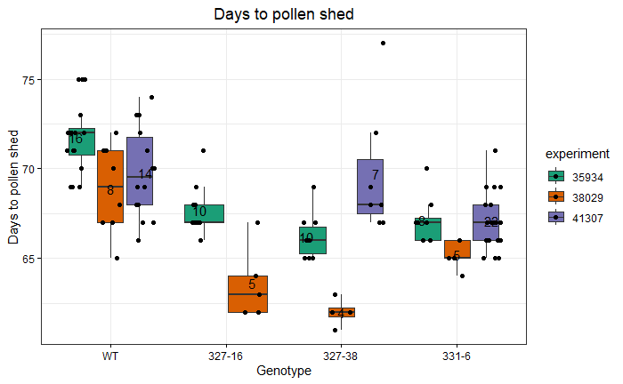
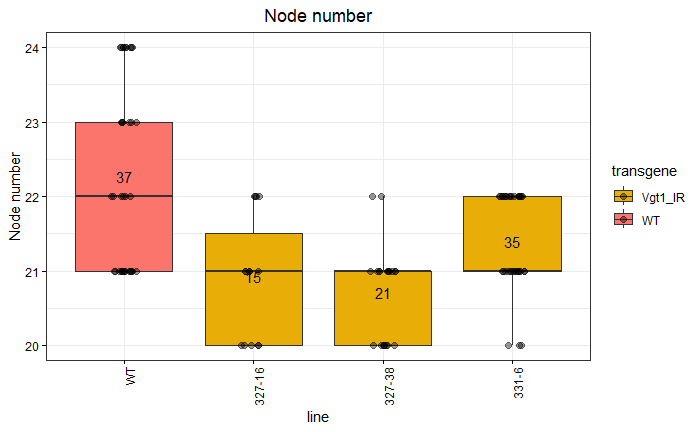
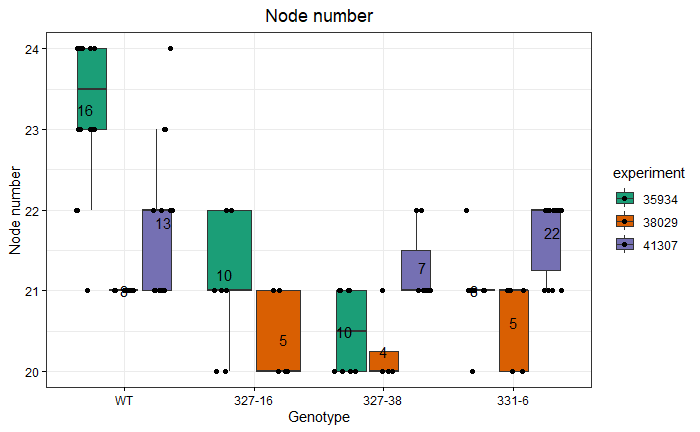
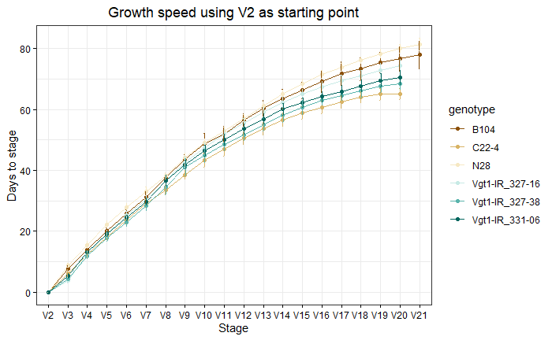
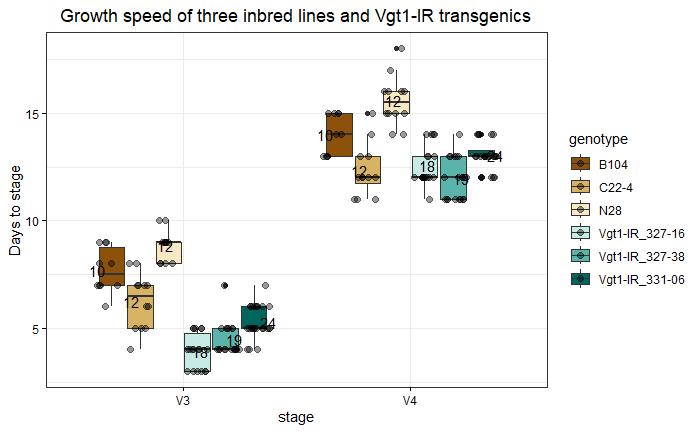
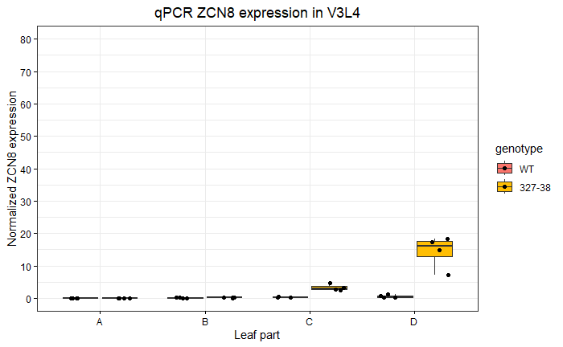
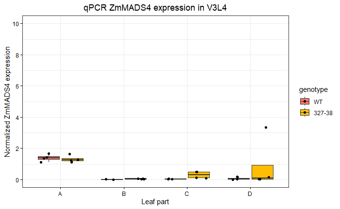
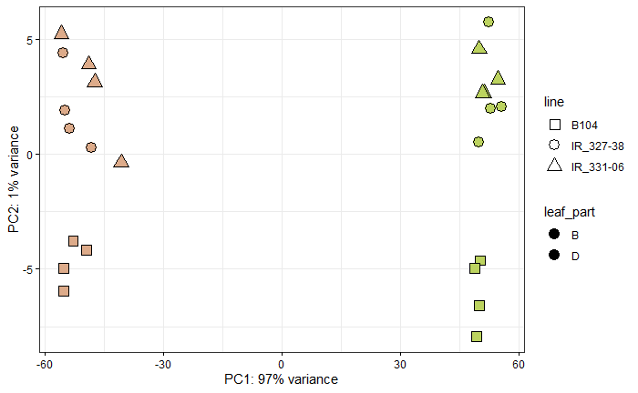
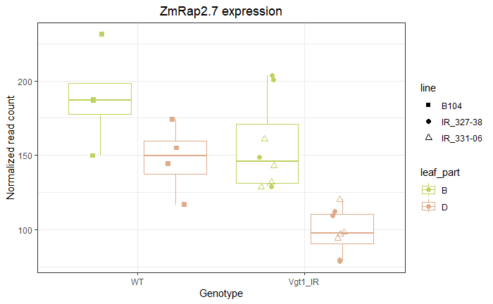
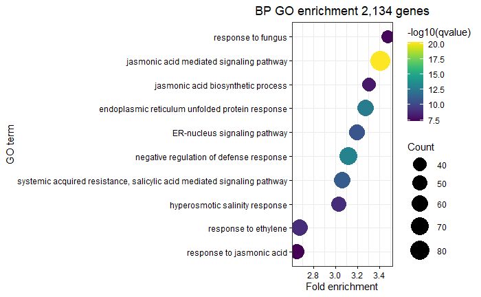

```{r, echo=FALSE}
knitr::opts_chunk$set(eval = FALSE)
```

# Introduction

This document gathers the bioinformatic analyses performed for the publication "Vgt1 acts as an enhancer of ZmRap2.7 and regulates flowering time in maize". Light-weight raw or processed data are also provided in the GitHub repository https://github.com/johanzi/scripts_zicola_vgt1.

To rerun the analyses, clone the repository into a local directory:

```{bash, eval=FALSE}
git clone https://github.com/johanzi/scripts_zicola_vgt1
```

In addition, another repository is needed for the GO term analyses:

```{bash, eval=FALSE}
git clone https://github.com/johanzi/GOMAP_maize_B73_NAM5
```


# Flowering time analysis

## Libraries

```{r}
library("ggplot2")
library("multcomp")
library("agricolae")
library("car")

give.n <- function(x){
  return(c(y = mean(x), label = length(x)))
}

```


```
R version 4.0.3 (2020-10-10)
Platform: x86_64-w64-mingw32/x64 (64-bit)
Running under: Windows 10 x64 (build 19045)

Matrix products: default

locale:
[1] LC_COLLATE=English_United States.1252 
[2] LC_CTYPE=English_United States.1252   
[3] LC_MONETARY=English_United States.1252
[4] LC_NUMERIC=C                          
[5] LC_TIME=English_United States.1252    

attached base packages:
[1] stats     graphics  grDevices utils     datasets  methods   base     

other attached packages:
[1] car_3.1-2       carData_3.0-5   agricolae_1.3-7 multcomp_1.4-25
[5] TH.data_1.1-2   MASS_7.3-60.0.1 survival_3.5-8  mvtnorm_1.2-5  
[9] ggplot2_3.4.1  

loaded via a namespace (and not attached):
 [1] bslib_0.4.1       compiler_4.0.3    pillar_1.9.0      jquerylib_0.1.4  
 [5] tools_4.0.3       digest_0.6.27     nlme_3.1-165      lattice_0.22-6   
 [9] jsonlite_1.8.8    evaluate_0.24.0   lifecycle_1.0.3   tibble_3.2.1     
[13] gtable_0.3.1      pkgconfig_2.0.3   rlang_1.0.6       Matrix_1.6-5     
[17] cli_3.6.2         rstudioapi_0.16.0 yaml_2.2.1        xfun_0.37        
[21] fastmap_1.1.0     cluster_2.1.6     withr_3.0.0       dplyr_1.1.0      
[25] knitr_1.42        generics_0.1.3    vctrs_0.5.2       sass_0.4.9       
[29] grid_4.0.3        tidyselect_1.2.1  glue_1.7.0        R6_2.5.1         
[33] fansi_1.0.6       rmarkdown_2.25    magrittr_2.0.3    codetools_0.2-20 
[37] scales_1.3.0      htmltools_0.5.2   splines_4.0.3     abind_1.4-5      
[41] colorspace_2.1-0  sandwich_3.1-0    utf8_1.2.4        munsell_0.5.1    
[45] cachem_1.0.6      AlgDesign_1.2.1   zoo_1.8-12       
```

## Data

Raw data are available in https://github.com/johanzi/scripts_zicola_vgt1/data/data/flowering_time.txt.

```{r}
# Set directory to the cloned github repo scripts_zicola_vgt1
setwd("/path/to/scripts_zicola_vgt1")

df <- read.table("data/flowering_time.txt", 
                 stringsAsFactors=TRUE,sep = "\t",
                 dec = ",",
                 na.strings = c("NA",""), 
                 header=TRUE)

# Set experiment as factor
df$experiment <- as.factor(df$experiment)

# Order lines
df$line <- factor(df$line, levels=c("WT","327-16","327-38","331-6"))

```

## Days to pollen shed

```{r}
ggplot(df, aes(line, DPS, fill=transgene)) + 
  geom_boxplot(outlier.color = NA) +   
  geom_point(position=position_jitterdodge(dodge.width = 0.8), 
              aes(y=DPS, group=transgene), size=2, alpha=0.4)  +
  stat_summary(fun.data = give.n, geom = "text") + 
  ggtitle("Days to pollen shed") +  
  theme_bw() + 
  theme(plot.title = element_text(hjust = 0.5), 
        axis.text.x = element_text(angle = 90, hjust = 1, color="black"),
        axis.text.y = element_text(color="black"), 
        axis.ticks = element_line(color = "black")) +
        theme(plot.title = element_text(hjust = 0.5)) +
        scale_y_continuous(labels = scales::comma_format()) +
        scale_fill_manual(values=c("#E8AE07","#FB756C"))

```


```{r warning=FALSE}

ggplot(df, aes(line, DPS, fill=experiment)) + 
  geom_boxplot(outlier.colour=NA) +
  geom_point(position=position_jitterdodge(dodge.width=0.9), 
             aes(group=experiment)) +
  ggtitle("Days to pollen shed") +  ylab("Days to pollen shed") + xlab("Genotype") +
  theme_bw() +  
  theme(plot.title = element_text(hjust = 0.5))   +
  theme(axis.text.x = element_text(color="black"),
        axis.text.y = element_text(color="black"),
        axis.ticks = element_line(color = "black")) +
  theme(plot.title = element_text(hjust = 0.5)) +
  scale_y_continuous(labels = scales::comma_format()) 

```




```{r}
# Test homoscedasticity, if p-value > 5%, Ho all variances
# are equals is not rejected
bartlett.test(DPS~line, data=df)

#Alternatively (need library "car")
leveneTest(DPS~line, data=df)

# Normality residuals
with(df, shapiro.test(DPS))

#ANOVA
fit = aov(DPS~line + experiment, data=df)

# Check normality of residual distribution
plot(fit, which=2)

# Check independence of residuals (residual errors have a mean of zero)
plot(fit, which=1)

# Perform Dunnett posthoc test
Dunnett <- glht(fit, linfct=mcp(line = "Dunnett"), alternative="two.sided")
summary(Dunnett)

```

```
	 Simultaneous Tests for General Linear Hypotheses

Multiple Comparisons of Means: Dunnett Contrasts


Fit: aov(formula = DPS ~ line + experiment, data = df)

Linear Hypotheses:
                 Estimate Std. Error t value Pr(>|t|)    
327-16 - WT == 0  -3.7775     0.6925  -5.455 8.77e-07 ***
327-38 - WT == 0  -3.9199     0.5982  -6.553  < 1e-07 ***
331-6 - WT == 0   -3.7517     0.5296  -7.085  < 1e-07 ***
---
Signif. codes:  0 ‘***’ 0.001 ‘**’ 0.01 ‘*’ 0.05 ‘.’ 0.1 ‘ ’ 1
(Adjusted p values reported -- single-step method)
```


## Days to silking

```{r}
ggplot(df, aes(line, silking, fill=transgene)) + 
  geom_boxplot() +  
  stat_summary(fun.data = give.n, geom = "text") + 
  ggtitle("Days to silking") +  
  theme_bw() + 
  theme(plot.title = element_text(hjust = 0.5), 
        axis.text.x = element_text(angle = 90, hjust = 1, color="black"),
        axis.text.y = element_text(color="black"), 
        axis.ticks = element_line(color = "black")) +
        theme(plot.title = element_text(hjust = 0.5)) +
        scale_y_continuous(labels = scales::comma_format()) +
        scale_fill_manual(values=c("#07B738","#E8AE07","#FB756C"))


ggplot(df, aes(line, silking, fill=transgene)) + 
  geom_boxplot(outlier.color = NA) +   
  geom_point(position=position_jitterdodge(dodge.width = 0.8), 
              aes(y=silking, group=transgene), size=2, alpha=0.4)  +
  stat_summary(fun.data = give.n, geom = "text") + 
  ggtitle("Days to silking") +  
  theme_bw() + ylab("Days to silking") +
  theme(plot.title = element_text(hjust = 0.5), 
        axis.text.x = element_text(angle = 90, hjust = 1, color="black"),
        axis.text.y = element_text(color="black"), 
        axis.ticks = element_line(color = "black")) +
        theme(plot.title = element_text(hjust = 0.5)) +
        scale_y_continuous(labels = scales::comma_format()) +
        scale_fill_manual(values=c("#E8AE07","#FB756C"))

```


```{r warning=FALSE}

ggplot(df, aes(line, silking, fill=experiment)) + 
  geom_boxplot(outlier.colour=NA) +
  geom_point(position=position_jitterdodge(dodge.width=0.9), 
             aes(group=experiment)) +
  ggtitle("Days to silking") +  ylab("Days to silking") + xlab("Genotype") +
  theme_bw() +  
  theme(plot.title = element_text(hjust = 0.5))   +
  theme(axis.text.x = element_text(color="black"),
        axis.text.y = element_text(color="black"),
        axis.ticks = element_line(color = "black")) +
  theme(plot.title = element_text(hjust = 0.5)) +
  scale_y_continuous(labels = scales::comma_format()) 

```


```{r}
#Test homoscedasticity, if p-value > 5%, 
# Ho all variances are equals is not rejected
bartlett.test(silking~line, data=df)

#Alternatively (need library "car")
leveneTest(silking~line, data=df)

#ANOVA
fit = aov(silking~line + experiment, data=df)

# Check normality of residual distribution
plot(fit, which=2)

# Check independence of residuals (residual errors have a mean of zero)
plot(fit, which=1)

# Perform Dunnett posthoc test
Dunnett <- glht(fit, linfct=mcp(line = "Dunnett"), alternative="two.sided")
summary(Dunnett)

```

```
	 Simultaneous Tests for General Linear Hypotheses

Multiple Comparisons of Means: Dunnett Contrasts


Fit: aov(formula = silking ~ line + experiment, data = df)

Linear Hypotheses:
                 Estimate Std. Error t value Pr(>|t|)    
327-16 - WT == 0  -4.7714     0.7862  -6.069   <1e-06 ***
327-38 - WT == 0  -4.4667     0.6791  -6.577   <1e-06 ***
331-6 - WT == 0   -4.2777     0.6012  -7.115   <1e-06 ***
---
Signif. codes:  0 ‘***’ 0.001 ‘**’ 0.01 ‘*’ 0.05 ‘.’ 0.1 ‘ ’ 1
(Adjusted p values reported -- single-step method)

```


## Node number

```{r}

ggplot(df, aes(line, node, fill=transgene)) + 
  geom_boxplot(outlier.color = NA) +   
  geom_point(position=position_jitterdodge(dodge.width = 0.8), 
              aes(y=node, group=transgene), size=2, alpha=0.4)  +
  stat_summary(fun.data = give.n, geom = "text") + 
  ggtitle("Node number") +  
  theme_bw() + ylab("Node number") +
  theme(plot.title = element_text(hjust = 0.5), 
        axis.text.x = element_text(angle = 90, hjust = 1, color="black"),
        axis.text.y = element_text(color="black"), 
        axis.ticks = element_line(color = "black")) +
        theme(plot.title = element_text(hjust = 0.5)) +
        scale_y_continuous(labels = scales::comma_format()) +
        scale_fill_manual(values=c("#E8AE07","#FB756C"))

```



```{r warning=FALSE}

ggplot(df, aes(line, node, fill=experiment)) + 
  geom_boxplot(outlier.colour=NA) +
  geom_point(position=position_jitterdodge(dodge.width=0.9), 
             aes(group=experiment)) +
  ggtitle("Node number") + ylab("Node number") + xlab("Genotype") +
  theme_bw() +  
  theme(plot.title = element_text(hjust = 0.5))   +
  theme(axis.text.x = element_text(color="black"),
        axis.text.y = element_text(color="black"),
        axis.ticks = element_line(color = "black")) +
  theme(plot.title = element_text(hjust = 0.5)) +
  scale_y_continuous(labels = scales::comma_format()) 

```




```{r}
#Test homoscedasticity, if p-value > 5%, 
# Ho all variances are equals is not rejected
bartlett.test(node~line, data=df)

#Alternatively (need library "car")
leveneTest(node~line, data=df)

#ANOVA
fit = aov(node~line + experiment, data=df)

# Check normality of residual distribution
plot(fit, which=2)

# Check independence of residuals (residual errors have a mean of zero)
plot(fit, which=1)

# Perform Dunnett posthoc test
Dunnett <- glht(fit, linfct=mcp(line = "Dunnett"), alternative="two.sided")
summary(Dunnett)

```

```
	 Simultaneous Tests for General Linear Hypotheses

Multiple Comparisons of Means: Dunnett Contrasts


Fit: aov(formula = node ~ line + experiment, data = df)

Linear Hypotheses:
                 Estimate Std. Error t value Pr(>|t|)    
327-16 - WT == 0  -1.2467     0.2542  -4.904 1.09e-05 ***
327-38 - WT == 0  -1.5877     0.2203  -7.207  < 1e-05 ***
331-6 - WT == 0   -0.9197     0.1962  -4.688 2.46e-05 ***
---
Signif. codes:  0 ‘***’ 0.001 ‘**’ 0.01 ‘*’ 0.05 ‘.’ 0.1 ‘ ’ 1
(Adjusted p values reported -- single-step method)

```

# Growth speed analysis

## Libraries

```{r}
library(tidyverse)
library(ggplot2)
library(wesanderson)
library(RColorBrewer)
library(multcomp)
library(dunn.test)
library(car)
```


```
R version 4.0.3 (2020-10-10)
Platform: x86_64-w64-mingw32/x64 (64-bit)
Running under: Windows 10 x64 (build 19045)

Matrix products: default

locale:
[1] LC_COLLATE=English_United States.1252 
[2] LC_CTYPE=English_United States.1252   
[3] LC_MONETARY=English_United States.1252
[4] LC_NUMERIC=C                          
[5] LC_TIME=English_United States.1252    

attached base packages:
[1] stats     graphics  grDevices utils     datasets  methods   base     

other attached packages:
 [1] dunn.test_1.3.6    multcomp_1.4-25    TH.data_1.1-2     
 [4] MASS_7.3-60.0.1    survival_3.5-8     mvtnorm_1.2-5     
 [7] RColorBrewer_1.1-3 wesanderson_0.3.7  lubridate_1.9.3   
[10] forcats_1.0.0      stringr_1.5.1      dplyr_1.1.0       
[13] purrr_0.3.4        readr_2.1.5        tidyr_1.2.1       
[16] tibble_3.2.1       ggplot2_3.4.1      tidyverse_2.0.0   

loaded via a namespace (and not attached):
 [1] pillar_1.9.0      compiler_4.0.3    tools_4.0.3      
 [4] lattice_0.22-6    lifecycle_1.0.3   gtable_0.3.1     
 [7] timechange_0.3.0  pkgconfig_2.0.3   rlang_1.0.6      
[10] Matrix_1.6-5      cli_3.6.2         rstudioapi_0.16.0
[13] withr_3.0.0       generics_0.1.3    vctrs_0.5.2      
[16] hms_1.1.3         grid_4.0.3        tidyselect_1.2.1 
[19] glue_1.7.0        R6_2.5.1          fansi_1.0.6      
[22] tzdb_0.4.0        magrittr_2.0.3    codetools_0.2-20 
[25] scales_1.3.0      splines_4.0.3     colorspace_2.1-0 
[28] sandwich_3.1-0    utf8_1.2.4        stringi_1.8.3    
[31] munsell_0.5.1     zoo_1.8-12 
```


## Data

Raw data available in https://github.com/johanzi/scripts_zicola_vgt1/data/data/growth_speed.txt. The values are in number of days from the V2 stage, apart from "node", which represents the number of nodes at maturity.

```{r}
# Import data
data_R <- read.delim("data/growth_speed.txt")

data_R$genotype <- as.factor(data_R$genotype)

# Growth rate data
df_growth_speed <- data_R[, 1:20]

# DAV2 stands for days after V2 stage
df_growth_speed <- df_growth_speed %>% gather(stage, DAV2, V3:V21)

stage_order <- paste("V",3:21, sep="")

df_growth_speed$stage <- factor(df_growth_speed$stage, levels=stage_order, ordered=T)

# Flowering data
df_flo_time <- data_R %>% dplyr::select(genotype, DPS, silking, node)

```


## Growth speed all stages


```{r}

data_summary <- function(data, varname, groupnames){
  require(plyr)
  summary_func <- function(x, col){
    c(mean = mean(x[[col]], na.rm=TRUE),
      sd = sd(x[[col]], na.rm=TRUE))
  }
  data_sum<-ddply(data, groupnames, .fun=summary_func,
                  varname)
  data_sum <- rename(data_sum, c("mean" = varname))
 return(data_sum)
}

df2 <- data_summary(df_growth_speed, varname="DAV2", 
                    groupnames=c("genotype", "stage"))

# filter(stage!="V21") 
df2 %>% ggplot(aes(x=stage, y=DAV2, group=genotype, color=genotype)) + 
  geom_line() +
  geom_point()+
  geom_errorbar(aes(ymin=DAV2-sd, ymax=DAV2+sd), width=.2,
                 position=position_dodge(0.05)) + theme_bw()+ 
  theme(axis.text.x = element_text(color="black"), 
        axis.text.y = element_text(color="black"),
        axis.ticks = element_line(color = "black")) + 
  theme(plot.title = element_text(hjust = 0.5)) + 
  scale_y_continuous(labels = scales::comma_format())

```




## Days to pollen shed

```{r}

df_flo_time %>% ggplot(aes(genotype, DPS, fill=genotype)) + 
  geom_boxplot(outlier.color = NA) +   
  geom_point(position=position_jitterdodge(dodge.width = 0.8), 
              aes(y=DPS, group=genotype), size=2, alpha=0.4)  +
  stat_summary(fun.data = give.n, geom = "text") + 
  ggtitle("Days to pollen shed") +  ylab("Days to pollen shed") +
  theme_bw() + 
  theme(plot.title = element_text(hjust = 0.5), 
        axis.text.x = element_text(angle = 90, hjust = 1, color="black"),
        axis.text.y = element_text(color="black"), 
        axis.ticks = element_line(color = "black")) +
        theme(plot.title = element_text(hjust = 0.5)) +
        scale_y_continuous(labels = scales::comma_format())

```


```{r}
# Test homoscedasticity, if p-value > 5%, Ho all variances
# are equals is not rejected

df_flo_time_IR <- df_flo_time %>% filter(genotype %in% 
                           c("B104","Vgt1-IR_327-16","Vgt1-IR_327-38","Vgt1-IR_331-06")) 


bartlett.test(DPS~genotype, data=df_flo_time_IR)

#Alternatively (need library "car")
leveneTest(DPS~genotype, data=df_flo_time_IR)

# Normality residuals
with(df_flo_time_IR, shapiro.test(DPS))

#ANOVA
fit = aov(DPS~genotype, data=df_flo_time_IR)

# Check normality of residual distribution
plot(fit, which=2)

# Check independence of residuals (residual errors have a mean of zero)
plot(fit, which=1)

# Perform Dunnett posthoc test
Dunnett <- glht(fit, linfct=mcp(genotype = "Dunnett"), alternative="two.sided")
summary(Dunnett)

```

```
	 Simultaneous Tests for General Linear Hypotheses

Multiple Comparisons of Means: Dunnett Contrasts


Fit: aov(formula = DPS ~ genotype, data = df_flo_time_IR)

Linear Hypotheses:
                           Estimate Std. Error t value Pr(>|t|)    
Vgt1-IR_327-16 - B104 == 0   -2.700      1.109  -2.434    0.042 *  
Vgt1-IR_327-38 - B104 == 0   -7.884      1.099  -7.175   <0.001 ***
Vgt1-IR_331-06 - B104 == 0   -6.783      1.059  -6.408   <0.001 ***
---
Signif. codes:  0 ‘***’ 0.001 ‘**’ 0.01 ‘*’ 0.05 ‘.’ 0.1 ‘ ’ 1
(Adjusted p values reported -- single-step method)

```


## Days to silking


```{r}

df_flo_time %>% ggplot(aes(genotype, silking, fill=genotype)) + 
  geom_boxplot(outlier.color = NA) +   
  geom_point(position=position_jitterdodge(dodge.width = 0.8), 
              aes(y=silking, group=genotype), size=2, alpha=0.4)  +
  stat_summary(fun.data = give.n, geom = "text") + 
  ggtitle("Days to silking") +  ylab("Days to silking") +
  theme_bw() + 
  theme(plot.title = element_text(hjust = 0.5), 
        axis.text.x = element_text(angle = 90, hjust = 1, color="black"),
        axis.text.y = element_text(color="black"), 
        axis.ticks = element_line(color = "black")) +
        theme(plot.title = element_text(hjust = 0.5)) +
        scale_y_continuous(labels = scales::comma_format())

```


```{r}
# Test homoscedasticity, if p-value > 5%, Ho all variances
# are equals is not rejected

bartlett.test(silking~genotype, data=df_flo_time_IR)

#Alternatively (need library "car")
leveneTest(silking~genotype, data=df_flo_time_IR)

# Normality residuals
with(df_flo_time_IR, shapiro.test(silking))

#ANOVA
fit = aov(silking~genotype, data=df_flo_time_IR)

# Check normality of residual distribution
plot(fit, which=2)

# Check independence of residuals (residual errors have a mean of zero)
plot(fit, which=1)

# Perform Dunnett posthoc test
Dunnett <- glht(fit, linfct=mcp(genotype = "Dunnett"), alternative="two.sided")
summary(Dunnett)

```

```
	 Simultaneous Tests for General Linear Hypotheses

Multiple Comparisons of Means: Dunnett Contrasts


Fit: aov(formula = silking ~ genotype, data = df_flo_time_IR)

Linear Hypotheses:
                           Estimate Std. Error t value Pr(>|t|)    
Vgt1-IR_327-16 - B104 == 0    0.125      1.220   0.102  0.99877    
Vgt1-IR_327-38 - B104 == 0   -6.165      1.210  -5.096  < 0.001 ***
Vgt1-IR_331-06 - B104 == 0   -3.917      1.172  -3.343  0.00319 ** 
---
Signif. codes:  0 ‘***’ 0.001 ‘**’ 0.01 ‘*’ 0.05 ‘.’ 0.1 ‘ ’ 1
(Adjusted p values reported -- single-step method)
```


## Node number


```{r}

df_flo_time %>% ggplot(aes(genotype, node, fill=genotype)) + 
  geom_boxplot(outlier.color = NA) +   
  geom_point(position=position_jitterdodge(dodge.width = 0.8), 
              aes(y=node, group=genotype), size=2, alpha=0.4)  +
  stat_summary(fun.data = give.n, geom = "text") + 
  ggtitle("Node number") +  ylab("Node number") +
  theme_bw() + 
  theme(plot.title = element_text(hjust = 0.5), 
        axis.text.x = element_text(angle = 90, hjust = 1, color="black"),
        axis.text.y = element_text(color="black"), 
        axis.ticks = element_line(color = "black")) +
        theme(plot.title = element_text(hjust = 0.5)) +
        scale_y_continuous(labels = scales::comma_format())

```


```{r}
# Test homoscedasticity, if p-value > 5%, Ho all variances
# are equals is not rejected

bartlett.test(node~genotype, data=df_flo_time_IR)

#Alternatively (need library "car")
leveneTest(node~genotype, data=df_flo_time_IR)

# Normality residuals
with(df_flo_time_IR, shapiro.test(node))

#ANOVA
fit = aov(node~genotype, data=df_flo_time_IR)

# Check normality of residual distribution
plot(fit, which=2)

# Check independence of residuals (residual errors have a mean of zero)
plot(fit, which=1)

# Perform Dunnett posthoc test
Dunnett <- glht(fit, linfct=mcp(genotype = "Dunnett"), alternative="two.sided")
summary(Dunnett)

```

```
	 Simultaneous Tests for General Linear Hypotheses

Multiple Comparisons of Means: Dunnett Contrasts


Fit: aov(formula = node ~ genotype, data = df_flo_time_IR)

Linear Hypotheses:
                           Estimate Std. Error t value Pr(>|t|)    
Vgt1-IR_327-16 - B104 == 0  -0.9000     0.2074  -4.340 0.000131 ***
Vgt1-IR_327-38 - B104 == 0  -1.0053     0.2054  -4.894  < 1e-04 ***
Vgt1-IR_331-06 - B104 == 0  -1.3167     0.1979  -6.653  < 1e-04 ***
---
Signif. codes:  0 ‘***’ 0.001 ‘**’ 0.01 ‘*’ 0.05 ‘.’ 0.1 ‘ ’ 1
(Adjusted p values reported -- single-step method)
```


## Growth speed V3 and V4

```{r}
df_growth_speed %>% filter(stage %in% c("V3","V4")) %>% 
  ggplot(aes(x=stage, y=DAV2, fill=genotype)) +
  geom_boxplot() +   geom_boxplot(outlier.color = NA) +   
  geom_point(position=position_jitterdodge(dodge.width = 0.8), 
              aes(y=DAV2, group=genotype), size=2, alpha=0.4) + 
  theme_bw() + 
  ylab("Days to stage") +
  ggtitle("Growth speed of with type and transgenic lines") + 
  theme(axis.text.x = element_text(color="black"), 
        axis.text.y = element_text(color="black"),
        axis.ticks = element_line(color = "black")) + 
        theme(plot.title = element_text(hjust = 0.5)) + 
        scale_y_continuous(labels = scales::comma_format())

```



Restrict to WT B104 and Vgt1-IR transgenic lines:

```{r}

df_growth_speed %>% filter(stage %in% c("V3","V4")) %>% filter(genotype %in% c("B104","Vgt1-IR_327-16","Vgt1-IR_327-38","Vgt1-IR_331-06")) %>% 
  ggplot(aes(x=stage, y=DAS, fill=genotype)) +
  geom_boxplot() +   geom_boxplot(outlier.color = NA) +   
  geom_point(position=position_jitterdodge(dodge.width = 0.8), 
              aes(y=DAS, group=genotype), size=2, alpha=0.4) + 
  theme_bw() + 
  ylab("Days to stage") +
  ggtitle("Growth speed of with type and transgenic lines") + 
  theme(axis.text.x = element_text(color="black"), 
        axis.text.y = element_text(color="black"),
        axis.ticks = element_line(color = "black")) + 
        theme(plot.title = element_text(hjust = 0.5)) + 
        scale_y_continuous(labels = scales::comma_format()) +
        scale_fill_manual(values=c("#F8766D","#FDCC8A","#FC8D59","#FFC000"))


```


## Statistical analysis at V3

```{r}

df_growth_speed_V3 <- df_growth_speed %>% subset(stage=="V3") %>% filter(genotype %in% c("B104","Vgt1-IR_327-16","Vgt1-IR_327-38","Vgt1-IR_331-06"))

fit <- aov(DAS ~ genotype, data=df_growth_speed_V3)

# Test homoscedasticity, if p-value > 5%, Ho all variances
# are equals is not rejected
bartlett.test(DAS~genotype, data=df_growth_speed_V3)

#Alternatively (need library "car")
leveneTest(DAS~genotype, data=df_growth_speed_V3)

# Check normality of residual distribution
plot(fit, which=2)

# Check independence of residuals (residual errors have a mean of zero)
plot(fit, which=1)

summary(glht(fit, linfct=mcp(genotype="Dunnett"), alternative="two.sided"))

```

```
	 Simultaneous Tests for General Linear Hypotheses

Multiple Comparisons of Means: Dunnett Contrasts


Fit: aov(formula = DAS ~ genotype, data = df_growth_speed_V3)

Linear Hypotheses:
                           Estimate Std. Error t value Pr(>|t|)    
Vgt1-IR_327-16 - B104 == 0  -3.7556     0.3223  -11.65   <1e-10 ***
Vgt1-IR_327-38 - B104 == 0  -3.2263     0.3193  -10.11   <1e-10 ***
Vgt1-IR_331-06 - B104 == 0  -2.4083     0.3076   -7.83   <1e-10 ***
---
Signif. codes:  0 ‘***’ 0.001 ‘**’ 0.01 ‘*’ 0.05 ‘.’ 0.1 ‘ ’ 1
(Adjusted p values reported -- single-step method)

```

## Statistical analysis at V4


```{r}

df_growth_speed_V4 <- df_growth_speed %>% subset(stage=="V4") %>% filter(genotype %in% c("B104","Vgt1-IR_327-16","Vgt1-IR_327-38","Vgt1-IR_331-06"))

fit <- aov(DAS ~ genotype, data=df_growth_speed_V4)

# Test homoscedasticity, if p-value > 5%, Ho all variances
# are equals is not rejected
bartlett.test(DAS~genotype, data=df_growth_speed_V4)

#Alternatively (need library "car")
leveneTest(DAS~genotype, data=df_growth_speed_V4)

# Check normality of residual distribution
plot(fit, which=2)

# Check independence of residuals (residual errors have a mean of zero)
plot(fit, which=1)

summary(glht(fit, linfct=mcp(genotype="Dunnett"), alternative="two.sided"))
```

```
	 Simultaneous Tests for General Linear Hypotheses

Multiple Comparisons of Means: Dunnett Contrasts


Fit: aov(formula = DAS ~ genotype, data = df_growth_speed_V4)

Linear Hypotheses:
                           Estimate Std. Error t value Pr(>|t|)    
Vgt1-IR_327-16 - B104 == 0  -1.4444     0.3419  -4.225   <0.001 ***
Vgt1-IR_327-38 - B104 == 0  -2.0526     0.3387  -6.061   <0.001 ***
Vgt1-IR_331-06 - B104 == 0  -0.9583     0.3263  -2.937   0.0113 *  
---
Signif. codes:  0 ‘***’ 0.001 ‘**’ 0.01 ‘*’ 0.05 ‘.’ 0.1 ‘ ’ 1
(Adjusted p values reported -- single-step method)

```

# qPCR analysis

## Libraries

```{r}
library(plyr)
library(dplyr)
library(readr)
library(ggplot2)
library(ggpubr)

# Stat
library(multcomp)
library(lme4)
library(agricolae)

# Summarize lm output
library(jtools)

# Function
give.n <- function(x){
  return(c(y = mean(x), label = length(x)))
}
```


```
R version 4.0.3 (2020-10-10)
Platform: x86_64-w64-mingw32/x64 (64-bit)
Running under: Windows 10 x64 (build 19045)

Matrix products: default

locale:
[1] LC_COLLATE=English_United States.1252 
[2] LC_CTYPE=English_United States.1252   
[3] LC_MONETARY=English_United States.1252
[4] LC_NUMERIC=C                          
[5] LC_TIME=English_United States.1252    

attached base packages:
[1] stats     graphics  grDevices utils     datasets  methods  
[7] base     

other attached packages:
 [1] jtools_2.2.2    agricolae_1.3-7 lme4_1.1-35.3  
 [4] Matrix_1.6-5    multcomp_1.4-25 TH.data_1.1-2  
 [7] MASS_7.3-60.0.1 survival_3.5-8  mvtnorm_1.2-5  
[10] ggpubr_0.4.0    ggplot2_3.4.1   readr_2.1.5    
[13] dplyr_1.1.0     plyr_1.8.9     

loaded via a namespace (and not attached):
 [1] zoo_1.8-12        tidyselect_1.2.1  xfun_0.37        
 [4] pander_0.6.5      purrr_0.3.4       splines_4.0.3    
 [7] lattice_0.22-6    carData_3.0-5     colorspace_2.1-0 
[10] vctrs_0.5.2       generics_0.1.3    AlgDesign_1.2.1  
[13] utf8_1.2.4        rlang_1.0.6       pillar_1.9.0     
[16] nloptr_2.0.3      glue_1.7.0        withr_3.0.0      
[19] lifecycle_1.0.3   munsell_0.5.1     ggsignif_0.6.4   
[22] gtable_0.3.1      codetools_0.2-20  knitr_1.42       
[25] tzdb_0.4.0        fansi_1.0.6       broom_1.0.6      
[28] Rcpp_1.0.12       backports_1.4.1   scales_1.3.0     
[31] abind_1.4-5       digest_0.6.27     hms_1.1.3        
[34] rstatix_0.7.2     grid_4.0.3        cli_3.6.2        
[37] tools_4.0.3       sandwich_3.1-0    magrittr_2.0.3   
[40] tibble_3.2.1      cluster_2.1.6     crayon_1.5.2     
[43] car_3.1-2         tidyr_1.2.1       pkgconfig_2.0.3  
[46] minqa_1.2.7       rstudioapi_0.16.0 R6_2.5.1         
[49] boot_1.3-30       nlme_3.1-165      compiler_4.0.3 
```

## Data

```{r}
# Set directory to the cloned github repo scripts_zicola_vgt1
setwd("/path/to/scripts_zicola_vgt1")

# Import dataframe
df <- read_delim("data/data_qPCR.txt", "\t", 
    escape_double = FALSE, show_col_types = FALSE)

# Create a new variable merging part and stage
df$tissue = paste(df$stage, df$part, sep="_")

df <- df %>% relocate(tissue, .before=stage)

# Change into factor the 4 first columns
df <- df %>% mutate_at(1:4, factor)

# Change the rest into integers
df <- df %>% mutate_at(5:7, as.numeric)

# Order genotype
df$genotype <- factor(df$genotype, levels=c("WT", "327-38"))

```

For the analysis, we performed for each stage and leaf part a comparison between WT and the IR-Vgt1 transgenic line 327-38. In each case, we assessed if the variances were equal between group, then used a t-test. If the variances were unequal, we used the Welch's test, which does not rely on the assumption of homoscedasticity.

## ZmRap2.7 expression analysis

### ZmRap2.7 expression in V3L4

```{r}

df %>% filter(stage=="V3L4") %>% ggplot(aes(x=part, y=ZmRap27, fill=genotype)) +
  geom_boxplot(outlier.shape=NA) + 
  geom_point(position=position_jitterdodge(dodge.width=0.9), aes(fill=genotype)) + 
  theme_bw() + ggtitle("qPCR ZmRap2.7 expression in V3L4") +
  ylab("Normalized ZmRap2.7 expression") +
  xlab("Leaf part") +
  scale_fill_manual(values=c("#FB756C","#FFBE03")) +
  theme(axis.text.x = element_text(color="black"),
        axis.text.y = element_text(color="black"),
        axis.ticks = element_line(color = "black")) + 
  theme(plot.title = element_text(hjust = 0.5)) +
  scale_y_continuous(limits=c(0,6.2), breaks=seq(0,6.2,2))


```


```{r}
# Test egality in variance in each leaf part
bartlett.test(ZmRap27~genotype, data=df[(df$stage=="V3L4" & df$part=="A"),])
bartlett.test(ZmRap27~genotype, data=df[(df$stage=="V3L4" & df$part=="B"),])
bartlett.test(ZmRap27~genotype, data=df[(df$stage=="V3L4" & df$part=="C"),])
bartlett.test(ZmRap27~genotype, data=df[(df$stage=="V3L4" & df$part=="D"),])

# Perform T-test for each leaf part
with(df[(df$stage=="V3L4" & df$part=="A"),] , 
     t.test(ZmRap27[genotype=="WT"], ZmRap27[genotype=="327-38"], var.equal = TRUE))
with(df[(df$stage=="V3L4" & df$part=="B"),] , 
     t.test(ZmRap27[genotype=="WT"], ZmRap27[genotype=="327-38"], var.equal = TRUE))
with(df[(df$stage=="V3L4" & df$part=="C"),] , 
     t.test(ZmRap27[genotype=="WT"], ZmRap27[genotype=="327-38"], var.equal = TRUE))
with(df[(df$stage=="V3L4" & df$part=="D"),] , 
     t.test(ZmRap27[genotype=="WT"], ZmRap27[genotype=="327-38"], var.equal = TRUE))
```


### ZmRap2.7 expression in V4L5

```{r}

df %>% filter(stage=="V4L5") %>% ggplot(aes(x=part, y=ZmRap27, fill=genotype)) +
  geom_boxplot(outlier.shape=NA) + 
  geom_point(position=position_jitterdodge(dodge.width=0.9), aes(fill=genotype)) + 
  theme_bw() + ggtitle("qPCR ZmRap2.7 expression in V4L5") +
  ylab("Normalized ZmRap2.7 expression") +
  xlab("Leaf part") +
  scale_fill_manual(values=c("#FB756C","#FFBE03")) +
  theme(axis.text.x = element_text(color="black"),
        axis.text.y = element_text(color="black"),
        axis.ticks = element_line(color = "black")) + 
  theme(plot.title = element_text(hjust = 0.5)) +
  scale_y_continuous(limits=c(0,6.2), breaks=seq(0,6.2,2))

```


```{r}
# Test egality in variance in each leaf part
bartlett.test(ZmRap27~genotype, data=df[(df$stage=="V4L5" & df$part=="A"),])
bartlett.test(ZmRap27~genotype, data=df[(df$stage=="V4L5" & df$part=="B"),])
bartlett.test(ZmRap27~genotype, data=df[(df$stage=="V4L5" & df$part=="C"),])
bartlett.test(ZmRap27~genotype, data=df[(df$stage=="V4L5" & df$part=="D"),])

# Perform T-test for each leaf part
with(df[(df$stage=="V4L5" & df$part=="A"),] , 
     t.test(ZmRap27[genotype=="WT"], ZmRap27[genotype=="327-38"], var.equal = TRUE))
with(df[(df$stage=="V4L5" & df$part=="B"),] , 
     t.test(ZmRap27[genotype=="WT"], ZmRap27[genotype=="327-38"], var.equal = TRUE))
with(df[(df$stage=="V4L5" & df$part=="C"),] , 
     t.test(ZmRap27[genotype=="WT"], ZmRap27[genotype=="327-38"], var.equal = TRUE))
with(df[(df$stage=="V4L5" & df$part=="D"),] , 
     t.test(ZmRap27[genotype=="WT"], ZmRap27[genotype=="327-38"], var.equal = TRUE))
```

### ZmRap2.7 expression in V5L6

```{r}

df %>% filter(stage=="V5L6") %>% ggplot(aes(x=part, y=ZmRap27, fill=genotype)) +
  geom_boxplot(outlier.shape=NA) + 
  geom_point(position=position_jitterdodge(dodge.width=0.9), aes(fill=genotype)) + 
  theme_bw() + ggtitle("qPCR ZmRap2.7 expression in V5L6") +
  ylab("Normalized ZmRap2.7 expression") +
  xlab("Leaf part") +
  scale_fill_manual(values=c("#FB756C","#FFBE03")) +
  theme(axis.text.x = element_text(color="black"),
        axis.text.y = element_text(color="black"),
        axis.ticks = element_line(color = "black")) + 
  theme(plot.title = element_text(hjust = 0.5)) +
  scale_y_continuous(limits=c(0,6.2), breaks=seq(0,6.2,2))

```


```{r}
# Test egality in variance in each leaf part
bartlett.test(ZmRap27~genotype, data=df[(df$stage=="V5L6" & df$part=="A"),])
bartlett.test(ZmRap27~genotype, data=df[(df$stage=="V5L6" & df$part=="B"),])
bartlett.test(ZmRap27~genotype, data=df[(df$stage=="V5L6" & df$part=="C"),])
bartlett.test(ZmRap27~genotype, data=df[(df$stage=="V5L6" & df$part=="D"),])

# Perform T-test for each leaf part
with(df[(df$stage=="V5L6" & df$part=="A"),] , 
     t.test(ZmRap27[genotype=="WT"], ZmRap27[genotype=="327-38"], var.equal = TRUE))
with(df[(df$stage=="V5L6" & df$part=="B"),] , 
     t.test(ZmRap27[genotype=="WT"], ZmRap27[genotype=="327-38"], var.equal = TRUE))
with(df[(df$stage=="V5L6" & df$part=="C"),] , 
     t.test(ZmRap27[genotype=="WT"], ZmRap27[genotype=="327-38"], var.equal = TRUE))
with(df[(df$stage=="V5L6" & df$part=="D"),] , 
     t.test(ZmRap27[genotype=="WT"], ZmRap27[genotype=="327-38"], var.equal = TRUE))
```


## ZCN8 expression analysis

### ZCN8 expression in V3L4

```{r}

df %>% filter(stage=="V3L4") %>% ggplot(aes(x=part, y=ZCN8, fill=genotype)) +
  geom_boxplot(outlier.shape=NA) + 
  geom_point(position=position_jitterdodge(dodge.width=0.9), aes(fill=genotype)) + 
  theme_bw() + ggtitle("qPCR ZCN8 expression in V3L4") +
  ylab("Normalized ZCN8 expression") +
  xlab("Leaf part") +
  scale_fill_manual(values=c("#FB756C","#FFBE03")) +
  theme(axis.text.x = element_text(color="black"),
        axis.text.y = element_text(color="black"),
        axis.ticks = element_line(color = "black")) + 
  theme(plot.title = element_text(hjust = 0.5)) + 
  scale_y_continuous(limits=c(0,80), breaks=seq(0,80,10))

```



```{r}
# Test egality in variance in each leaf part
bartlett.test(ZCN8~genotype, data=df[(df$stage=="V3L4" & df$part=="A"),])
bartlett.test(ZCN8~genotype, data=df[(df$stage=="V3L4" & df$part=="B"),])
bartlett.test(ZCN8~genotype, data=df[(df$stage=="V3L4" & df$part=="C"),])
bartlett.test(ZCN8~genotype, data=df[(df$stage=="V3L4" & df$part=="D"),])

# Perform T-test for each leaf part
with(df[(df$stage=="V3L4" & df$part=="A"),] , 
     t.test(ZCN8[genotype=="WT"], ZCN8[genotype=="327-38"], var.equal = TRUE))
with(df[(df$stage=="V3L4" & df$part=="B"),] , 
     t.test(ZCN8[genotype=="WT"], ZCN8[genotype=="327-38"], var.equal = TRUE))
with(df[(df$stage=="V3L4" & df$part=="C"),] , 
     t.test(ZCN8[genotype=="WT"], ZCN8[genotype=="327-38"], var.equal = FALSE))
with(df[(df$stage=="V3L4" & df$part=="D"),] , 
     t.test(ZCN8[genotype=="WT"], ZCN8[genotype=="327-38"], var.equal = FALSE))
```


### ZCN8 expression in V4L5

```{r}

df %>% filter(stage=="V4L5") %>% ggplot(aes(x=part, y=ZCN8, fill=genotype)) +
  geom_boxplot(outlier.shape=NA) + 
  geom_point(position=position_jitterdodge(dodge.width=0.9), aes(fill=genotype)) + 
  theme_bw() + ggtitle("qPCR ZCN8 expression in V4L5") +
  ylab("Normalized ZCN8 expression") +
  xlab("Leaf part") +
  scale_fill_manual(values=c("#FB756C","#FFBE03")) +
  theme(axis.text.x = element_text(color="black"),
        axis.text.y = element_text(color="black"),
        axis.ticks = element_line(color = "black")) + 
  theme(plot.title = element_text(hjust = 0.5)) + 
  scale_y_continuous(limits=c(0,80), breaks=seq(0,80,10))

```


```{r}
# Test egality in variance in each leaf part
bartlett.test(ZCN8~genotype, data=df[(df$stage=="V4L5" & df$part=="A"),])
bartlett.test(ZCN8~genotype, data=df[(df$stage=="V4L5" & df$part=="B"),])
bartlett.test(ZCN8~genotype, data=df[(df$stage=="V4L5" & df$part=="C"),])
bartlett.test(ZCN8~genotype, data=df[(df$stage=="V4L5" & df$part=="D"),])

# Perform T-test for each leaf part
with(df[(df$stage=="V4L5" & df$part=="A"),] , 
     t.test(ZCN8[genotype=="WT"], ZCN8[genotype=="327-38"], var.equal = FALSE))
with(df[(df$stage=="V4L5" & df$part=="B"),] , 
     t.test(ZCN8[genotype=="WT"], ZCN8[genotype=="327-38"], var.equal = TRUE))
with(df[(df$stage=="V4L5" & df$part=="C"),] , 
     t.test(ZCN8[genotype=="WT"], ZCN8[genotype=="327-38"], var.equal = TRUE))
with(df[(df$stage=="V4L5" & df$part=="D"),] , 
     t.test(ZCN8[genotype=="WT"], ZCN8[genotype=="327-38"], var.equal = TRUE))
```

### ZCN8 expression in V5L6

```{r}

df %>% filter(stage=="V5L6") %>% ggplot(aes(x=part, y=ZCN8, fill=genotype)) +
  geom_boxplot(outlier.shape=NA) + 
  geom_point(position=position_jitterdodge(dodge.width=0.9), aes(fill=genotype)) + 
  theme_bw() + ggtitle("qPCR ZCN8 expression in V5L6") +
  ylab("Normalized ZCN8 expression") +
  xlab("Leaf part") +
  scale_fill_manual(values=c("#FB756C","#FFBE03")) +
  theme(axis.text.x = element_text(color="black"),
        axis.text.y = element_text(color="black"),
        axis.ticks = element_line(color = "black")) + 
  theme(plot.title = element_text(hjust = 0.5)) + 
  scale_y_continuous(limits=c(0,80), breaks=seq(0,80,10))

```


```{r}
# Test egality in variance in each leaf part
bartlett.test(ZCN8~genotype, data=df[(df$stage=="V4L5" & df$part=="A"),])
bartlett.test(ZCN8~genotype, data=df[(df$stage=="V4L5" & df$part=="B"),])
bartlett.test(ZCN8~genotype, data=df[(df$stage=="V4L5" & df$part=="C"),])
bartlett.test(ZCN8~genotype, data=df[(df$stage=="V4L5" & df$part=="D"),])

# Perform T-test for each leaf part
with(df[(df$stage=="V4L5" & df$part=="A"),] , 
     t.test(ZCN8[genotype=="WT"], ZCN8[genotype=="327-38"], var.equal = FALSE))
with(df[(df$stage=="V4L5" & df$part=="B"),] , 
     t.test(ZCN8[genotype=="WT"], ZCN8[genotype=="327-38"], var.equal = TRUE))
with(df[(df$stage=="V4L5" & df$part=="C"),] , 
     t.test(ZCN8[genotype=="WT"], ZCN8[genotype=="327-38"], var.equal = TRUE))
with(df[(df$stage=="V4L5" & df$part=="D"),] , 
     t.test(ZCN8[genotype=="WT"], ZCN8[genotype=="327-38"], var.equal = TRUE))
```


## ZmMADS4 expression analysis

### ZmMADS4 expression in V3L4

```{r}

df %>% filter(stage=="V3L4") %>% ggplot(aes(x=part, y=ZmMADS4, fill=genotype)) +
  geom_boxplot(outlier.shape=NA) + 
  geom_point(position=position_jitterdodge(dodge.width=0.9), aes(fill=genotype)) + 
  theme_bw() + ggtitle("qPCR ZmMADS4 expression in V3L4") +
  ylab("Normalized ZmMADS4 expression") +
  xlab("Leaf part") +
  scale_fill_manual(values=c("#FB756C","#FFBE03")) +
  theme(axis.text.x = element_text(color="black"),
        axis.text.y = element_text(color="black"),
        axis.ticks = element_line(color = "black")) + 
  theme(plot.title = element_text(hjust = 0.5)) + 
  scale_y_continuous(limits=c(0,10), breaks=seq(0,10,2))

```



```{r}
# Test egality in variance in each leaf part
bartlett.test(ZmMADS4~genotype, data=df[(df$stage=="V3L4" & df$part=="A"),])
bartlett.test(ZmMADS4~genotype, data=df[(df$stage=="V3L4" & df$part=="B"),])
bartlett.test(ZmMADS4~genotype, data=df[(df$stage=="V3L4" & df$part=="C"),])
bartlett.test(ZmMADS4~genotype, data=df[(df$stage=="V3L4" & df$part=="D"),])

# Perform T-test for each leaf part
with(df[(df$stage=="V3L4" & df$part=="A"),] , 
     t.test(ZmMADS4[genotype=="WT"], ZmMADS4[genotype=="327-38"], var.equal = TRUE))
with(df[(df$stage=="V3L4" & df$part=="B"),] , 
     t.test(ZmMADS4[genotype=="WT"], ZmMADS4[genotype=="327-38"], var.equal = TRUE))
with(df[(df$stage=="V3L4" & df$part=="C"),] , 
     t.test(ZmMADS4[genotype=="WT"], ZmMADS4[genotype=="327-38"], var.equal = FALSE))
with(df[(df$stage=="V3L4" & df$part=="D"),] , 
     t.test(ZmMADS4[genotype=="WT"], ZmMADS4[genotype=="327-38"], var.equal = FALSE))
```


### ZmMADS4 expression in V4L5

```{r}

df %>% filter(stage=="V4L5") %>% ggplot(aes(x=part, y=ZmMADS4, fill=genotype)) +
  geom_boxplot(outlier.shape=NA) + 
  geom_point(position=position_jitterdodge(dodge.width=0.9), aes(fill=genotype)) + 
  theme_bw() + ggtitle("qPCR ZmMADS4 expression in V4L5") +
  ylab("Normalized ZmMADS4 expression") +
  xlab("Leaf part") +
  scale_fill_manual(values=c("#FB756C","#FFBE03")) +
  theme(axis.text.x = element_text(color="black"),
        axis.text.y = element_text(color="black"),
        axis.ticks = element_line(color = "black")) + 
  theme(plot.title = element_text(hjust = 0.5)) + 
  scale_y_continuous(limits=c(0,10), breaks=seq(0,10,2))

```


```{r}
# Test egality in variance in each leaf part
bartlett.test(ZmMADS4~genotype, data=df[(df$stage=="V4L5" & df$part=="A"),])
bartlett.test(ZmMADS4~genotype, data=df[(df$stage=="V4L5" & df$part=="B"),])
bartlett.test(ZmMADS4~genotype, data=df[(df$stage=="V4L5" & df$part=="C"),])
bartlett.test(ZmMADS4~genotype, data=df[(df$stage=="V4L5" & df$part=="D"),])

# Perform T-test for each leaf part
with(df[(df$stage=="V4L5" & df$part=="A"),] , 
     t.test(ZmMADS4[genotype=="WT"], ZmMADS4[genotype=="327-38"], var.equal = TRUE))
with(df[(df$stage=="V4L5" & df$part=="B"),] , 
     t.test(ZmMADS4[genotype=="WT"], ZmMADS4[genotype=="327-38"], var.equal = TRUE))
with(df[(df$stage=="V4L5" & df$part=="C"),] , 
     t.test(ZmMADS4[genotype=="WT"], ZmMADS4[genotype=="327-38"], var.equal = FALSE))
with(df[(df$stage=="V4L5" & df$part=="D"),] , 
     t.test(ZmMADS4[genotype=="WT"], ZmMADS4[genotype=="327-38"], var.equal = TRUE))
```

### ZmMADS4 expression in V5L6

```{r}

df %>% filter(stage=="V5L6") %>% ggplot(aes(x=part, y=ZmMADS4, fill=genotype)) +
  geom_boxplot(outlier.shape=NA) + 
  geom_point(position=position_jitterdodge(dodge.width=0.9), aes(fill=genotype)) + 
  theme_bw() + ggtitle("qPCR ZmMADS4 expression in V5L6") +
  ylab("Normalized ZmMADS4 expression") +
  xlab("Leaf part") +
  scale_fill_manual(values=c("#FB756C","#FFBE03")) +
  theme(axis.text.x = element_text(color="black"),
        axis.text.y = element_text(color="black"),
        axis.ticks = element_line(color = "black")) + 
  theme(plot.title = element_text(hjust = 0.5)) + 
  scale_y_continuous(limits=c(0,10), breaks=seq(0,10,2))

```


```{r}
# Test egality in variance in each leaf part
bartlett.test(ZmMADS4~genotype, data=df[(df$stage=="V4L5" & df$part=="A"),])
bartlett.test(ZmMADS4~genotype, data=df[(df$stage=="V4L5" & df$part=="B"),])
bartlett.test(ZmMADS4~genotype, data=df[(df$stage=="V4L5" & df$part=="C"),])
bartlett.test(ZmMADS4~genotype, data=df[(df$stage=="V4L5" & df$part=="D"),])

# Perform T-test for each leaf part
with(df[(df$stage=="V4L5" & df$part=="A"),] , 
     t.test(ZmMADS4[genotype=="WT"], ZmMADS4[genotype=="327-38"], var.equal = TRUE))
with(df[(df$stage=="V4L5" & df$part=="B"),] , 
     t.test(ZmMADS4[genotype=="WT"], ZmMADS4[genotype=="327-38"], var.equal = TRUE))
with(df[(df$stage=="V4L5" & df$part=="C"),] , 
     t.test(ZmMADS4[genotype=="WT"], ZmMADS4[genotype=="327-38"], var.equal = FALSE))
with(df[(df$stage=="V4L5" & df$part=="D"),] , 
     t.test(ZmMADS4[genotype=="WT"], ZmMADS4[genotype=="327-38"], var.equal = TRUE))
```


# RNA-seq analysis

## Libraries

```{r, eval=FALSE}

library(conflicted)
library(dplyr)
conflicts_prefer(dplyr::filter)
conflicts_prefer(dplyr::select)

library(readr) # Import csv files
library(ggplot2)
library(ggpubr) # Easy plotting
library(car)
library(forcats) # Reordering factors (tidyverse)
library(tidyr)
library(kableExtra) # Nice table display
library(reshape2)
library(gridExtra) # Diplays plot side by side
library(VennDiagram)
library(DESeq2)
library(GeneOverlap)
library(tidyverse)
library(viridis)

# Import GO functions (git clone https://github.com/johanzi/GOMAP_maize_B73_NAM5)
source("S:/git_repositories/GOMAP_maize_B73_NAM5/go_functions.R", chdir = T)

```

The GO term enrichment analysis is performed using the scripts from another GitHub repository (https://github.com/johanzi/GOMAP_maize_B73_NAM5). This repository needs to be cloned locally and the `go_functions.R` script needs to be sourced (see chunk of code above).

```
R version 4.0.3 (2020-10-10)
Platform: x86_64-w64-mingw32/x64 (64-bit)
Running under: Windows 10 x64 (build 19045)

Matrix products: default

locale:
[1] LC_COLLATE=English_United States.1252 
[2] LC_CTYPE=English_United States.1252   
[3] LC_MONETARY=English_United States.1252
[4] LC_NUMERIC=C                          
[5] LC_TIME=English_United States.1252    

attached base packages:
 [1] parallel  stats4    grid      stats     graphics  grDevices
 [7] utils     datasets  methods   base     

other attached packages:
 [1] viridis_0.6.5               viridisLite_0.4.2          
 [3] lubridate_1.9.3             stringr_1.5.1              
 [5] purrr_0.3.4                 tibble_3.2.1               
 [7] tidyverse_2.0.0             GeneOverlap_1.24.0         
 [9] DESeq2_1.28.1               SummarizedExperiment_1.18.2
[11] DelayedArray_0.14.1         matrixStats_1.3.0          
[13] Biobase_2.48.0              GenomicRanges_1.40.0       
[15] GenomeInfoDb_1.24.2         IRanges_2.22.2             
[17] S4Vectors_0.26.1            BiocGenerics_0.34.0        
[19] VennDiagram_1.7.3           futile.logger_1.4.3        
[21] gridExtra_2.3               reshape2_1.4.4             
[23] kableExtra_1.4.0            tidyr_1.2.1                
[25] forcats_1.0.0               car_3.1-2                  
[27] carData_3.0-5               ggpubr_0.4.0               
[29] ggplot2_3.4.1               readr_2.1.5                
[31] dplyr_1.1.0                

loaded via a namespace (and not attached):
 [1] bitops_1.0-7           bit64_4.0.5           
 [3] RColorBrewer_1.1-3     tools_4.0.3           
 [5] backports_1.4.1        utf8_1.2.4            
 [7] R6_2.5.1               KernSmooth_2.23-24    
 [9] DBI_1.2.3              colorspace_2.1-0      
[11] withr_3.0.0            tidyselect_1.2.1      
[13] bit_4.0.5              compiler_4.0.3        
[15] cli_3.6.2              formatR_1.14          
[17] xml2_1.3.5             caTools_1.18.2        
[19] scales_1.3.0           genefilter_1.70.0     
[21] systemfonts_1.0.6      digest_0.6.27         
[23] rmarkdown_2.25         svglite_2.1.3         
[25] XVector_0.28.0         pkgconfig_2.0.3       
[27] htmltools_0.5.2        fastmap_1.1.0         
[29] rlang_1.0.6            rstudioapi_0.16.0     
[31] RSQLite_2.3.7          generics_0.1.3        
[33] gtools_3.9.5           BiocParallel_1.22.0   
[35] RCurl_1.98-1.5         magrittr_2.0.3        
[37] GenomeInfoDbData_1.2.3 Matrix_1.6-5          
[39] Rcpp_1.0.12            munsell_0.5.1         
[41] fansi_1.0.6            abind_1.4-5           
[43] lifecycle_1.0.3        stringi_1.8.3         
[45] zlibbioc_1.34.0        gplots_3.1.3.1        
[47] plyr_1.8.9             blob_1.2.4            
[49] lattice_0.22-6         splines_4.0.3         
[51] annotate_1.66.0        hms_1.1.3             
[53] locfit_1.5-9.4         knitr_1.42            
[55] pillar_1.9.0           ggsignif_0.6.4        
[57] geneplotter_1.66.0     futile.options_1.0.1  
[59] XML_3.99-0.8           glue_1.7.0            
[61] evaluate_0.24.0        lambda.r_1.2.4        
[63] vctrs_0.5.2            tzdb_0.4.0            
[65] gtable_0.3.1           cachem_1.0.6          
[67] xfun_0.37              xtable_1.8-4          
[69] broom_1.0.6            rstatix_0.7.2         
[71] survival_3.5-8         AnnotationDbi_1.50.3  
[73] memoise_2.0.1          timechange_0.3.0 
```


## Data

Fastq files for the 24 samples are available on NCBI PRJNA1110215.

| Accession   | line           | genotype | leaf_part |
|-------------|----------------|----------|-----------|
| SRR28994749 | Vgt1_IR_327_38 | Vgt1_IR  | B         |
| SRR28994748 | Vgt1_IR_327_38 | Vgt1_IR  | B         |
| SRR28994737 | Vgt1_IR_327_38 | Vgt1_IR  | B         |
| SRR28994732 | Vgt1_IR_327_38 | Vgt1_IR  | B         |
| SRR28994731 | Vgt1_IR_327_38 | Vgt1_IR  | D         |
| SRR28994730 | Vgt1_IR_327_38 | Vgt1_IR  | D         |
| SRR28994729 | Vgt1_IR_327_38 | Vgt1_IR  | D         |
| SRR28994728 | Vgt1_IR_327_38 | Vgt1_IR  | D         |
| SRR28994727 | Vgt1_IR_331_06 | Vgt1_IR  | B         |
| SRR28994726 | Vgt1_IR_331_06 | Vgt1_IR  | B         |
| SRR28994747 | Vgt1_IR_331_06 | Vgt1_IR  | B         |
| SRR28994746 | Vgt1_IR_331_06 | Vgt1_IR  | B         |
| SRR28994745 | Vgt1_IR_331_06 | Vgt1_IR  | D         |
| SRR28994744 | Vgt1_IR_331_06 | Vgt1_IR  | D         |
| SRR28994743 | Vgt1_IR_331_06 | Vgt1_IR  | D         |
| SRR28994742 | Vgt1_IR_331_06 | Vgt1_IR  | D         |
| SRR28994741 | WT_B104        | WT       | B         |
| SRR28994740 | WT_B104        | WT       | B         |
| SRR28994739 | WT_B104        | WT       | B         |
| SRR28994738 | WT_B104        | WT       | B         |
| SRR28994736 | WT_B104        | WT       | D         |
| SRR28994735 | WT_B104        | WT       | D         |
| SRR28994734 | WT_B104        | WT       | D         |
| SRR28994733 | WT_B104        | WT       | D         |

```{bash, eval=FALSE}

while read i; do
    echo "/home/zicola/bin/sratoolkit.3.0.7-ubuntu64/bin/fasterq-dump $i -e 8"
    /home/zicola/bin/sratoolkit.3.0.7-ubuntu64/bin/fasterq-dump $i -e 8
done < <(cut -f1 list_SRR.txt)

# Compress all fastq files
gzip *fastq

```


## Adapter trimming

considering all 50 bp bases are above the Q-value 30 for quality. The adapter content is pretty low and toward the end of the reads (top 1.28% of the reads at base 50).

There are some content bias for the firs 9 bp but they are probably due to the octomer of H used to random 5' breath priming in the library prep. I should keep them for the mapping.

## Mapping on B73 NAM5 reference

Download fasta and gtf files.

```{bash, eval=FALSE}
cd ~/genomes/maize_B73/B73_NAM5

# Fasta
server="ftp://ftp.ensemblgenomes.org/pub/plants/release-51"

wget ${server}/fasta/zea_mays/dna/Zea_mays.Zm-B73-REFERENCE-NAM5.0.dna.toplevel.fa.gz

# GTF file
wget ${server}/gtf/zea_mays/Zea_mays.Zm-B73-REFERENCE-NAM5.0.51.gtf.gz

# Modify chromosome names to have chr1, ...
sed -i 's/^>\([1-9]\)/>chr\1/g' Zea_mays.Zm-B73-REFERENCE-NAM5.0.dna.toplevel.fa

# Same for GTF file
sed -i 's/^[1-9]/chr&/g' Zea_mays.Zm-B73-REFERENCE-NAM5.0.51.gtf

# Remove contigs from fasta and gtf files
sed '/^scaf/d' Zea_mays.Zm-B73-REFERENCE-NAM5.0.dna.toplevel.fa \
  > Zea_mays.Zm-B73-REFERENCE-NAM5.0.dna.toplevel.wo_contigs.fa
  
sed '/^scaf/d' Zea_mays.Zm-B73-REFERENCE-NAM5.0.51.gtf \
  > Zea_mays.Zm-B73-REFERENCE-NAM5.0.51.wo_contigs.gtf
```


## Genome index

```{bash, eval=FALSE}
# Load mapper
module load hisat2/2.1.0

# Create reference genome with indexes having for prefix B73_NAM5
hisat2-build Zea_mays.Zm-B73-REFERENCE-NAM5.0.dna.toplevel.wo_contigs.fa B73_NAM5
```

## Mapping

Map reads with hisat2 (v2.1.0).

```{bash, eval=FALSE}

#!/bin/bash
#SBATCH --job-name=hisat2
#SBATCH --cpus-per-task=8
#SBATCH --time=06:00:00
#SBATCH -o hisat2.o%j
#SBATCH --partition=medium

module load spack-user
module load hisat2/2.1.0
module load samtools/1.9 

outputdir="/path/to/output"

fastqc_path="/path/to/raw_fastq"

index_file="/path/to/index/B73_NAM5"

# Loop for mapping
for i in $fastqc_path/J*/*1.fq.gz; do
  name_fastq=$(basename "$i" | cut -d. -f1 | cut -d_ -f5)
  if [ -e ${outputdir}/${name_fastq}.bam ]; then
    echo "${outputdir}/${name_fastq}.bam already exists"
  else
    hisat2 -p $SLURM_CPUS_PER_TASK --rna-strandness F --dta -x $index_file -U $i | \
      tee >(samtools flagstat - > ${outputdir}/${name_fastq}.flagstat) | \
      samtools sort -O BAM | \
      tee ${outputdir}/${name_fastq}.bam | \
      samtools index - ${outputdir}/${name_fastq}.bam.bai
  fi
done

```

## Read count

```{bash, eval=FALSE}

#!/bin/bash
#SBATCH --job-name=htseq
#SBATCH --cpus-per-task=8
#SBATCH --time=05:00:00
#SBATCH -o hisat2.o%j
#SBATCH --partition=medium

module load htseq/0.6.1
module load samtools/1.9

bam_dir="/path/to/mapping_hisat2_NAM5"
gtf_file="/path/to/Zea_mays.Zm-B73-REFERENCE-NAM5.0.51.wo_contigs.gtf"
output="/path/to/output"

for i in ${bam_dir}/*bam; do
	name_file=$(basename $i | cut -d. -f1 -)
	if [ ! -e ${output}/${name_file}.count ]; then
	  samtools view -F 4 $i | htseq-count -s yes \
	    -t exon -i gene_id - $gtf_file > ${output}/${name_file}.count
  fi
done

```


## Read count matrix

gather read counts for each gene in one matrix, genes in row, samples in columns.

```{bash, eval=FALSE}

# Get script from my Git
wget https://raw.githubusercontent.com/johanzi/RNA-seq_pipeline/master/merge_counts.sh

# Create list_file_counts.txt and sample_names.txt file, 
# I would use the library code for sample names
for i in *count; do
  echo $i >> list_file_counts.txt
  echo $i | cut -d. -f1 >> sample_names.txt
done

# Merge into cts.txt file (genes in rows, samples in columns)
bash merge_counts.sh list_file_counts.txt sample_names.txt > cts.txt
```

The `cts.txt` file is available on github (https://github.com/johanzi/scripts_zicola_vgt1/data/cts.txt).

## coldata file

| sample | line      | genotype | stage | leaf_part |
|--------|-----------|----------|-------|-----------|
| J306   | WT        | WT       | V3L4  | D         |
| J308   | WT        | WT       | V3L4  | B         |
| J310   | WT        | WT       | V3L4  | D         |
| J312   | WT        | WT       | V3L4  | B         |
| J314   | WT        | WT       | V3L4  | D         |
| J316   | WT        | WT       | V3L4  | B         |
| J324   | WT        | WT       | V3L4  | B         |
| J326   | WT        | WT       | V3L4  | D         |
| J352   | IR_327-38 | Vgt1_IR  | V3L4  | B         |
| J354   | IR_327-38 | Vgt1_IR  | V3L4  | D         |
| J356   | IR_327-38 | Vgt1_IR  | V3L4  | B         |
| J358   | IR_327-38 | Vgt1_IR  | V3L4  | D         |
| J360   | IR_327-38 | Vgt1_IR  | V3L4  | B         |
| J362   | IR_327-38 | Vgt1_IR  | V3L4  | D         |
| J372   | IR_327-38 | Vgt1_IR  | V3L4  | B         |
| J374   | IR_327-38 | Vgt1_IR  | V3L4  | D         |
| J376   | IR_331-06 | Vgt1_IR  | V3L4  | B         |
| J378   | IR_331-06 | Vgt1_IR  | V3L4  | D         |
| J380   | IR_331-06 | Vgt1_IR  | V3L4  | B         |
| J382   | IR_331-06 | Vgt1_IR  | V3L4  | D         |
| J384   | IR_331-06 | Vgt1_IR  | V3L4  | B         |
| J386   | IR_331-06 | Vgt1_IR  | V3L4  | D         |
| J400   | IR_331-06 | Vgt1_IR  | V3L4  | B         |
| J402   | IR_331-06 | Vgt1_IR  | V3L4  | D         |

The `coldata.txt` file is available on github (https://github.com/johanzi/scripts_zicola_vgt1/data/coldata.txt).

## Load cts and coldata

```{r}

# Set directory to the cloned github repo scripts_zicola_vgt1
setwd("/path/to/scripts_zicola_vgt1")

# Adding check.names = FALSE prevent X prefixes to be added to the library names
cts = read.table("data/cts.txt", header=TRUE, row.names=1, check.names = FALSE)

coldata <- read.table("data/coldata.txt", header=TRUE)

# Convert the variables into factors 
col_names <- names(coldata)
coldata[,col_names] <- lapply(coldata[,col_names] , factor)

### Check that sample names match in both files
all(colnames(cts) %in% coldata$sample)

```

## Create dds (DESeq Data Set) object

```{r}
# Create a DESeqDataSet object
dds <- DESeqDataSetFromMatrix(countData = cts,
                              colData = coldata,
                              design= ~ genotype)

# Perform differential expression analysis
dds <- DESeq(dds)

# Create a DESeqResults object
res <- results(dds)

summary(res)

DEG <- as.data.frame(res) %>% rownames_to_column("geneID")

sigDEG <- as.data.frame(res) %>% rownames_to_column("geneID") %>% filter(padj < 0.05)

write.table(sigDEG, "NAM5/significant_genes_genotype_DESeq2.txt",
            quote=FALSE, row.names=FALSE, sep="\t")

```

## PCA

```{r}
# Variance stabilizing transformation
vsd <- vst(dds, blind=FALSE)

# Create PCA
#pcaData <- plotPCA(vsd, intgroup=c("leaf_part", "genotype"), returnData=TRUE)

pcaData <- plotPCA(vsd, intgroup=c("leaf_part", "line"), returnData=TRUE)

# Get percentage variation
percentVar <- round(100 * attr(pcaData, "percentVar"))

ggplot(pcaData) +  geom_point(aes(PC1, PC2, fill=leaf_part, shape=line), size=4) +
  xlab(paste0("PC1: ",percentVar[1],"% variance")) +
  ylab(paste0("PC2: ",percentVar[2],"% variance")) +
  theme_bw() + scale_fill_manual(values=c("#BCD35F","#DDAB8A")) +
  scale_shape_manual(values=c(22, 21, 24)) +
  theme(axis.text.x = element_text(color="black"), 
          axis.text.y = element_text(color="black"), 
          axis.ticks = element_line(color = "black")) +  
  theme(plot.title = element_text(hjust = 0.5))

```



## Subanalysis - leaf part B

```{r}
# Subset coldata and cts
coldata_B <- coldata %>% filter(leaf_part=="B")

samples_B <- coldata_B$sample

# Keep only columns for samples with leaf part B
cts_B <-  cts %>% dplyr::select(samples_B)


# Create a DESeqDataSet object
dds_B <- DESeqDataSetFromMatrix(countData = cts_B,
                              colData = coldata_B,
                              design= ~ genotype)

# Perform differential expression analysis
dds_B <- DESeq(dds_B)

# Create a DESeqResults object
res_B <- results(dds_B)

summary(res_B)

DEG_B <- as.data.frame(res_B) %>% rownames_to_column("geneID")

sigDEG <- as.data.frame(res_B) %>% rownames_to_column("geneID") 
  %>% filter(padj < 0.05)

write.table(sigDEG, "significant_genes_genotype_DESeq2_leaf_part_B.txt", 
            quote=FALSE, row.names=FALSE, sep="\t")
```


## Subanalysis - leaf part D

```{r}
# Subset coldata and cts
coldata_D <- coldata %>% filter(leaf_part=="D")

samples_D <- coldata_D$sample

# Keep only columns for samples with leaf part D
cts_D <-  cts %>% dplyr::select(samples_D)

# Create a DESeqDataSet object
dds_D <- DESeqDataSetFromMatrix(countData = cts_D,
                              colData = coldata_D,
                              design= ~ genotype)

# Perform differential expression analysis
dds_D <- DESeq(dds_D)

# Create a DESeqResults object
res_D <- results(dds_D)

summary(res_D)

DEG_D <- as.data.frame(res_D) %>% rownames_to_column("geneID")

sigDEG <- as.data.frame(res_D) %>% rownames_to_column("geneID") 
  %>% filter(padj < 0.05)

write.table(sigDEG, "significant_genes_genotype_DESeq2_leaf_part_D.txt", 
            quote=FALSE, row.names=FALSE, sep="\t")

```

## Plot expression of ZmRap2.7

```{r}
ZmRap27_plot <- plotCounts(dds, gene="Zm00001eb355240", intgroup="genotype", 
                           main = "ZmRap2.7", returnData = T)

# The row names are the individual, so I can retrieve which lines they are from

ZmRap27_plot %<>% rownames_to_column(var="sample") %>% mutate_at("sample", as.factor)

ZmRap27_plot_all <- merge(ZmRap27_plot, coldata, by="sample")

ZmRap27_plot_all$genotype.x <- factor(ZmRap27_plot_all$genotype.x, 
                                      levels=c("WT","Vgt1_IR"), ordered=T)

# Choose manually the shape of the signs for each line (scale_shape_manual)
ZmRap27_plot_all %>% 
  ggplot(aes(x=genotype.x, y=count, color=leaf_part, fill=leaf_part)) +
  geom_boxplot(fill="white", position=position_dodge(width=0.9), outlier.colour=NA) +
  geom_point(position=position_jitterdodge(dodge.width=0.9), 
             aes(shape=line, group=leaf_part), size=2) +
  theme_bw() +
  scale_shape_manual(values=c(15, 16, 2)) +
  ylab("Normalized read count") +
  xlab("Genotype") +
  ggtitle("ZmRap2.7 expression") +
  theme(plot.title = element_text(hjust = 0.5)) +
  scale_colour_manual(values = c("#BCD35F","#DDAB8A"))

```




## Plot expression of ZCN8

```{r}
ZCN8_plot <- plotCounts(dds, gene="Zm00001eb353250", 
                        intgroup="genotype", returnData = T)

# The row names are the individual, so I can retrieve which lines they are from

ZCN8_plot %<>% rownames_to_column(var="sample") %>% mutate_at("sample", as.factor)

ZCN8_plot_all <- merge(ZCN8_plot, coldata, by="sample")

ZCN8_plot_all$genotype.x <- factor(ZCN8_plot_all$genotype.x, 
                                   levels=c("WT","Vgt1_IR"), ordered=T)

# Choose manually the shape of the signs for each line (scale_shape_manual)
ZCN8_plot_all %>% ggplot(aes(x=genotype.x, y=count, color=leaf_part, fill=leaf_part)) +
  geom_boxplot(fill="white", position=position_dodge(width=0.9), outlier.colour=NA) +
  geom_point(position=position_jitterdodge(dodge.width=0.9), 
             aes(shape=line, group=leaf_part), size=2) + 
  theme_bw() + scale_shape_manual(values=c(15, 16, 2)) + 
  ylab("Normalized read count") +
  xlab("Genotype") +
  ggtitle("ZCN8 expression") +
  theme(plot.title = element_text(hjust = 0.5)) +
  scale_colour_manual(values = c("#BCD35F","#DDAB8A"))

```


## Plot expression of ZmCOL9


```{r}


plotCounts(dds, gene="Zm00001eb057540", intgroup="genotype", 
                           main = "ZMM4")
```


```{r}
ZmCOL9_plot <- plotCounts(dds, gene="Zm00001eb189080", intgroup="genotype", 
                           main = "ZmCOL9", returnData = T)

# The row names are the individual, so I can retrieve which lines they are from

ZmCOL9_plot %<>% rownames_to_column(var="sample") %>% mutate_at("sample", as.factor)

ZmCOL9_plot_all <- merge(ZmCOL9_plot, coldata, by="sample")

ZmCOL9_plot_all$genotype.x <- factor(ZmCOL9_plot_all$genotype.x, 
                                      levels=c("WT","Vgt1_IR"), ordered=T)

# Choose manually the shape of the signs for each line (scale_shape_manual)
ZmCOL9_plot_all %>% ggplot(aes(x=genotype.x, y=count, color=leaf_part, fill=leaf_part)) +
  geom_boxplot(fill="white", position=position_dodge(width=0.9), outlier.colour=NA) +
  geom_point(position=position_jitterdodge(dodge.width=0.9), 
             aes(shape=line, group=leaf_part), size=2) +
  theme_bw() +
  scale_shape_manual(values=c(15, 16, 2)) +
  ylab("Normalized read count") +
  xlab("Genotype") +
  ggtitle("ZmCOL9 expression") +
  theme(plot.title = element_text(hjust = 0.5)) +
  scale_colour_manual(values = c("#BCD35F","#DDAB8A"))

```


## Union DEGs leaf part B and D

```{r}
# Both text files are available in github 
# https://github.com/johanzi/scripts_zicola_vgt1/data

# Set directory to the cloned github repo scripts_zicola_vgt1
setwd("/path/to/scripts_zicola_vgt1")

df_DEGs_part_B <- read.delim("data/significant_genes_genotype_DESeq2_leaf_part_B.txt")
df_DEGs_part_D <- read.delim("data/significant_genes_genotype_DESeq2_leaf_part_D.txt")

# Check how many genes are expressed
# Franziska uses as background the number of genes expressed in her RNA-seq data
# sum(rowSums(cts_5)>50)
# 21702 / 43459 genes have more than 50 reads across the 24 samples

require(GeneOverlap)

gs=21702

overlap <-  newGeneOverlap(df_DEGs_part_B$geneID, 
                           df_DEGs_part_D$geneID, genome.size = gs)
print(overlap)

print(testGeneOverlap(overlap))

ID_genes_union <- overlap@union
```

```
Detailed information about this GeneOverlap object:
listA size=1374, e.g. Zm00001eb000420 Zm00001eb000590 Zm00001eb000970
listB size=1019, e.g. Zm00001eb000470 Zm00001eb001460 Zm00001eb001760
Intersection size=259, e.g. Zm00001eb006000 Zm00001eb006260 Zm00001eb008660
Union size=2134, e.g. Zm00001eb000420 Zm00001eb000590 Zm00001eb000970
Genome size=21702
Overlap has not been tested yet. Use testGeneOverlap method.
Detailed information about this GeneOverlap object:
listA size=1374, e.g. Zm00001eb000420 Zm00001eb000590 Zm00001eb000970
listB size=1019, e.g. Zm00001eb000470 Zm00001eb001460 Zm00001eb001760
Intersection size=259, e.g. Zm00001eb006000 Zm00001eb006260 Zm00001eb008660
Union size=2134, e.g. Zm00001eb000420 Zm00001eb000590 Zm00001eb000970
Genome size=21702
# Contingency Table:
      notA  inA
notB 19568 1115
inB    760  259
Overlapping p-value=2.6e-90
Odds ratio=6.0
Overlap tested using Fisher's exact test (alternative=greater)
Jaccard Index=0.1
```

## Venn Diagram

```{r}
grid.newpage()
draw.pairwise.venn(area1 = 1374, area2 = 1019, cross.area = 259, 
                   category = c("Part B","Part D"), lty="blank", 
                   fill = c("#BCD35F","#DEAA87"))
```


## GO enrichment analysis

```{r}

list_ego_results <- ego_analysis(ID_genes_union)

lapply(list_ego_results, function(x) sum(x@result$p.adjust < 0.05))

```

BP has 124 significant terms, CC 1, and MF 7.

```{r}

df_ego_analysis <- enrichResult2dataframe(list_ego_results)

df_ego_analysis_significant <- df_ego_analysis %>% dplyr::filter(p.adjust < 0.05)

write_delim(df_ego_analysis_significant, 
            "df_ego_analysis_significant_2134_DEGs.txt", delim="\t")

df_ego_analysis_significant %>% arrange(qvalue) %>% 
  head(10) %>% 
  mutate(Description = fct_reorder(Description, FoldEnrich)) %>%
  ggplot(aes(x=FoldEnrich, y=Description, color=-log10(qvalue))) +
  geom_point(aes(size = Count))  + xlab("Fold enrichment") + 
  ylab("GO term") + 
  ggtitle("BP GO enrichment 2,134 genes") +
  theme_bw() +
  theme(axis.text.x = element_text(color="black"),
        axis.text.y = element_text(color="black"),
        axis.ticks = element_line(color = "black")) +
  theme(plot.title = element_text(hjust = 0.5)) +
  scale_size_area(max_size = 10) +
  scale_color_viridis()


# Get list genes in significant terms
list_genes_GO_2134 <- unique(unlist(lapply(df_ego_analysis_significant$geneID, 
                                           function(x) unlist(str_split(x, "/")))))

```


Format in a table to make fit in the figure 4.

```{r}
df_ego_analysis_significant %>% arrange(qvalue) %>% 
  head(10) %>% dplyr::select(c("Description", "FoldEnrich", "Count", "qvalue")) 
```

Export in Excel and format the table for publication.


# ChIP-seq analysis

## Libraries

```{r}
library(dplyr)
library(readr) # Import csv files
library(ggplot2)
library(viridis)
library(ggpubr) # Easy plotting
library(car)
library(forcats) # Reordering factors (tidyverse)
library(tidyr)
library(kableExtra) # Nice table display
library(reshape2)
library(gridExtra) # Diplays plot side by side
library(VennDiagram)
library(DESeq2)
library(GeneOverlap)
library(tidyverse)
library(motifStack)

# Import GO functions (git clone https://github.com/johanzi/GOMAP_maize_B73_NAM5)
source("S:/git_repositories/GOMAP_maize_B73_NAM5/go_functions.R", chdir = T)

# Functions for motifStack
format_motif <- function(motif, colorblind=FALSE, RC=FALSE){
  # Set colors to blind-color friendly
  if(colorblind==TRUE){
    motif$color <- c(A="#a6cee3", C="#33a02c",G="#1f78b4",T="#b2df8a")
  } else {
    motif$color <- c(A="#78CB3A", C="#0809C7",G="#CAC936",T="#AE0018")
    }
  # Set to RC if needed
  if(RC==TRUE){
    motif <- matrixReverseComplement(motif)
  }
  # Plot motif
  return(motif)
}

```


```
R version 4.0.3 (2020-10-10)
Platform: x86_64-w64-mingw32/x64 (64-bit)
Running under: Windows 10 x64 (build 19045)

Matrix products: default

locale:
[1] LC_COLLATE=English_United States.1252  LC_CTYPE=English_United States.1252   
[3] LC_MONETARY=English_United States.1252 LC_NUMERIC=C                          
[5] LC_TIME=English_United States.1252    

attached base packages:
 [1] parallel  stats4    grid      stats     graphics  grDevices utils     datasets 
 [9] methods   base     

other attached packages:
 [1] motifStack_1.32.1           Biostrings_2.56.0          
 [3] XVector_0.28.0              ade4_1.7-22                
 [5] MotIV_1.43.0                grImport2_0.3-1            
 [7] lubridate_1.9.3             stringr_1.5.1              
 [9] purrr_0.3.4                 tibble_3.2.1               
[11] tidyverse_2.0.0             GeneOverlap_1.24.0         
[13] DESeq2_1.28.1               SummarizedExperiment_1.18.2
[15] DelayedArray_0.14.1         matrixStats_1.3.0          
[17] Biobase_2.48.0              GenomicRanges_1.40.0       
[19] GenomeInfoDb_1.24.2         IRanges_2.22.2             
[21] S4Vectors_0.26.1            BiocGenerics_0.34.0        
[23] VennDiagram_1.7.3           futile.logger_1.4.3        
[25] gridExtra_2.3               reshape2_1.4.4             
[27] kableExtra_1.4.0            tidyr_1.2.1                
[29] forcats_1.0.0               car_3.1-2                  
[31] carData_3.0-5               ggpubr_0.4.0               
[33] viridis_0.6.5               viridisLite_0.4.2          
[35] ggplot2_3.4.1               readr_2.1.5                
[37] dplyr_1.1.0                

loaded via a namespace (and not attached):
 [1] colorspace_2.1-0         ggsignif_0.6.4           base64enc_0.1-3         
 [4] rstudioapi_0.16.0        rGADEM_2.36.0            bit64_4.0.5             
 [7] AnnotationDbi_1.50.3     fansi_1.0.6              xml2_1.3.5              
[10] splines_4.0.3            cachem_1.0.6             geneplotter_1.66.0      
[13] knitr_1.42               seqLogo_1.54.3           Rsamtools_2.4.0         
[16] broom_1.0.6              annotate_1.66.0          png_0.1-8               
[19] compiler_4.0.3           backports_1.4.1          Matrix_1.6-5            
[22] fastmap_1.1.0            cli_3.6.2                formatR_1.14            
[25] htmltools_0.5.2          tools_4.0.3              gtable_0.3.1            
[28] glue_1.7.0               GenomeInfoDbData_1.2.3   Rcpp_1.0.12             
[31] vctrs_0.5.2              svglite_2.1.3            rtracklayer_1.48.0      
[34] xfun_0.37                timechange_0.3.0         lifecycle_1.0.3         
[37] gtools_3.9.5             rstatix_0.7.2            XML_3.99-0.8            
[40] MASS_7.3-60.0.1          zlibbioc_1.34.0          scales_1.3.0            
[43] BSgenome_1.56.0          hms_1.1.3                lambda.r_1.2.4          
[46] RColorBrewer_1.1-3       memoise_2.0.1            stringi_1.8.3           
[49] RSQLite_2.3.7            genefilter_1.70.0        caTools_1.18.2          
[52] BiocParallel_1.22.0      rlang_1.0.6              pkgconfig_2.0.3         
[55] systemfonts_1.0.6        bitops_1.0-7             evaluate_0.24.0         
[58] lattice_0.22-6           htmlwidgets_1.5.4        GenomicAlignments_1.24.0
[61] bit_4.0.5                tidyselect_1.2.1         plyr_1.8.9              
[64] magrittr_2.0.3           R6_2.5.1                 gplots_3.1.3.1          
[67] generics_0.1.3           DBI_1.2.3                pillar_1.9.0            
[70] withr_3.0.0              survival_3.5-8           abind_1.4-5             
[73] RCurl_1.98-1.5           crayon_1.5.2             futile.options_1.0.1    
[76] KernSmooth_2.23-24       utf8_1.2.4               tzdb_0.4.0              
[79] rmarkdown_2.25           jpeg_0.1-10              locfit_1.5-9.4          
[82] blob_1.2.4               digest_0.6.27            xtable_1.8-4            
[85] munsell_0.5.1   
```


## Data

| Accession    | Name    |
|--------------|---------|
| SRR12022262  | control |
| SRR8525048   | EREB109 |
| SRR8525151   | EREB109 |
| SRR8525082   | EREB17  |
| SRR8525083   | EREB17  |
| SRR8525077   | EREB211 |
| SRR8525078   | EREB211 |
| SRR8525113   | EREB98  |
| SRR8525114   | EREB98  |
| SRR8525105   | EREB54  |
| SRR8525104   | EREB54  |
| SRR8524985   | EREB71  |
| SRR8524986   | EREB71  |
| SRR8525013   | EREB102 |
| SRR8525014   | EREB102 |
| SRR8525012   | EREB18  |
| SRR8525011   | EREB18  |
| SRR8524996   | EREB172 |
| SRR8524995   | EREB172 |
| SRR8525118   | EREB97  |
| SRR8525120   | EREB97  |
| SRR8525068   | EREB209 |
| SRR8525069   | EREB209 |
| SRR8525136   | EREB147 |
| SRR8525134   | EREB147 |
| SRR8525044   | EREB34  |
| SRR8525043   | EREB34  |
| SRR8525086   | EREB198 |
| SRR8525047   | EREB198 |
| SRR29006029  | ZmRap27 |
| SRR29006028  | ZmRap27 |

The first 28 samples were published in [Tu et al 2020](https://www.nature.com/articles/s41467-020-18832-8) The last 2 samples were generated in this study (PRJNA1110977).

Download data by pasting the first column of the table above into the text file `list_SRR.txt`.

```{bash, eval=FALSE}

while read i; do
  if [[ -e ${i}_1.fastq ]] & [[ -e ${i}_2.fastq ]]; then
    echo "$i already downloaded"
  else
    echo "/home/zicola/bin/sratoolkit.3.0.7-ubuntu64/bin/fasterq-dump $i -e 8"
    /home/zicola/bin/sratoolkit.3.0.7-ubuntu64/bin/fasterq-dump $i -e 8
  fi
done < <(cut -f1 list_SRR.txt)

# Compress all fastq files
gzip *fastq

```

Add a prefix the fastq files names with the sample name. `SRR_to_EREB.txt` should contain in fist column the SRA (e.g. SRR8525105) and sample name (e.g. SRR8525105 EREB54). Use table above to create this file.

```{bash, eval=FALSE}

while read i; do
  SRR=$(echo "$i" | cut -f1)
  name=$(echo "$i" | cut -f2)
  mv ${SRR}_1.fastq.gz ${SRR}_${name}_1.fastq.gz
  mv ${SRR}_2.fastq.gz ${SRR}_${name}_2.fastq.gz
done < SRR_to_EREB.txt

```


## Adapter trimming and deduplication

```{bash, eval=FALSE}

fastp --version
fastp 0.23.4

for i in raw/*gz; do
  name=$(basename "$i" | cut -d_ -f1-2)
  if [[ -e trimmed/${name}_1.trimmed.fastq.gz ]] & \
      [[ -e trimmed/${name}_2.trimmed.fastq.gz ]]; then
    echo "$i already processed"
  else 
    fastp --thread 16 \
    --in1 raw/${name}_1.fastq.gz \
    --in2 raw/${name}_2.fastq.gz \
    --out1 trimmed/${name}_1.trimmed.fastq.gz \
    --out2 trimmed/${name}_2.trimmed.fastq.gz \
    --dedup \
    --json trimmed/${name}.json \
    --html trimmed/${name}.html
  fi
done

```

## Mapping

Download fasta and gtf files.

```{bash, eval=FALSE}
cd ~/genomes/maize_B73/B73_NAM5

# Download Fasta
server="ftp://ftp.ensemblgenomes.org/pub/plants/release-51"

wget ${server}/fasta/zea_mays/dna/Zea_mays.Zm-B73-REFERENCE-NAM5.0.dna.toplevel.fa.gz

# Modify chromosome names to have chr1, ...
sed -i 's/^>\([1-9]\)/>chr\1/g' Zea_mays.Zm-B73-REFERENCE-NAM5.0.dna.toplevel.fa

# Remove contigs
sed '/^scaf/d' Zea_mays.Zm-B73-REFERENCE-NAM5.0.dna.toplevel.fa \
  > B73_NAM5.fa

# Create a bowtie2 index
bowtie2-build -f B73_NAM5.fa B73_NAM5

# Create an index samtools index (Zm_NAM5.fa.fai)
samtools faidx B73_NAM5.fa

```

Map the fastq files and remove duplicate reads.

```{bash, eval=FALSE}

bowtie2 --version
bowtie2-align-s version 2.5.2

samtools version
samtools 1.18
Using htslib 1.18

# Get prefix files
ls -1 trimmed/*gz | cut -d/ -f2 | cut -d_ -f1-2 | sort | uniq > prefix_fastq.txt

# -f 3 keep only paired reads
# -F 4 remove unmapped reads

# Give absolute path (crash otherwise)
index="/path/to/index/B73_NAM5"

while read i; do
    if [[ -e mapped/${i}.bam ]]; then
      echo "$i already processed"
    else 
      echo "Processing $i"
      bowtie2 -p 10 \
        -x $index \
        -1 ./trimmed/${i}_1.trimmed.fastq.gz \
        -2 ./trimmed/${i}_2.trimmed.fastq.gz | \
        samtools view -Sb -F 4 -f 3 -@ 2 | \
        samtools sort -@ 2 | \
        samtools rmdup - mapped/${i}.bam
    fi
done < prefix_fastq.txt

```


## Peak calling

The peak calling is performed on individual mapped bam files using the GEM algorithm (Guo et al., 2012)

GEM requires chromosome files in separate folders. The fasta files should have the name of the chromosome only (creates bug in GEM otherwise).

```{bash, eval=FALSE}
# Split chromosomes in individual fasta files.
seqkit split --by-id Zm_NAM5.fa

# Rename fasta with only chromosome names
rename 's/Zm_NAM5.part_//' Zm_NAM5.fa.split/*fa

# Remove any extra information after the chromosome name in the fasta files
for i in *fa; do
  cut -d' ' -f1 $i > ${i%.*}.renamed.fa
  mv ${i%.*}.renamed.fa ${i%.*}.fa
done

```

Create bash script `peak_calling.sh` for peak calling. Note that `SRR12022262_control.bam` contain the mapped reads of the ChIP-seq input control and provides the background level to perform peak calling.

```{bash, eval=FALSE}
#!/usr/bin/env bash

if [ -z $1 ]; then
      echo "$(basename $0) <file.bam> <output_name>"
      exit 0
fi

# First and second arguments given to the bash script
sample=$1
output_name=$2

control="/path/to/SRR12022262_control.bam"
genome_file="/path/to/Zm_NAM5.fa.split/"

# Genome index created by the command samtools faidx Zm_NAM5.fa
chrom_size="/path/to/Zm_NAM5.fa.fai"

# Argument explanation (check https://groups.csail.mit.edu/cgs/gem/index.html)
# --kmin and --k_max: 	minimum and maximum value of k-mers
# --fold: 	Fold (IP/Control) cutoff to filter predicted events (default=3)
# --q: 	significance level for q-value, specified as -log10(q-value). 
#             For example, to enforce a q-value threshold of 0.001, 
#             set this value to 3. (default=2, i.e. q-value=0.01)
# --nrf: Do not filter duplicate reads (i.e. potential PCR duplicates) 
#             (default is to apply filtering considering 
#             the read counts at its neighboring bases)
# --outNP: Output binding events in ENCODE NarrowPeak format
#             (default is NO narrowPeak file output)

java -Xmx10G -jar /home/zicola/bin/gem/gem.jar \
  --t 16 \
  --g $chrom_size \
  --d /home/zicola/bin/gem/Read_Distribution_default.txt \
  --genome $genome_file \
  --expt $sample \
  --ctrl $control \
  --f bam \
  --out $output_name \
  --k_min 4 \
  --k_max 12 \
  --fold 3 \
  --q 3 \
  --nrf \
  --outNP \
  --outHOMER \
  --outMEME
  
```


```{bash, eval=FALSE}
# Create output directory
mkdir peak_calling

# List all mapped bam files
\ls -1 mapped/*bam |  cut -d/ -f2 | cut -d. -f1 > list_samples_bam.txt

# Remove control from the list
sed -i '/SRR12022262_control/d' list_samples_bam.txt

# Loop over the bam file list and perform peak calling
while read i; do
  if [ -d peak_calling/$i ]; then
    echo "$i already processed, skip."
  else
    echo "bash peak_calling.sh mapped/${i}.bam peak_calling/$i"
    bash peak_calling.sh mapped/${i}.bam peak_calling/$i
  fi
done < list_samples_bam.txt

```

All peaks are 201-long.

### Summary mapping and peak calling

```{bash, eval=FALSE}

while read i; do
  if [ -e peak_calling/$i/${i}.GEM_events.narrowPeak ]; then
    nb_peak=$(wc -l peak_calling/$i/${i}.GEM_events.narrowPeak | cut -d' ' -f1 )
    echo -e "$i\t$nb_peak"
  fi
done < list_samples_bam.txt

```

Summary of the number of peaks called by GEM for each sample:

| TF      | sample              | peaks_GEM |
|---------|---------------------|-----------|
| EREB102 | SRR8525013_EREB102  | 62,485    |
| EREB102 | SRR8525014_EREB102  | 49,922    |
| EREB109 | SRR8525048_EREB109  | 119,914   |
| EREB109 | SRR8525151_EREB109  | 52,394    |
| EREB147 | SRR8525134_EREB147  | 77,240    |
| EREB147 | SRR8525136_EREB147  | 62,525    |
| EREB17  | SRR8525082_EREB17   | 25,534    |
| EREB17  | SRR8525083_EREB17   | 32,706    |
| EREB172 | SRR8524995_EREB172  | 66,435    |
| EREB172 | SRR8524996_EREB172  | 88,245    |
| EREB18  | SRR8525011_EREB18   | 26,317    |
| EREB18  | SRR8525012_EREB18   | 26,789    |
| EREB198 | SRR8525047_EREB198  | 57,714    |
| EREB198 | SRR8525086_EREB198  | 29,103    |
| EREB209 | SRR8525068_EREB209  | 73,347    |
| EREB209 | SRR8525069_EREB209  | 99,247    |
| EREB211 | SRR8525077_EREB211  | 118,118   |
| EREB211 | SRR8525078_EREB211  | 47,657    |
| EREB34  | SRR8525043_EREB34   | 18,228    |
| EREB34  | SRR8525044_EREB34   | 35,840    |
| EREB54  | SRR8525104_EREB54   | 67,131    |
| EREB54  | SRR8525105_EREB54   | 71,437    |
| EREB71  | SRR8524985_EREB71   | 13,304    |
| EREB71  | SRR8524986_EREB71   | 16,306    |
| EREB97  | SRR8525118_EREB97   | 65,991    |
| EREB97  | SRR8525120_EREB97   | 39,087    |
| EREB98  | SRR8525113_EREB98   | 34,389    |
| EREB98  | SRR8525114_EREB98   | 67,383    |
| ZmRap27 | SRR29006028_ZmRap27 | 49,609    |
| ZmRap27 | SRR29006029_ZmRap27 | 70,754    |

The number of peaks vary greatly across samples (from 13,204 to 119,914).

### Reproducible peaks with IDR 

#### Install IDR package with conda

```{bash, eval=FALSE}
# Create an environment in python (v3.9)
# (recommended in https://bioconda.github.io/recipes/idr/README.html)

conda create --name IDR python=3.9.19
conda activate IDR

# Install IDR via conda
conda install idr -c bioconda

idr -h
# Error message
#/home/zicola/anaconda3/envs/IDR/lib/python3.9/site-packages/idr/idr.py:9: 
#UserWarning: A NumPy version >=1.22.4 and <2.3.0 is 
# required for this version of SciPy (detected version 1.19.5)
#  from scipy.stats.stats import rankdata

# Define version of numpy (1.19.5 mentioned in
# https://bioconda.github.io/recipes/idr/README.html)
pip install "numpy==1.19.5"

# I don't which version of scipy I need but one before 1.13.1. 
# Give random try with 1.9
pip install "scipy==1.9"

idr -h
# Works

# Test
idr --samples ./tests/data/peak1 ./tests/data/peak2

Initial parameter values: [0.10 1.00 0.20 0.50]
Final parameter values: [1.57 1.26 0.89 0.41]
Number of reported peaks - 50537/50537 (100.0%)

Number of peaks passing IDR cutoff of 0.05 - 12748/50537 (25.2%)

```


#### Run IDR for each sample

```{bash, eval=FALSE}

mkdir IDR_output

# Keep only TF name
cut -d_ -f2 list_samples_bam.txt | uniq > list_IDR.txt

while read i; do
  echo "Processing $i"
  if [[ -e IDR_output/${i}_idr_peak.txt ]]; then
    echo "$i already processed"
  else
    rep1=$(ls -1 peak_calling/*${i}/*${i}.GEM_events.narrowPeak | head -n1)
    rep2=$(ls -1 peak_calling/*${i}/*${i}.GEM_events.narrowPeak | tail -n1)
    echo "IDR on $rep1 and $rep2"
    echo "idr --samples $rep1 $rep2 --input-file-type narrowPeak 
      --rank signal.value --idr-threshold 0.01 \
      --output-file IDR_output/${i}"
    idr --samples $rep1 $rep2 --input-file-type narrowPeak \
      --rank signal.value --idr-threshold 0.01 \
      --output-file IDR_output/${i}_idr_peak.txt
  fi
done < list_IDR.txt

```

| TF      | IDR_peaks |
|---------|-----------|
| EREB102 | 11,084    |
| EREB109 | 6,653     |
| EREB147 | 20,675    |
| EREB17  | 6,511     |
| EREB172 | 35,763    |
| EREB18  | 2,157     |
| EREB198 | 9,133     |
| EREB209 | 27,981    |
| EREB211 | 10,853    |
| EREB34  | 792       |
| EREB54  | 23,477    |
| EREB71  | 1,895     |
| EREB97  | 2,274     |
| EREB98  | 6,307     |
| ZmRap27 | 1,846     |

We get from 792 to 35,763 reproducible peaks for each TF.

#### Retrieve peaks from replicates

Retrieve peaks considered as reproducible from each replicate.

```{bash, eval=FALSE}

module load bedtools seqkit

cut -d_ -f2 prefix_fastq.txt | sort | uniq | grep -v "control" > list_EREB.txt

mkdir IDR_output/rep1_IDR_GEM_peaks
mkdir IDR_output/rep2_IDR_GEM_peaks

# Keep reproducible peaks from first replicates
while read i; do
  rep1=$(ls -1 peak_calling/*${i}/*${i}.GEM_events.narrowPeak | head -n1)
  bedtools intersect -a $rep1 -b IDR_output/${i}_idr_peak.txt -wa -u > \
  IDR_output/rep1_IDR_GEM_peaks/${i}_rep1.bed
done < list_EREB.txt

# Keep reproducible peaks from second replicates
while read i; do
  rep2=$(ls -1 peak_calling/*${i}/*${i}.GEM_events.narrowPeak | tail -n1)
  bedtools intersect -a $rep2 -b IDR_output/${i}_idr_peak.txt -wa -u > \
  IDR_output/rep2_IDR_GEM_peaks/${i}_rep2.bed
done < list_EREB.txt

# Keep peaks of rep1 that overlap peaks in rep2
while read i; do
  bedtools intersect -a IDR_output/rep1_IDR_GEM_peaks/${i}_rep1.bed -b \
  IDR_output/rep2_IDR_GEM_peaks/${i}_rep2.bed -wa -u >  \
  IDR_output/intersect_rep1_rep2/${i}.bed
done < list_EREB.txt

# Remove the peaks overlapping the gene position (NAM5 coordinates available) 
# for all EREB apart from EREB102 and EREB98 (only annotated in AGPv4)

# Bed files with all gene coordinates
bed_genes="Zea_mays.Zm-B73-REFERENCE-NAM-5.0.51.genes.bed"

while read i; do
  name=$(echo "$i" | cut -f1)
  ID=$(echo "$i" | cut -f2)
  grep -w $ID $bed_genes > ${ID}.bed
  bedtools intersect -v -a IDR_output/intersect_rep1_rep2/${name}.bed -b ${ID}.bed > \
  IDR_output/intersect_rep1_rep2/cleaned/${name}.bed
done < name_to_gene.txt

```

Number of reproducible peaks:

| TF      | IDR_peaks |
|---------|-----------|
| EREB102 | 14,128    |
| EREB109 | 8,413     |
| EREB147 | 24,266    |
| EREB17  | 7,321     |
| EREB172 | 41,736    |
| EREB18  | 2,591     |
| EREB198 | 10,746    |
| EREB209 | 31,539    |
| EREB211 | 13,012    |
| EREB34  | 957       |
| EREB54  | 25,652    |
| EREB71  | 2,130     |
| EREB97  | 2,962     |
| EREB98  | 6,964     |
| ZmRap27 | 2,200     |

Get fasta sequences and keep only the top 1000 peaks for MEME-CHIP analysis.

```{bash, eval=FALSE}

# Location of the fasta file from B73 NAM5 genome
genome_file="/home/zicola/fasta/B73_NAM5/B73_NAM5_chr_only/Zm_NAM5.fa"

# Extract fasta sequence
while read i; do
  fastaFromBed -fi $genome_file -bed IDR_output/intersect_rep1_rep2/cleaned/${i}.bed -fo IDR_output/intersect_rep1_rep2/cleaned/fasta/${i}.fa
done  < list_EREB.txt

# Keep only top 1000 peaks for MEME-CHIP analysis
mkdir IDR_output/intersect_rep1_rep2/cleaned/fasta/top1000

while read i; do
  seqkit head -n 1000 IDR_output/intersect_rep1_rep2/cleaned/fasta/${i}.fa > \
  IDR_output/intersect_rep1_rep2/cleaned/fasta/top1000/${i}.top1000.fa
done  < list_EREB.txt

```


## MEME-CHIP analysis

### MEME-CHIP local installation

```{bash, eval=FALSE}
# Go to a directory containing the fasta files to be analyzed
# Make sure this directory and subdirectories are set in chmod 777
# chmod -R 777 /path/to/meme/analysis
chmod -R 777 /path/to/meme/analysis && cd /path/to/meme/analysis

# Get the last version of memesuite (v5.5.5)
docker pull memesuite/memesuite

# Run memesuite
docker run -v `pwd`:/home/meme -d memesuite/memesuite:latest

# One can also run using the server interface:
# docker run -v `pwd`:/home/meme -d -p 8080:8080 memesuite/memesuite:latest
# Then open a web browser and go to http://localhost:8080/meme_5.5.5/

# Get into interactive mode using container id
# Here I assume only one container is running 
docker exec -it $(docker ps -q) /bin/sh

```

Download the TF database from https://meme-suite.org/meme/doc/download.html#seq_dbs. The file should be in `motif_databases/ARABD/ArabidopsisPBM_20140210.meme` once the archive is decompressed.

```{bash, eval=FALSE}
# Open archive
tar xzvf motif_databases.12.25.tgz

# Check file
file motif_databases/ARABD/ArabidopsisPBM_20140210.meme
motif_databases/ARABD/ArabidopsisPBM_20140210.meme: ASCII text

```

### MEME-CHIP run

```{bash, eval=FALSE}

for i in meme_chip_analysis/new_analysis/*fa; do
  meme-chip -dna -db motif_databases/ARABD/ArabidopsisPBM_20140210.meme -maxw 8 \
  -o ${i%%.*}  -meme-mod zoops -spamo-skip -fimo-skip -meme-p 16 $i
done

```


### Motif visualization

Gather the `combined.meme` files which contains the motifs found across the different analyses of MEME-CHIP and ranked by most to least significant.

```{bash, eval=FALSE}

# Rename each combined.meme with the TF name
for i in *; do
  if [ -e ${i}/combined.meme ]; then
    cp ${i}/combined.meme summary_meme_chip//${i}.txt
  fi
done

```

#### Motif ZmRap2.7 vs TOE1

The top MEME-ChIP motif for ZmRap2.7 is similar to TOE1.

Download TOE1 motif from Franco Zorilla 2014 https://footprintdb.eead.csic.es/index.php?motif=44ea4c59f616f5ca92af81fd877294d0

The TOE2 motif is slightly different
https://footprintdb.eead.csic.es/index.php?motif=73188131fc858bfb8d76bed9e00b1284

```{r}

zmrap27 <- importMatrix("data/meme_chip/summary_meme_chip/ZmRap27.txt", 
                        format="meme", to="pcm")[[1]]

TOE1 <- importMatrix("data/meme_chip/TOE1_7272.motif.transfac",  
                     format="transfac", to="auto")[[1]]

list_motifs <- lapply(list(TOE1, zmrap27), format_motif, RC=T)

motifStack(pfms=list_motifs, layout="tree",  ncex=1)

```


The second biggest hit for ZmRap2.7 with 136 site is the DEAR3 motif (https://www.arabidopsis.org/locus?key=34350) (https://footprintdb.eead.csic.es/index.php?db=ArabidopsisPBM:20140210&motif=DEAR3).

> DEAR3, DREB AND EAR MOTIF PROTEIN 3, encodes a member of the DREB subfamily A-5 of ERF/AP2 transcription factor family. The protein contains one AP2 domain. There are 16 members in this subfamily including RAP2.1, RAP2.9 and RAP2.10.

This motif looks like the top motif of all 14 maize EREB top motif.

#### ZmRap2.7 vs EREB TFs

Compare the DEAR3 motif found for ZmRap2.7 with the top motif of all 14 EREB from the Tu et al 2020 dataset.

```{r}
setwd("/path/to/scripts_zicola_vgt1")

temp = list.files(path="data/meme_chip/summary_meme_chip", pattern="*.txt")

# Remove ZmRap2.7
temp <- temp[1:14]

# Load combined.meme files
motifs_EREB = lapply(paste("data/meme_chip/summary_meme_chip/", temp, sep=""),
                     function(x) importMatrix(x, format="meme", to="pcm")[[1]])

# Add now ZmRap2.7 DEAR3 motif (fourth position in meme-chip summary
motifs_EREB[[15]] <- importMatrix("data/meme_chip/summary_meme_chip/ZmRap27.txt",
                                  format="meme", to="pcm")[[4]]

# Rename each elements with the TF name
names <-  gsub(".txt", "", 
               list.files(path="ChIP_ZmRap27/asus_analysis/summary_meme_chip", 
                          pattern="*.txt"))

# Extract top motif (first in the list) for each TF
for (i in 1:length(motifs_EREB)){
  motifs_EREB[[i]]$name <- names[[i]]
}

# Rename motif with the TF name
names(motifs_EREB) <- names

# Display the stacked motifs
motifStack(pfms=motifs_EREB, layout="tree",  ncex=1)
#motifStack(pfms=motifs_EREB, layout="radialPhylog")

```


## ZmRap2.7 read density around TSS

Visualize enrichment in ZmRap2.7 ChIP-seq data around the transcriptional start sites of genes.

### Libraries

Install R libraries needed for ngs.plot:

```{r}
install.packages("doMC", dep=T)
install.packages("caTools", dep=T)
install.packages("utils", dep=T)

if (!require("BiocManager", quietly = TRUE))
    install.packages("BiocManager")
BiocManager::install(version = "3.19")
source("http://bioconductor.org/biocLite.R")
BiocManager::install(c("BSgenome", "Rsamtools","ShortRead"))
```


```{r}
library(doMC)
library(caTools)
library(utils)
library(BSgenome)
library(Rsamtools)
library(ShortRead)
```

```
R version 4.4.1 (2024-06-14)
Platform: x86_64-pc-linux-gnu
Running under: Ubuntu 20.04.6 LTS

Matrix products: default
BLAS:   /usr/lib/x86_64-linux-gnu/blas/libblas.so.3.9.0 
LAPACK: /usr/lib/x86_64-linux-gnu/lapack/liblapack.so.3.9.0

locale:
 [1] LC_CTYPE=en_US.UTF-8       LC_NUMERIC=C              
 [3] LC_TIME=de_DE.UTF-8        LC_COLLATE=en_US.UTF-8    
 [5] LC_MONETARY=de_DE.UTF-8    LC_MESSAGES=en_US.UTF-8   
 [7] LC_PAPER=de_DE.UTF-8       LC_NAME=C                 
 [9] LC_ADDRESS=C               LC_TELEPHONE=C            
[11] LC_MEASUREMENT=de_DE.UTF-8 LC_IDENTIFICATION=C       

time zone: Europe/Berlin
tzcode source: system (glibc)

attached base packages:
[1] stats4    parallel  stats     graphics  grDevices utils     datasets 
[8] methods   base     

other attached packages:
 [1] ShortRead_1.62.0            GenomicAlignments_1.40.0   
 [3] SummarizedExperiment_1.34.0 Biobase_2.64.0             
 [5] MatrixGenerics_1.16.0       matrixStats_1.3.0          
 [7] BiocParallel_1.38.0         Rsamtools_2.20.0           
 [9] BSgenome_1.72.0             rtracklayer_1.64.0         
[11] BiocIO_1.14.0               Biostrings_2.72.1          
[13] XVector_0.44.0              GenomicRanges_1.56.1       
[15] GenomeInfoDb_1.40.1         IRanges_2.38.1             
[17] S4Vectors_0.42.1            BiocGenerics_0.50.0        
[19] caTools_1.18.2              doMC_1.3.8                 
[21] iterators_1.0.14            foreach_1.5.2              

loaded via a namespace (and not attached):
 [1] SparseArray_1.4.8       bitops_1.0-7            jpeg_0.1-10            
 [4] lattice_0.22-5          grid_4.4.1              RColorBrewer_1.1-3     
 [7] jsonlite_1.8.8          Matrix_1.6-5            restfulr_0.0.15        
[10] httr_1.4.7              UCSC.utils_1.0.0        XML_3.99-0.17          
[13] codetools_0.2-19        abind_1.4-5             crayon_1.5.2           
[16] DelayedArray_0.30.1     yaml_2.3.8              S4Arrays_1.4.1         
[19] tools_4.4.1             deldir_2.0-4            interp_1.1-6           
[22] GenomeInfoDbData_1.2.12 hwriter_1.3.2.1         curl_5.2.0             
[25] R6_2.5.1                png_0.1-8               zlibbioc_1.50.0        
[28] pwalign_1.0.0           Rcpp_1.0.12             latticeExtra_0.6-30    
[31] rjson_0.2.21            compiler_4.4.1          RCurl_1.98-1.14    
```


### Install ngs.plot and the maize database

ngs.plot can be download from GitHub (https://github.com/shenlab-sinai/ngsplot).

Use ngsplot database for B73 AGPv3 genome assembly (download archive `ngsplotdb_AGPv3_26_3.00.tar.gz` on https://drive.google.com/drive/folders/0B1PVLadG_dCKNEsybkh5TE9XZ1E?resourcekey=0-ux6XMoJr0qaS6lemqPJBpQ)

```{bash, eval=FALSE}
# Clone repository
cd ~/bin
git clone https://github.com/shenlab-sinai/ngsplot

# Add to ~/.bashrc
export PATH="~/bin/ngsplot/bin:$PATH"
export NGSPLOT="~/bin/ngsplot"

# Move archive file into ~/bin/ngsplot and install
ngsplotdb.py install ngsplotdb_AGPv3_26_3.00.tar.gz

# Check if installation worked
ngsplotdb.py list

#ID       Assembly Species  EnsVer   NPVer    InstalledFeatures        
#AGPv3	AGPv3	zea_mays	26.0	3.0	exon,genebody,tss,tes

```

### Map ChIP-seq data on B73 AGPv3

Use ngs.plot but I need to remap the ChIP-seq reads to B73 AGPv3:

```{bash, eval=FALSE}

# Download B73 AGPv3 fasta
wget https://download.maizegdb.org/B73_RefGen_v3/B73_RefGen_v3.fa.gz

gunzip B73_RefGen_v3/B73_RefGen_v3.fa.gz

# Build index
bowtie2-build -f B73_RefGen_v3.fa B73_RefGen_v3

# Map the two replicates for ZmRap2.7 and the control

index="/home/zicola/fasta/B73_AGPv3/B73_RefGen_v3"

bowtie2 -p 10 \
  -x $index \
  -1 trimmed/SRR29006028_ZmRap27_1.trimmed.fastq.gz \
  -2 trimmed/SRR29006028_ZmRap27_2.trimmed.fastq.gz | \
  samtools view -b -F 4 -f 3 -@ 2 | \
  samtools sort -@ 4 | \
  samtools rmdup - mapped_AGPv3/SRR29006028_ZmRap27.bam
  
bowtie2 -p 10 \
  -x $index \
  -1 trimmed/SRR29006029_ZmRap27_1.trimmed.fastq.gz \
  -2 trimmed/SRR29006029_ZmRap27_2.trimmed.fastq.gz | \
  samtools view -b -F 4 -f 3 -@ 2 | \
  samtools sort -@ 4 | \
  samtools rmdup - mapped_AGPv3/SRR29006029_ZmRap27.bam

bowtie2 -p  10 \
  -x $index \
  -1 trimmed/SRR12022262_control_1.trimmed.fastq.gz \
  -2 trimmed/SRR12022262_control_2.trimmed.fastq.gz | \
  samtools view -b -F 4 -f 3 -@ 4 | \
  samtools sort -@ 4 | \
  samtools rmdup - mapped_AGPv3/SRR12022262_control.bam
  
```


### Run ngs.plot

Create a configuration file `config_file.txt`:

| mapped_AGPv3/SRR29006029_ZmRap27.bam:mapped_AGPv3/SRR12022262_control.bam | -1 | Replicate_1 |
|---------------------------------------------------------------------------|----|-------------|
| mapped_AGPv3/SRR29006028_ZmRap27.bam:mapped_AGPv3/SRR12022262_control.bam | -1 | Replicate_2 |

```{bash, eval=FALSE}
# Read density at TSS (-/+ 1 kb) with normalization by the control sample
ngs.plot.r -P 0 -G AGPv3 -R tss -C ngsplot/config_file.txt \
-O ngsplot/ChIP_TSS_1kb -T ngsplot/ChIP_TSS_1kb_normalized -L 1000
```

Output file is `ngsplot/ChIP_TSS_1kb_normalized.avgprof.pdf`


## Overlap ZmRap2.7 peaks with genic regions

Check overlap with 10 kb upstream to 5 kb downstream genic regions.

Download gtf file with B73 NAM5 gene coordinates here:https://datacommons.cyverse.org/browse/iplant/home/shared/ncsu-plantreplication/work/References/maize/AGPv5.0/Zea_mays.Zm-B73-REFERENCE-NAM-5.0.51.gtf

### Extract genic regions

```{bash, eval=FALSE}

# Gff to bed
gff2bed < Zea_mays.Zm-B73-REFERENCE-NAM-5.0.51.gtf > \
Zea_mays.Zm-B73-REFERENCE-NAM-5.0.51.bed

# Keep only gene features
awk '$8=="gene"' Zea_mays.Zm-B73-REFERENCE-NAM-5.0.51.bed > \
Zea_mays.Zm-B73-REFERENCE-NAM-5.0.51.genes.bed

# Get 10 kb upstream to 5 kb downstream
bedtools slop -i Zea_mays.Zm-B73-REFERENCE-NAM-5.0.51.genes.bed \
-g B73_NAM5_genome_Pt_Mt.fa.fai -s -l 10000 -r 5000 > \
Zea_mays.Zm-B73-REFERENCE-NAM-5.0.51.genes.up10k.down5kb.bed

# Sort
bedtools sort -i Zea_mays.Zm-B73-REFERENCE-NAM-5.0.51.genes.up10k.down5kb.bed > Zea_mays.Zm-B73-REFERENCE-NAM-5.0.51.genes.up10k.down5kb.sorted.bed 

```

### Genes overlapped

```{bash, eval=FALSE}

# Get unique genes overlapped
genic_regions="data/Zea_mays.Zm-B73-REFERENCE-NAM-5.0.51.genes.up10k.down5kb.sorted.bed"

bedtools intersect -a $genic_regions -b data/ZmRap27_peaks.bed -wa  \
  | cut -f10 | cut -d';' -f1 | cut -d'"' -f2 | sort | \
  uniq > data/ZmRap27_up10kb_down5kb_geneID.txt

wc -l ZmRap27_up10kb_down5kb_geneID.txt
2109

```

2,109 genes found with ZmRap2.7 peaks within 10 kb upstream to 5 kb downstream.

## Overlap with DEGs

```{r}
df_DEGs_part_B <- read.delim("data/significant_genes_genotype_DESeq2_leaf_part_B.txt")
df_DEGs_part_D <- read.delim("data/significant_genes_genotype_DESeq2_leaf_part_D.txt")

geneID_chip <- read.delim("data/ZmRap27_up10kb_down5kb_geneID.txt", header=F)

geneID_chip <- unlist(geneID_chip)
# 2109 genes with ZmRap2.7 in promoter region (5kb)

geneID_union_B_D <- base::union(df_DEGs_part_B$geneID, df_DEGs_part_D$geneID)
# 2134 DEGs union

length(base::union(geneID_union_B_D, geneID_chip))
# 3984 genes in total 

require(GeneOverlap)

gs=39035

overlap <-  newGeneOverlap(geneID_union_B_D, geneID_chip, genome.size = gs)
#print(overlap)

print(testGeneOverlap(overlap))
# 259 intersect

# Export list 259 genes
write(overlap@intersection, "data/259_overlap_geneID.txt")

```

```
Detailed information about this GeneOverlap object:
listA size=2134, e.g. Zm00001eb000420 Zm00001eb000590 Zm00001eb000970
listB size=2109, e.g. Zm00001eb000620 Zm00001eb000860 Zm00001eb000870
Intersection size=259, e.g. Zm00001eb001850 Zm00001eb006000 Zm00001eb008660
Union size=3984, e.g. Zm00001eb000420 Zm00001eb000590 Zm00001eb000970
Genome size=39035
# Contingency Table:
      notA  inA
notB 35051 1875
inB   1850  259
Overlapping p-value=2.1e-35
Odds ratio=2.6
Overlap tested using Fisher's exact test (alternative=greater)
Jaccard Index=0.1
```

### Venn Diagram

```{r}
grid.newpage()
draw.pairwise.venn(area1 = 2109, area2 = 2134, cross.area = 259, 
                   category = c("ChIP-seq","DEGs"), 
                   lty="blank", fill = c("#fc8d62","#66c2a5"))
```


### GO analysis 2109 target ChIP

```{r}

ego <- ego_analysis(geneID_chip)

lapply(ego, function(x) sum(x@result$p.adjust < 0.05))

# 21 BP terms and 1 MF term significant

# I need to remove "regulation of cell death"  as it is obsolete
#  "negative regulation of programmed cell death" does not seem to 
# be obsolete (https://www.ebi.ac.uk/QuickGO/term/GO:0043069)
# Turn list of enrichResult objects into one dataframe
df_ego_analysis <- enrichResult2dataframe(ego)

# Keep only significant hits (here I use alpha risk 5%) and remove obsolescent term "GO:0010941"
df_ego_analysis_significant <- df_ego_analysis %>% 
  dplyr::filter(p.adjust < 0.05) %>% dplyr::filter(ID != "GO:0010941") 

df_ego_analysis_significant %>% filter(ontology=="BP") %>% 
  arrange(qvalue) %>% head(10) %>%
  mutate(Description = fct_reorder(Description, FoldEnrich)) %>%  
  ggplot(aes(x=FoldEnrich, y=Description, color=-log10(qvalue))) +
  geom_point(aes(size = Count))  + 
  xlab("Fold enrichment") + 
  ylab("GO term") + 
  ggtitle("BP GO enrichment 2,109 genes")  + 
  theme_bw() + 
  theme(axis.text.x = element_text(color="black"),
        axis.text.y = element_text(color="black"),
        axis.ticks = element_line(color = "black")) + 
  theme(plot.title = element_text(hjust = 0.5)) + 
  scale_size_area(max_size = 10) + scale_color_viridis()


# Save 
write_delim(df_ego_analysis_significant, 
            "data/df_ego_analysis_significant_2109_genes_ChIP_ZmRap27.txt", delim="\t")


# Get list genes in significant terms
list_genes_GO_2109 <- unique(unlist(lapply(
  df_ego_analysis_significant$geneID, function(x) unlist(str_split(x, "/")))))

# 356 genes found

```


### GO analysis 259 overlapping genes

```{r}

ego <- ego_analysis(overlap@intersection)

lapply(ego, function(x) sum(x@result$p.adjust < 0.05))
# 32 BP terms significant

# dotplot(ego[[1]],showCategory=20,x="FoldEnrich", title="BP ZmRap2.7 ChIP-seq peak (260 genes)")

df_overlap <- enrichResult2dataframe(ego)

df_overlap_sig <- df_overlap %>% dplyr::filter(p.adjust < 0.05)

# Remove obsolete terms GO:0007568  and GO:0010941 (regulation of cell death and ageing). See https://www.ebi.ac.uk/QuickGO/term/GO:0007568 and 


# Keep only significant hits (here I use alpha risk 5%) and remove obsolescent term "GO:0010941"
df_ego_analysis_significant <- df_overlap_sig %>% 
  dplyr::filter(p.adjust < 0.05) %>% 
  dplyr::filter(ID != "GO:0010941")  %>% 
  dplyr::filter(ID != "GO:0007568")

df_ego_analysis_significant %>% arrange(qvalue) %>% 
  head(10) %>% 
  mutate(Description = fct_reorder(Description, FoldEnrich)) %>%  
  ggplot(aes(x=FoldEnrich, y=Description, color=-log10(qvalue))) +  
  geom_point(aes(size = Count))+ 
  xlab("Fold enrichment") + 
  ylab("GO term") + 
  ggtitle("BP GO enrichment 259 genes")  + 
  theme_bw()+ 
  theme(axis.text.x = element_text(color="black"),
        axis.text.y = element_text(color="black"),
        axis.ticks = element_line(color = "black")) + 
  theme(plot.title = element_text(hjust = 0.5)) + 
  scale_color_viridis() + 
  scale_size_area(max_size = 10) 

write_delim(df_ego_analysis_significant, 
            "data/df_ego_analysis_significant_259_genes_DEG_ChIP_ZmRap27.txt", delim="\t")


# Get list genes in significant terms
list_genes_GO_259 <- unique(unlist(
  lapply(df_ego_analysis_significant$geneID, function(x) unlist(str_split(x, "/")))))

# 78

```


```{r}
df_ego_analysis_significant %>% arrange(qvalue) %>% 
  head(10) %>% dplyr::select(c("Description", "FoldEnrich", "Count", "qvalue")) 
```

Check the overlap of the genes contributing to the significant GO terms for the ChIP-seq target genes and the overlap

```{r}
length(Reduce(intersect, list(list_genes_GO_2134, list_genes_GO_2109, list_genes_GO_259)))
```

69 in common.


# 4C-seq analysis

Enzymes used for the 4C-seq:

First restriction enzyme (RE1)
* BglII: AGATCT
Second restriction enzyme (RE2)
* Csp6I (CviQI): GTAC

## Libraries

Install pipe4C.

Paper:[Krijger et al 2020](https://www.sciencedirect.com/science/article/pii/S1046202318304742#s0135)
GitHub repository: [pipe4C](https://github.com/deLaatLab/pipe4C/tree/master)

```{bash, eval=FALSE}
# Download git repository
git clone https://github.com/deLaatLab/pipe4C.git
```


```{r}
# R 4.4.1

library(tidyverse)
library(ggraph)
library(optparse)
library(config)
library(caTools)
library(isotone)

# The following R packages available from Bioconductor:
library(ShortRead)
library(GenomicAlignments)
library(GenomicRanges)
library(BSgenome)
library(rtracklayer)

# The peakC package available from https://github.com/deWitLab/peakC/.
library(devtools)

#install_github("deWitLab/peakC")
library(peakC)

# Load after you created the package 
# See part "Create BSgenome for B73 NAM5"
library(BSgenome.zmv5)

```


```
R version 4.4.1 (2024-06-14)
Platform: x86_64-pc-linux-gnu
Running under: Ubuntu 20.04.6 LTS

Matrix products: default
BLAS:   /usr/lib/x86_64-linux-gnu/blas/libblas.so.3.9.0 
LAPACK: /usr/lib/x86_64-linux-gnu/lapack/liblapack.so.3.9.0

locale:
  [1] LC_CTYPE=en_US.UTF-8       LC_NUMERIC=C              
[3] LC_TIME=de_DE.UTF-8        LC_COLLATE=en_US.UTF-8    
[5] LC_MONETARY=de_DE.UTF-8    LC_MESSAGES=en_US.UTF-8   
[7] LC_PAPER=de_DE.UTF-8       LC_NAME=C                 
[9] LC_ADDRESS=C               LC_TELEPHONE=C            
[11] LC_MEASUREMENT=de_DE.UTF-8 LC_IDENTIFICATION=C       

time zone: Europe/Berlin
tzcode source: system (glibc)

attached base packages:
  [1] stats4    stats     graphics  grDevices utils     datasets  methods  
[8] base     

other attached packages:
  [1] peakC_0.2                   devtools_2.4.5             
[3] usethis_2.2.3               BSgenome.zmv5_1.0          
[5] BSgenome_1.72.0             rtracklayer_1.64.0         
[7] BiocIO_1.14.0               ShortRead_1.62.0           
[9] GenomicAlignments_1.40.0    SummarizedExperiment_1.34.0
[11] Biobase_2.64.0              MatrixGenerics_1.16.0      
[13] matrixStats_1.3.0           Rsamtools_2.20.0           
[15] GenomicRanges_1.56.1        Biostrings_2.72.1          
[17] GenomeInfoDb_1.40.1         XVector_0.44.0             
[19] IRanges_2.38.1              S4Vectors_0.42.1           
[21] BiocParallel_1.38.0         BiocGenerics_0.50.0        
[23] isotone_1.1-1               caTools_1.18.2             
[25] config_0.3.2                optparse_1.7.5             
[27] ggraph_2.2.1                lubridate_1.9.3            
[29] forcats_1.0.0               stringr_1.5.1              
[31] dplyr_1.1.4                 purrr_1.0.2                
[33] readr_2.1.4                 tidyr_1.3.0                
[35] tibble_3.2.1                ggplot2_3.5.1              
[37] tidyverse_2.0.0            

loaded via a namespace (and not attached):
  [1] RColorBrewer_1.1-3      rstudioapi_0.15.0       jsonlite_1.8.8         
[4] magrittr_2.0.3          farver_2.1.1            fs_1.6.3               
[7] zlibbioc_1.50.0         vctrs_0.6.5             memoise_2.0.1          
[10] RCurl_1.98-1.14         htmltools_0.5.7         S4Arrays_1.4.1         
[13] curl_5.2.0              SparseArray_1.4.8       htmlwidgets_1.6.4      
[16] cachem_1.0.8            igraph_2.0.3            mime_0.12              
[19] lifecycle_1.0.4         pkgconfig_2.0.3         Matrix_1.6-5           
[22] R6_2.5.1                fastmap_1.1.1           GenomeInfoDbData_1.2.12
[25] shiny_1.8.1.1           digest_0.6.33           colorspace_2.1-0       
[28] pkgload_1.3.3           hwriter_1.3.2.1         fansi_1.0.6            
[31] timechange_0.2.0        nnls_1.5                httr_1.4.7             
[34] polyclip_1.10-6         abind_1.4-5             compiler_4.4.1         
[37] remotes_2.5.0           withr_2.5.2             viridis_0.6.5          
[40] pkgbuild_1.4.3          ggforce_0.4.2           MASS_7.3-60            
[43] DelayedArray_0.30.1     sessioninfo_1.2.2       rjson_0.2.21           
[46] tools_4.4.1             httpuv_1.6.15           glue_1.6.2             
[49] restfulr_0.0.15         promises_1.3.0          grid_4.4.1             
[52] generics_0.1.3          gtable_0.3.4            tzdb_0.4.0             
[55] hms_1.1.3               tidygraph_1.3.1         utf8_1.2.4             
[58] ggrepel_0.9.5           pillar_1.9.0            later_1.3.2            
[61] getopt_1.20.4           tweenr_2.0.3            lattice_0.22-5         
[64] deldir_2.0-4            tidyselect_1.2.0        miniUI_0.1.1.1         
[67] gridExtra_2.3           graphlayouts_1.1.1      stringi_1.8.3          
[70] UCSC.utils_1.0.0        yaml_2.3.8              codetools_0.2-19       
[73] interp_1.1-6            cli_3.6.2               xtable_1.8-4           
[76] munsell_0.5.0           Rcpp_1.0.12             png_0.1-8              
[79] XML_3.99-0.17           parallel_4.4.1          ellipsis_0.3.2         
[82] latticeExtra_0.6-30     jpeg_0.1-10             profvis_0.3.8          
[85] urlchecker_1.0.1        bitops_1.0-7            pwalign_1.0.0          
[88] viridisLite_0.4.2       scales_1.3.0            crayon_1.5.2           
[91] rlang_1.1.2        

```


## Data

| Accession   | code        | name                                                     |
|-------------|-------------|----------------------------------------------------------|
| SRR29005912 | Husk_rep1   | 4C-seq of Zea mays: Husk tissue   rep1                   |
| SRR29005911 | Husk_rep2   | 4C-seq   of Zea mays: Husk tissue rep2                   |
| SRR29005910 | Husk_rep3   | 4C-seq of Zea mays: Husk tissue   rep3                   |
| SRR30183516 | V2_IST_rep1 | 4C-seq   of Zea mays: Inner stem tissue seedling V2 rep1 |
| SRR29005908 | V2_IST_rep2 | 4C-seq of Zea mays: Inner stem   tissue seedling V2 rep2 |
| SRR30183515 | V2_IST_rep3 | 4C-seq of Zea mays: Inner stem tissue seedling V2 rep3   |

Download data by pasting the first column of the table above into the text file `list_SRR.txt`.

```{bash, eval=FALSE}

while read i; do
  if [[ -e ${i}_1.fastq ]] & [[ -e ${i}_2.fastq ]]; then
    echo "$i already downloaded"
  else
    echo "/home/zicola/bin/sratoolkit.3.0.7-ubuntu64/bin/fasterq-dump $i -e 8"
    /home/zicola/bin/sratoolkit.3.0.7-ubuntu64/bin/fasterq-dump $i -e 8
  fi
done < <(cut -f1 list_SRR.txt)

# Compress all fastq files
gzip *fastq

```

Rename the file to integrate sample name:

```{bash, eval=FALSE}

while read i; do
  SRR=$(echo "$i" | cut -f1)
  name=$(echo "$i" | cut -f2)
  mv ${SRR}.fastq.gz ${SRR}_${name}.fastq.gz
done < table_SRR.txt

```


## Create BSgenome for B73 NAM5

Use only first 10 chromosomes. Each chromosome should be in a separate fasta file

```{bash, eval=FALSE}
cd /home/zicola/B73_NAM5/

# Download Fasta
server="ftp://ftp.ensemblgenomes.org/pub/plants/release-51"

wget ${server}/fasta/zea_mays/dna/Zea_mays.Zm-B73-REFERENCE-NAM5.0.dna.toplevel.fa.gz

# Modify chromosome names to have chr1, ...
sed -i 's/^>\([1-9]\)/>chr\1/g' Zea_mays.Zm-B73-REFERENCE-NAM5.0.dna.toplevel.fa

# Remove contigs
sed '/^scaf/d' Zea_mays.Zm-B73-REFERENCE-NAM5.0.dna.toplevel.fa \
  > B73_NAM5.fa
  
# Pipe4C also needs bowtie2 index for the genome
# Create a bowtie2 index
bowtie2-build -f B73_NAM5.fa B73_NAM5

# Create an index samtools index (Zm_NAM5.fa.fai)
samtools faidx B73_NAM5.fa

# Split chromosomes in individual fasta files.
seqkit split --by-id Zm_NAM5.fa

# Rename fasta with only chromosome names
rename 's/Zm_NAM5.part_//' Zm_NAM5.fa.split/*fa

# Move fasra files in extdata/zm_seqs
mkdir -p extdata/zm_seqs
mv Zm_NAM5.fa.split/*fa extdata/zm_seqs/

```

Create a text file `ZmaysZm5_seed` in `/home/zicola/B73_NAM5/` containing:

```
Package: BSgenome.zmv5
Title: Genome sequences for Zea mays (MaizeGDB B73 NAM5)
Description: A BSgenome package for chr1-10 Zea mays (B73 NAM5).
Version: 1.0
organism: Zea mays
common_name: Maize
provider: MaizeGDB
provider_version: zmv5
release_date: Mar. 2020
release_name: Maize Genome Sequencing B73 5.0
source_url: NA
circ_seqs: NA
organism_biocview: zmays
BSgenomeObjname: zmays
seqs_srcdir: extdata/zm_seqs
seqfiles_suffix: .fa
seqnames: c("chr1","chr2","chr3","chr4","chr5","chr6","chr7","chr8","chr9","chr10")
```

Forge the package in R: 

```{r}
# Set working directory containing the extdata/zm_seqs directory
setwd("/home/zicola/B73_NAM5/")

library(BSgenome)
forgeBSgenomeDataPkg("ZmaysZm5_seed")
```

Build the package in bash:

```{bash, eval=FALSE}
cd /home/zicola/fasta/B73_NAM5

R CMD build BSgenome.zmv5
R CMD check BSgenome.zmv5_1.0.tar.gz
R CMD INSTALL BSgenome.zmv5_1.0.tar.gz
```

Check if it works:

```{r}
library(BSgenome.zmv5)

# Get full length in bp of the chromosome 1
length(zmays$chr1)
308452471
```


## Update conf.ylm file

Edit `/path/to/pipe4C/conf.ylm` to add the path to fragFolder, the missing enzyme (BglII), the name of the BSgenome package created, and the path to bowtie2 indexes (including the prefix of the index):

```
Default:
 fragFolder: /home/zicola/bin/pipe4C/fragFolder 
 normalizeFactor: 1000000
 qualityCutoff : 0
 trimLength : 0
 minAmountReads : 1000
 maxAmountReads : 100000000
 readsQuality : 1
 cores : 1
 wSize : 21
 nTop : 2
 alnStart : TRUE
 mapUnique : FALSE
 nonBlind : TRUE
 wig : FALSE
 bigwig : FALSE
 cisplot : FALSE
 genomePlot : FALSE
 tsv : FALSE
 bins : FALSE
 mismatchMax : 0
 chr_random : FALSE
 chr_fix : FALSE
 chrUn : FALSE
 chrM : FALSE
 prefix : chr
 
enzymes:
  -
    BglII
    AGATCT
  -
    Csp6I
    GTAC
    
genomes:
  -
    zmays
    BSgenome.zmv5 

bowtie2:
  -
    zmays    
    /home/zicola/B73_NAM5/B73_NAM5
    
plot:
  maxY: 2500
  plotView: 1000000

```

## Create a VPinfo file

A text file `VPinfo.txt` containing a table with 9 columns (tab-separated) should be created. The table is here split in two due to the width limitation on a knitted PDF:

| expname     | primer                    | firstenzyme | secondenzyme |
|-------------|---------------------------|-------------|--------------|
| Husk_rep1   | TTCTTAAGATAGTGACAATAAGATC | BglII       | Csp6I        |
| Husk_rep2   | TTCTTAAGATAGTGACAATAAGATC | BglII       | Csp6I        |
| Husk_rep3   | TTCTTAAGATAGTGACAATAAGATC | BglII       | Csp6I        |
| V2_IST_rep1 | TTCTTAAGATAGTGACAATAAGATC | BglII       | Csp6I        |
| V2_IST_rep2 | TTCTTAAGATAGTGACAATAAGATC | BglII       | Csp6I        |
| V2_IST_rep3 | TTCTTAAGATAGTGACAATAAGATC | BglII       | Csp6I        |


| genome | vpchr | vppos     | analysis | fastq                            |
|--------|-------|-----------|----------|----------------------------------|
| zmays  | 8     | 135653433 | cis      | SRR29005912_Husk_rep1.fastq.gz   |
| zmays  | 8     | 135653433 | cis      | SRR29005911_Husk_rep2.fastq.gz   |
| zmays  | 8     | 135653433 | cis      | SRR29005910_Husk_rep3.fastq.gz   |
| zmays  | 8     | 135653433 | cis      | SRR30183516_V2_IST_rep1.fastq.gz |
| zmays  | 8     | 135653433 | cis      | SRR29005908_V2_IST_rep2.fastq.gz |
| zmays  | 8     | 135653433 | cis      | SRR30183515_V2_IST_rep3.fastq.gz |


## Run pipe4C

```{bash, eval=FALSE}

cd /home/zicola/bin/pipe4C/

Rscript pipe4C.R --vpFile=/path/to/VPinfo.txt \
    --fqFolder=/path/to/fastq \
    --outFolder=/path/to/output/out_vgt1 \
    --cores 16 --plot --wig

```

## Identify peaks

Use the three replicates to call for significant interactions with ZmRap2.7 TSS.

```{r}
setwd("~/bin/pipe4C")

pipe4CFunctionsFile <- "functions.R"

source(pipe4CFunctionsFile)

# For V2-IST tissue
resultsDir <- "./out_vgt1/RDS"
setwd(resultsDir)
rdsFiles <- c("V2_IST_rep1.rds","V2_IST_rep2.rds", "V2_IST_rep3.rds")
resPeakC <- doPeakC(rdsFiles = rdsFiles)
resPeaks <- getPeakCPeaks(resPeakC=resPeakC)

# Export peaks as bed files
setwd("~/bin/pipe4C")
peaksFile <- "./out_vgt1/V2_IST_peakC_peaks.bed"
exportPeakCPeaks(resPeakC=resPeakC,bedFile=peaksFile,name="V2_IST_peakC_peaks")

# For Husk tissue
resultsDir <- "./out_vgt1/RDS"
rdsFiles <- c("Husk_rep1.rds","Husk_rep2.rds","Husk_rep3.rds")
setwd(resultsDir)
resPeakC <- doPeakC(rdsFiles = rdsFiles)
resPeaks <- getPeakCPeaks(resPeakC=resPeakC)

# Export peaks as bed files
setwd("~/bin/pipe4C")
peaksFile <- "./out_vgt1/Husk_peakC_peaks.bed"
exportPeakCPeaks(resPeakC=resPeakC,bedFile=peaksFile,name="Husk_peakC_peaks")

```

Remove the two lines header

```{bash, eval=FALSE}
sed -i '/^chr/!d' V2_IST_peakC_peaks.bed
sed -i '/^chr/!d' Husk_peakC_peaks.bed
```


Note that V2-IST and husk have 14 peaks and 12 peaks, respectively. All peaks overlap with 2 peaks being uniquely present in V2-IST.

## Plot normalized read count at Vgt1

Gather the normalized read count at Vgt1 and uva to assess the difference between replicates and tissues.

```{r}

# Get all peaks coordinates in Grange
gr_V2 <-  rtracklayer::import("data/pipe4C/out_vgt1/V2_IST_peakC_peaks.bed")
names(gr_V2) <- c(paste("peak",rep(1:14), sep=""))

# Load pipe4C R objects
V1 <- readRDS("data/pipe4C/out_vgt1/RDS/V2_IST_rep1.rds")
V2 <- readRDS("data/pipe4C/out_vgt1/RDS/V2_IST_rep2.rds")
V3 <- readRDS("data/pipe4C/out_vgt1/RDS/V2_IST_rep3.rds")

H1 <- readRDS("data/pipe4C/out_vgt1/RDS/Husk_rep1.rds")
H2 <- readRDS("data/pipe4C/out_vgt1/RDS/Husk_rep2.rds")
H3 <- readRDS("data/pipe4C/out_vgt1/RDS/Husk_rep3.rds")

list_v <- list(V1,V2,V3)
list_h <- list(H1,H2,H3)

# Create a function that summarize the normalized read count overlapping
# the GRange object given as input
retrieve_norm4C <- function(gr_object){
  data_v <- lapply(list_v, function(x) subsetByOverlaps(x$reads, gr_object))
  data_h <- lapply(list_h, function(x) subsetByOverlaps(x$reads, gr_object))
  norm4C_v <- lapply(data_v, function(x) sum(x$norm4C))
  norm4C_h <- lapply(data_h, function(x) sum(x$norm4C))
  v_col_norm4C <- cbind(norm4C_v, norm4C_h)
  # Create a dataframe
  df_norm4C <- data.frame(v=unlist(norm4C_v), 
                        h=unlist(norm4C_h))
  df_norm4C_long <- df_norm4C %>% gather(replicate, norm4C,v:h)
  df_norm4C_long <- cbind(df_norm4C_long, rep(paste0("rep",1:3),2), 
                        c(rep("V2_IST",3), 
                          rep("Husk",3)))
  colnames(df_norm4C_long) <- c("sample","norm4C","rep","tissue")
  
  # Order 
  df_norm4C_long$tissue <- factor(df_norm4C_long$tissue, 
                                levels=c("V2_IST","Husk"), ordered=T)
  
  # Add a column for the peak name
  df_norm4C_long$peak <- c(rep(names(gr_object), 6))
  
  df_norm4C_long$sample <- as.factor(df_norm4C_long$sample)
  df_norm4C_long$rep <- as.factor(df_norm4C_long$rep)
  df_norm4C_long$peak <- as.factor(df_norm4C_long$peak)
                           
  return(df_norm4C_long)
}

# Retrieve norm4C values for each peaks
res <- lapply(seq_along(gr_V2), function(i) retrieve_norm4C(gr_V2[i]))

# Bind all dataframes
df_norm4C_long <- do.call("rbind", res)


# Plot
ggplot(df_norm4C_long, aes(y=norm4C, x=peak, fill=tissue)) +
  geom_boxplot() +
  geom_point(position=position_jitterdodge(dodge.width = 0.8), size=2)  +
  theme_bw() +
  scale_fill_manual(values = c("#1b9e77","#7570b3")) +
  ylab("Normalized read count") +
  xlab("Peak") +
  theme(axis.text.x = element_text(color="black"),
        axis.text.y = element_text(color="black"),
        axis.ticks = element_line(color = "black")) +
  theme(plot.title = element_text(hjust = 0.5)) +
  scale_y_continuous(labels = scales::comma_format()) +
  ggtitle("4C-seq normalized read count") + 
  theme(axis.text.x = element_text(angle=90, hjust=1))

```


Restrict to peaks visible in Figure 6.

```{r}

df_norm4C_long %>% filter(!peak %in% 
                            c("peak1","peak2","peak3","peak12","peak13","peak14")) %>%
  ggplot(aes(y=norm4C, x=peak, fill=tissue)) +
  geom_boxplot() +
  geom_point(position=position_jitterdodge(dodge.width = 0.8), size=2)  +
  theme_bw() +
  scale_fill_manual(values = c("#1b9e77","#7570b3")) +
  ylab("Normalized read count") +
  xlab("") +
  theme(axis.text.x = element_text(color="black"),
        axis.text.y = element_text(color="black"),
        axis.ticks = element_line(color = "black")) +
  theme(plot.title = element_text(hjust = 0.5)) +
  scale_y_continuous(labels = scales::comma_format()) +
  ggtitle("4C-seq normalized read count")

```


Test if significant difference between the two tissues.

```{r}
with(df_norm4C_long, t.test(norm4C[tissue=="V2_IST"], norm4C[tissue=="Husk"], 
                            var.equal=FALSE))
```
```
	Welch Two Sample t-test

data:  norm4C[tissue == "V2_IST"] and norm4C[tissue == "Husk"]
t = 0.91833, df = 2.1492, p-value = 0.4495
alternative hypothesis: true difference in means is not equal to 0
95 percent confidence interval:
 -1865639  2967303
sample estimates:
mean of x mean of y 
  2274033   1723201 
```


