Vgt1 acts as an enhancer of ZmRap2.7 and regulates flowering time in
maize
================
Johan Zicola
2024-08-16 15:46:08

- [Introduction](#introduction)
- [Flowering time analysis](#flowering-time-analysis)
  - [Libraries](#libraries)
  - [Data](#data)
  - [Days to pollen shed](#days-to-pollen-shed)
  - [Days to silking](#days-to-silking)
  - [Node number](#node-number)
- [Growth speed analysis](#growth-speed-analysis)
  - [Libraries](#libraries-1)
  - [Data](#data-1)
  - [Statistical analysis at V3](#statistical-analysis-at-v3)
  - [Statistical analysis at V4](#statistical-analysis-at-v4)
- [qPCR analysis](#qpcr-analysis)
  - [Libraries](#libraries-2)
  - [Data](#data-2)
  - [ZmRap2.7 expression analysis](#zmrap27-expression-analysis)
    - [ZmRap2.7 expression in V3L4](#zmrap27-expression-in-v3l4)
    - [ZmRap2.7 expression in V4L5](#zmrap27-expression-in-v4l5)
    - [ZmRap2.7 expression in V5L6](#zmrap27-expression-in-v5l6)
  - [ZCN8 expression analysis](#zcn8-expression-analysis)
    - [ZCN8 expression in V3L4](#zcn8-expression-in-v3l4)
    - [ZCN8 expression in V4L5](#zcn8-expression-in-v4l5)
    - [ZCN8 expression in V5L6](#zcn8-expression-in-v5l6)
  - [ZmMADS4 expression analysis](#zmmads4-expression-analysis)
    - [ZmMADS4 expression in V3L4](#zmmads4-expression-in-v3l4)
    - [ZmMADS4 expression in V4L5](#zmmads4-expression-in-v4l5)
    - [ZmMADS4 expression in V5L6](#zmmads4-expression-in-v5l6)
- [RNA-seq analysis](#rna-seq-analysis)
  - [Libraries](#libraries-3)
  - [Data](#data-3)
  - [Adapter trimming](#adapter-trimming)
  - [Mapping on B73 NAM5 reference](#mapping-on-b73-nam5-reference)
  - [Genome index](#genome-index)
  - [Mapping](#mapping)
  - [Read count](#read-count)
  - [Read count matrix](#read-count-matrix)
  - [coldata file](#coldata-file)
  - [Load cts and coldata](#load-cts-and-coldata)
  - [Create dds (DESeq Data Set)
    object](#create-dds-deseq-data-set-object)
  - [PCA](#pca)
  - [Subanalysis - leaf part B](#subanalysis---leaf-part-b)
  - [Subanalysis - leaf part D](#subanalysis---leaf-part-d)
  - [Plot expression of ZmRap2.7](#plot-expression-of-zmrap27)
  - [Plot expression of ZCN8](#plot-expression-of-zcn8)
  - [Union DEGs leaf part B and D](#union-degs-leaf-part-b-and-d)
  - [Venn Diagram](#venn-diagram)
  - [GO enrichment analysis](#go-enrichment-analysis)
- [ChIP-seq analysis](#chip-seq-analysis)
  - [Libraries](#libraries-4)
  - [Data](#data-4)
  - [Adapter trimming and
    deduplication](#adapter-trimming-and-deduplication)
  - [Mapping](#mapping-1)
  - [Peak calling](#peak-calling)
    - [Summary mapping and peak
      calling](#summary-mapping-and-peak-calling)
    - [Reproducible peaks with IDR](#reproducible-peaks-with-idr)
  - [MEME-CHIP analysis](#meme-chip-analysis)
    - [MEME-CHIP local installation](#meme-chip-local-installation)
    - [Motif visualization](#motif-visualization)
  - [ZmRap2.7 read density around TSS](#zmrap27-read-density-around-tss)
    - [Libraries](#libraries-5)
    - [Install ngs.plot and the maize
      database](#install-ngsplot-and-the-maize-database)
    - [Map ChIP-seq data on B73 AGPv3](#map-chip-seq-data-on-b73-agpv3)
    - [Run ngs.plot](#run-ngsplot)
- [4C-seq analysis](#4c-seq-analysis)
  - [Libraries](#libraries-6)
  - [Data](#data-5)
  - [Create BSgenome for B73 NAM5](#create-bsgenome-for-b73-nam5)
  - [Update conf.ylm file](#update-confylm-file)
  - [Create a VPinfo file](#create-a-vpinfo-file)
  - [Run pipe4C](#run-pipe4c)
  - [Identify peaks](#identify-peaks)
  - [Plot normalized read count at
    Vgt1](#plot-normalized-read-count-at-vgt1)

# Introduction

This document gathers the bioinformatic analyses performed for the
publication “Vgt1 acts as an enhancer of ZmRap2.7 and regulates
flowering time in maize”. Light-weight raw or processed data are also
provided in the GitHub repository
<https://github.com/johanzi/scripts_zicola_vgt1>.

To rerun the analyses, clone the repository into a local directory:

``` bash
git clone https://github.com/johanzi/scripts_zicola_vgt1
```

In addition, another repository is needed for the GO term analyses:

``` bash
git clone https://github.com/johanzi/GOMAP_maize_B73_NAM5
```

# Flowering time analysis

## Libraries

``` r
library("ggplot2")
library("multcomp")
library("agricolae")
library("car")

give.n <- function(x){
  return(c(y = mean(x), label = length(x)))
}
```

    R version 4.0.3 (2020-10-10)
    Platform: x86_64-w64-mingw32/x64 (64-bit)
    Running under: Windows 10 x64 (build 19045)

    Matrix products: default

    locale:
    [1] LC_COLLATE=English_United States.1252 
    [2] LC_CTYPE=English_United States.1252   
    [3] LC_MONETARY=English_United States.1252
    [4] LC_NUMERIC=C                          
    [5] LC_TIME=English_United States.1252    

    attached base packages:
    [1] stats     graphics  grDevices utils     datasets  methods   base     

    other attached packages:
    [1] car_3.1-2       carData_3.0-5   agricolae_1.3-7 multcomp_1.4-25
    [5] TH.data_1.1-2   MASS_7.3-60.0.1 survival_3.5-8  mvtnorm_1.2-5  
    [9] ggplot2_3.4.1  

    loaded via a namespace (and not attached):
     [1] bslib_0.4.1       compiler_4.0.3    pillar_1.9.0      jquerylib_0.1.4  
     [5] tools_4.0.3       digest_0.6.27     nlme_3.1-165      lattice_0.22-6   
     [9] jsonlite_1.8.8    evaluate_0.24.0   lifecycle_1.0.3   tibble_3.2.1     
    [13] gtable_0.3.1      pkgconfig_2.0.3   rlang_1.0.6       Matrix_1.6-5     
    [17] cli_3.6.2         rstudioapi_0.16.0 yaml_2.2.1        xfun_0.37        
    [21] fastmap_1.1.0     cluster_2.1.6     withr_3.0.0       dplyr_1.1.0      
    [25] knitr_1.42        generics_0.1.3    vctrs_0.5.2       sass_0.4.9       
    [29] grid_4.0.3        tidyselect_1.2.1  glue_1.7.0        R6_2.5.1         
    [33] fansi_1.0.6       rmarkdown_2.25    magrittr_2.0.3    codetools_0.2-20 
    [37] scales_1.3.0      htmltools_0.5.2   splines_4.0.3     abind_1.4-5      
    [41] colorspace_2.1-0  sandwich_3.1-0    utf8_1.2.4        munsell_0.5.1    
    [45] cachem_1.0.6      AlgDesign_1.2.1   zoo_1.8-12       

## Data

Raw data are available in
<https://github.com/johanzi/scripts_zicola_vgt1/data/data/flowering_time.txt>.

``` r
# Set directory to the cloned github repo scripts_zicola_vgt1
setwd("/path/to/scripts_zicola_vgt1")

df <- read.table("data/flowering_time.txt", 
                 stringsAsFactors=TRUE,sep = "\t",
                 dec = ",",
                 na.strings = c("NA",""), 
                 header=TRUE)

# Set experiment as factor
df$experiment <- as.factor(df$experiment)

# Order lines
df$line <- factor(df$line, levels=c("WT","325-2","326-20","326-40",
                                    "327-16","327-38","331-6"))
```

## Days to pollen shed

``` r
ggplot(df, aes(line, DPS, fill=transgene)) + 
  geom_boxplot() +  
  stat_summary(fun.data = give.n, geom = "text") + 
  ggtitle("Days to pollen shed") +  
  theme_bw() + 
  theme(plot.title = element_text(hjust = 0.5), 
        axis.text.x = element_text(angle = 90, hjust = 1, color="black"),
        axis.text.y = element_text(color="black"), 
        axis.ticks = element_line(color = "black")) +
        theme(plot.title = element_text(hjust = 0.5)) +
        scale_y_continuous(labels = scales::comma_format()) +
        scale_fill_manual(values=c("#07B738","#E8AE07","#FB756C"))
```

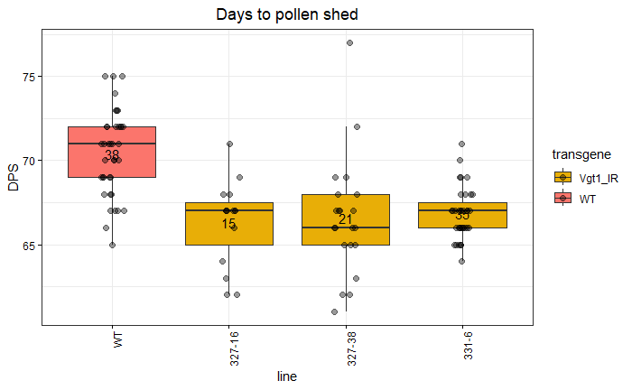

``` r
ggplot(df, aes(line, DPS, fill=experiment)) + 
  geom_boxplot(outlier.colour=NA) +
  geom_point(position=position_jitterdodge(dodge.width=0.9), 
             aes(group=experiment)) +
  ggtitle("Days to pollen shed") +  
  theme_bw() +  
  theme(plot.title = element_text(hjust = 0.5))   +
  theme(axis.text.x = element_text(color="black"),
        axis.text.y = element_text(color="black"),
        axis.ticks = element_line(color = "black")) +
  theme(plot.title = element_text(hjust = 0.5)) +
  scale_y_continuous(labels = scales::comma_format()) 
```

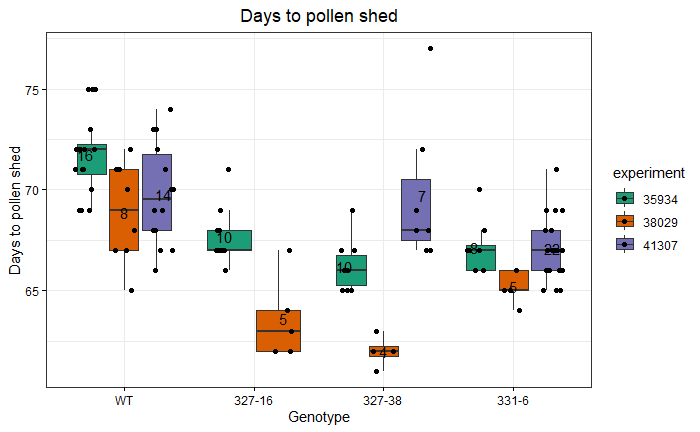

``` r
# Test homoscedasticity, if p-value > 5%, Ho all variances
# are equals is not rejected
bartlett.test(DPS~line, data=df)

#Alternatively (need library "car")
leveneTest(DPS~line, data=df)

# Normality residuals
with(df, shapiro.test(DPS))

#ANOVA
fit = aov(DPS~line + experiment, data=df)

# Check normality of residual distribution
plot(fit, which=2)

# Check independence of residuals (residual errors have a mean of zero)
plot(fit, which=1)

# Perform Dunnett posthoc test
Dunnett <- glht(fit, linfct=mcp(line = "Dunnett"), alternative="two.sided")
summary(Dunnett)
```

         Simultaneous Tests for General Linear Hypotheses

    Multiple Comparisons of Means: Dunnett Contrasts


    Fit: aov(formula = DPS ~ line + experiment)

    Linear Hypotheses:
                     Estimate Std. Error t value Pr(>|t|)    
    325-2 - WT == 0   -0.7463     0.5194  -1.437   0.5661    
    326-20 - WT == 0  -0.8279     0.6010  -1.378   0.6098    
    326-40 - WT == 0  -1.8374     0.6650  -2.763   0.0348 *  
    327-16 - WT == 0  -3.4374     0.6650  -5.169   <1e-04 ***
    327-38 - WT == 0  -3.8582     0.5806  -6.645   <1e-04 ***
    331-6 - WT == 0   -4.0094     0.5093  -7.872   <1e-04 ***
    ---
    Signif. codes:  0 ‘***’ 0.001 ‘**’ 0.01 ‘*’ 0.05 ‘.’ 0.1 ‘ ’ 1
    (Adjusted p values reported -- single-step method)

## Days to silking

``` r
ggplot(df, aes(line, silking, fill=transgene)) + 
  geom_boxplot() +  
  stat_summary(fun.data = give.n, geom = "text") + 
  ggtitle("Days to silking") +  
  theme_bw() + 
  theme(plot.title = element_text(hjust = 0.5), 
        axis.text.x = element_text(angle = 90, hjust = 1, color="black"),
        axis.text.y = element_text(color="black"), 
        axis.ticks = element_line(color = "black")) +
        theme(plot.title = element_text(hjust = 0.5)) +
        scale_y_continuous(labels = scales::comma_format()) +
        scale_fill_manual(values=c("#07B738","#E8AE07","#FB756C"))
```

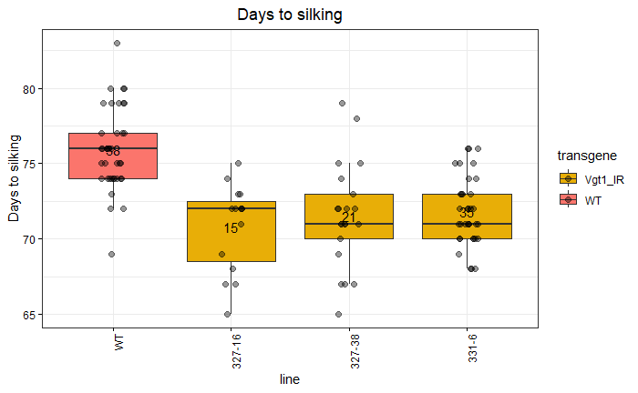

``` r
ggplot(df, aes(line, silking, fill=experiment)) + 
  geom_boxplot(outlier.colour=NA) +
  geom_point(position=position_jitterdodge(dodge.width=0.9), 
             aes(group=experiment)) +
  ggtitle("Days to silking") +  
  theme_bw() +  
  theme(plot.title = element_text(hjust = 0.5))   +
  theme(axis.text.x = element_text(color="black"),
        axis.text.y = element_text(color="black"),
        axis.ticks = element_line(color = "black")) +
  theme(plot.title = element_text(hjust = 0.5)) +
  scale_y_continuous(labels = scales::comma_format()) 
```


``` r
#Test homoscedasticity, if p-value > 5%, 
# Ho all variances are equals is not rejected
bartlett.test(silking~line, data=df)

#Alternatively (need library "car")
leveneTest(silking~line, data=df)

#ANOVA
fit = aov(silking~line + experiment, data=df)

# Check normality of residual distribution
plot(fit, which=2)

# Check independence of residuals (residual errors have a mean of zero)
plot(fit, which=1)

# Perform Dunnett posthoc test
Dunnett <- glht(fit, linfct=mcp(line = "Dunnett"), alternative="two.sided")
summary(Dunnett)
```

         Simultaneous Tests for General Linear Hypotheses

    Multiple Comparisons of Means: Dunnett Contrasts


    Fit: aov(formula = silking ~ line + experiment, data = df)

    Linear Hypotheses:
                     Estimate Std. Error t value Pr(>|t|)    
    325-2 - WT == 0   -1.3450     0.5626  -2.390    0.092 .  
    326-20 - WT == 0  -1.5062     0.6441  -2.339    0.104    
    326-40 - WT == 0  -3.2447     0.7254  -4.473   <1e-04 ***
    327-16 - WT == 0  -4.4447     0.7254  -6.127   <1e-04 ***
    327-38 - WT == 0  -4.4076     0.6337  -6.956   <1e-04 ***
    331-6 - WT == 0   -4.5252     0.5556  -8.144   <1e-04 ***
    ---
    Signif. codes:  0 ‘***’ 0.001 ‘**’ 0.01 ‘*’ 0.05 ‘.’ 0.1 ‘ ’ 1
    (Adjusted p values reported -- single-step method)

## Node number

``` r
ggplot(df, aes(line, node, fill=transgene)) + 
  geom_boxplot() +  
  stat_summary(fun.data = give.n, geom = "text") + 
  ggtitle("Node number") +  
  theme_bw() + 
  theme(plot.title = element_text(hjust = 0.5), 
        axis.text.x = element_text(angle = 90, hjust = 1, color="black"),
        axis.text.y = element_text(color="black"), 
        axis.ticks = element_line(color = "black")) +
        theme(plot.title = element_text(hjust = 0.5)) +
        scale_y_continuous(labels = scales::comma_format()) +
        scale_fill_manual(values=c("#07B738","#E8AE07","#FB756C"))
```


``` r
ggplot(df, aes(line, node, fill=experiment)) + 
  geom_boxplot(outlier.colour=NA) +
  geom_point(position=position_jitterdodge(dodge.width=0.9), 
             aes(group=experiment)) +
  ggtitle("Node number") +  
  theme_bw() +  
  theme(plot.title = element_text(hjust = 0.5))   +
  theme(axis.text.x = element_text(color="black"),
        axis.text.y = element_text(color="black"),
        axis.ticks = element_line(color = "black")) +
  theme(plot.title = element_text(hjust = 0.5)) +
  scale_y_continuous(labels = scales::comma_format()) 
```

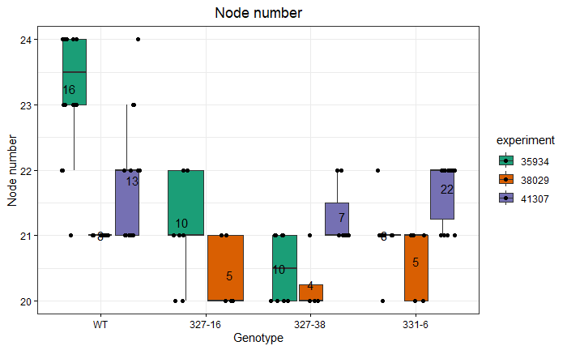

``` r
#Test homoscedasticity, if p-value > 5%, 
# Ho all variances are equals is not rejected
bartlett.test(node~line, data=df)

#Alternatively (need library "car")
leveneTest(node~line, data=df)

#ANOVA
fit = aov(node~line + experiment, data=df)

# Check normality of residual distribution
plot(fit, which=2)

# Check independence of residuals (residual errors have a mean of zero)
plot(fit, which=1)

# Perform Dunnett posthoc test
Dunnett <- glht(fit, linfct=mcp(line = "Dunnett"), alternative="two.sided")
summary(Dunnett)
```

         Simultaneous Tests for General Linear Hypotheses

    Multiple Comparisons of Means: Dunnett Contrasts


    Fit: aov(formula = node ~ line + experiment, data = df)

    Linear Hypotheses:
                     Estimate Std. Error t value Pr(>|t|)    
    325-2 - WT == 0   -0.3836     0.2007  -1.911    0.261    
    326-20 - WT == 0  -0.2505     0.2221  -1.128    0.783    
    326-40 - WT == 0   0.1854     0.2536   0.731    0.963    
    327-16 - WT == 0  -1.1479     0.2536  -4.526   <1e-04 ***
    327-38 - WT == 0  -1.5665     0.2221  -7.053   <1e-04 ***
    331-6 - WT == 0   -1.0073     0.1956  -5.150   <1e-04 ***
    ---
    Signif. codes:  0 ‘***’ 0.001 ‘**’ 0.01 ‘*’ 0.05 ‘.’ 0.1 ‘ ’ 1
    (Adjusted p values reported -- single-step method)

# Growth speed analysis

## Libraries

``` r
library(tidyverse)
library(ggplot2)
library(wesanderson)
library(RColorBrewer)
library(multcomp)
library(dunn.test)
```

    R version 4.0.3 (2020-10-10)
    Platform: x86_64-w64-mingw32/x64 (64-bit)
    Running under: Windows 10 x64 (build 19045)

    Matrix products: default

    locale:
    [1] LC_COLLATE=English_United States.1252 
    [2] LC_CTYPE=English_United States.1252   
    [3] LC_MONETARY=English_United States.1252
    [4] LC_NUMERIC=C                          
    [5] LC_TIME=English_United States.1252    

    attached base packages:
    [1] stats     graphics  grDevices utils     datasets  methods   base     

    other attached packages:
     [1] dunn.test_1.3.6    multcomp_1.4-25    TH.data_1.1-2     
     [4] MASS_7.3-60.0.1    survival_3.5-8     mvtnorm_1.2-5     
     [7] RColorBrewer_1.1-3 wesanderson_0.3.7  lubridate_1.9.3   
    [10] forcats_1.0.0      stringr_1.5.1      dplyr_1.1.0       
    [13] purrr_0.3.4        readr_2.1.5        tidyr_1.2.1       
    [16] tibble_3.2.1       ggplot2_3.4.1      tidyverse_2.0.0   

    loaded via a namespace (and not attached):
     [1] pillar_1.9.0      compiler_4.0.3    tools_4.0.3      
     [4] lattice_0.22-6    lifecycle_1.0.3   gtable_0.3.1     
     [7] timechange_0.3.0  pkgconfig_2.0.3   rlang_1.0.6      
    [10] Matrix_1.6-5      cli_3.6.2         rstudioapi_0.16.0
    [13] withr_3.0.0       generics_0.1.3    vctrs_0.5.2      
    [16] hms_1.1.3         grid_4.0.3        tidyselect_1.2.1 
    [19] glue_1.7.0        R6_2.5.1          fansi_1.0.6      
    [22] tzdb_0.4.0        magrittr_2.0.3    codetools_0.2-20 
    [25] scales_1.3.0      splines_4.0.3     colorspace_2.1-0 
    [28] sandwich_3.1-0    utf8_1.2.4        stringi_1.8.3    
    [31] munsell_0.5.1     zoo_1.8-12 

## Data

Raw data available in
<https://github.com/johanzi/scripts_zicola_vgt1/data/data/growth_rate.txt>

``` r
# Set directory to the cloned github repo scripts_zicola_vgt1
setwd("/path/to/scripts_zicola_vgt1")

# Import data
df <- read.delim("data/growth_rate.txt")
df <- df %>% mutate_at(names(data_R)[1:3], as.factor)

df <- df %>% filter(!line %in% c("N28","C22-4"))

# Order lines
df$line <- factor(df$line, levels=c("WT","327-16","327-38","331-06"))

# Plot data
ggplot(df, aes(x=stage, y=days_to_stage, fill=line)) +
  geom_boxplot() + 
  theme_bw() + 
  ylab("Days to stage") +
  ggtitle("Growth speed of with type and transgenic line") + 
  theme(axis.text.x = element_text(color="black"), 
        axis.text.y = element_text(color="black"),
        axis.ticks = element_line(color = "black")) + 
        theme(plot.title = element_text(hjust = 0.5)) + 
        scale_y_continuous(labels = scales::comma_format()) +
        scale_fill_brewer(palette="OrRd")
```

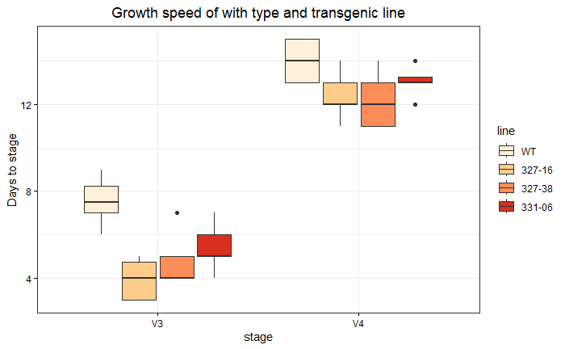

## Statistical analysis at V3

``` r
df_v3 <- df %>% subset(stage=="V3")

fit <- aov(days_to_stage ~ line, data=df_v3)

# Test homoscedasticity, if p-value > 5%, Ho all variances
# are equals is not rejected
bartlett.test(days_to_stage~line, data=df_v3)

#Alternatively (need library "car")
leveneTest(days_to_stage~line, data=df)

# Check normality of residual distribution
plot(fit, which=2)

# Check independence of residuals (residual errors have a mean of zero)
plot(fit, which=1)

summary(glht(fit, linfct=mcp(line="Dunnett"), alternative="two.sided"))
```

         Simultaneous Tests for General Linear Hypotheses

    Multiple Comparisons of Means: Dunnett Contrasts


    Fit: aov(formula = days_to_stage ~ line, data = df_v3)

    Linear Hypotheses:
                     Estimate Std. Error t value Pr(>|t|)    
    327-16 - WT == 0  -3.7222     0.3020  -12.33   <1e-10 ***
    327-38 - WT == 0  -3.1930     0.2988  -10.69   <1e-10 ***
    331-06 - WT == 0  -2.3750     0.2865   -8.29   <1e-10 ***
    ---
    Signif. codes:  0 ‘***’ 0.001 ‘**’ 0.01 ‘*’ 0.05

## Statistical analysis at V4

``` r
df_v4 <- df %>% subset(stage=="V4")

fit <- aov(days_to_stage ~ line, data=df_v4)

# Test homoscedasticity, if p-value > 5%, Ho all variances
# are equals is not rejected
bartlett.test(days_to_stage~line, data=df_v4)

#Alternatively (need library "car")
leveneTest(days_to_stage~line, data=df)

# Check normality of residual distribution
plot(fit, which=2)

# Check independence of residuals (residual errors have a mean of zero)
plot(fit, which=1)

summary(glht(fit, linfct=mcp(line="Dunnett"), alternative="two.sided"))
```

         Simultaneous Tests for General Linear Hypotheses

    Multiple Comparisons of Means: Dunnett Contrasts


    Fit: aov(formula = days_to_stage ~ line, data = df_v4)

    Linear Hypotheses:
                     Estimate Std. Error t value Pr(>|t|)    
    327-16 - WT == 0  -1.5278     0.3212  -4.756  < 0.001 ***
    327-38 - WT == 0  -2.1360     0.3178  -6.720  < 0.001 ***
    331-06 - WT == 0  -1.0417     0.3048  -3.418  0.00299 ** 
    ---
    Signif. codes:  0 ‘***’ 0.001 ‘**’ 0.01 ‘*’ 0.05 ‘.’ 0.1 ‘ ’ 1
    (Adjusted p values reported -- single-step method)

# qPCR analysis

## Libraries

``` r
library(plyr)
library(dplyr)
library(readr)
library(ggplot2)
library(ggpubr)

# Stat
library(multcomp)
library(lme4)
library(agricolae)

# Summarize lm output
library(jtools)

# Function
give.n <- function(x){
  return(c(y = mean(x), label = length(x)))
}
```

    R version 4.0.3 (2020-10-10)
    Platform: x86_64-w64-mingw32/x64 (64-bit)
    Running under: Windows 10 x64 (build 19045)

    Matrix products: default

    locale:
    [1] LC_COLLATE=English_United States.1252 
    [2] LC_CTYPE=English_United States.1252   
    [3] LC_MONETARY=English_United States.1252
    [4] LC_NUMERIC=C                          
    [5] LC_TIME=English_United States.1252    

    attached base packages:
    [1] stats     graphics  grDevices utils     datasets  methods  
    [7] base     

    other attached packages:
     [1] jtools_2.2.2    agricolae_1.3-7 lme4_1.1-35.3  
     [4] Matrix_1.6-5    multcomp_1.4-25 TH.data_1.1-2  
     [7] MASS_7.3-60.0.1 survival_3.5-8  mvtnorm_1.2-5  
    [10] ggpubr_0.4.0    ggplot2_3.4.1   readr_2.1.5    
    [13] dplyr_1.1.0     plyr_1.8.9     

    loaded via a namespace (and not attached):
     [1] zoo_1.8-12        tidyselect_1.2.1  xfun_0.37        
     [4] pander_0.6.5      purrr_0.3.4       splines_4.0.3    
     [7] lattice_0.22-6    carData_3.0-5     colorspace_2.1-0 
    [10] vctrs_0.5.2       generics_0.1.3    AlgDesign_1.2.1  
    [13] utf8_1.2.4        rlang_1.0.6       pillar_1.9.0     
    [16] nloptr_2.0.3      glue_1.7.0        withr_3.0.0      
    [19] lifecycle_1.0.3   munsell_0.5.1     ggsignif_0.6.4   
    [22] gtable_0.3.1      codetools_0.2-20  knitr_1.42       
    [25] tzdb_0.4.0        fansi_1.0.6       broom_1.0.6      
    [28] Rcpp_1.0.12       backports_1.4.1   scales_1.3.0     
    [31] abind_1.4-5       digest_0.6.27     hms_1.1.3        
    [34] rstatix_0.7.2     grid_4.0.3        cli_3.6.2        
    [37] tools_4.0.3       sandwich_3.1-0    magrittr_2.0.3   
    [40] tibble_3.2.1      cluster_2.1.6     crayon_1.5.2     
    [43] car_3.1-2         tidyr_1.2.1       pkgconfig_2.0.3  
    [46] minqa_1.2.7       rstudioapi_0.16.0 R6_2.5.1         
    [49] boot_1.3-30       nlme_3.1-165      compiler_4.0.3 

## Data

``` r
# Set directory to the cloned github repo scripts_zicola_vgt1
setwd("/path/to/scripts_zicola_vgt1")

# Import dataframe
df <- read_delim("data/data_qPCR.txt", "\t", 
    escape_double = FALSE, show_col_types = FALSE)

# Create a new variable merging part and stage
df$tissue = paste(df$stage, df$part, sep="_")

df <- df %>% relocate(tissue, .before=stage)

# Change into factor the 4 first columns
df <- df %>% mutate_at(1:4, factor)

# Change the rest into integers
df <- df %>% mutate_at(5:7, as.numeric)

# Order genotype
df$genotype <- factor(df$genotype, levels=c("WT", "327-38"))
```

For the analysis, we performed for each stage and leaf part a comparison
between WT and the IR-Vgt1 transgenic line 327-38. In each case, we
assessed if the variances were equal between group, then used a t-test.
If the variances were unequal, we used the Welch’s test, which does not
rely on the assumption of homoscedasticity.

## ZmRap2.7 expression analysis

### ZmRap2.7 expression in V3L4

``` r
df %>% filter(stage=="V3L4") %>% ggplot(aes(x=part, y=ZmRap27, fill=genotype)) +
  geom_boxplot(outlier.shape=NA) + 
  geom_point(position=position_jitterdodge(dodge.width=0.9), aes(fill=genotype)) + 
  theme_bw() + ggtitle("qPCR ZmRap2.7 expression in V3L4") +
  ylab("Normalized ZmRap2.7 expression") +
  xlab("Leaf part") +
  scale_fill_manual(values=c("#FB756C","#FFBE03")) +
  theme(axis.text.x = element_text(color="black"),
        axis.text.y = element_text(color="black"),
        axis.ticks = element_line(color = "black")) + 
  theme(plot.title = element_text(hjust = 0.5)) +
  scale_y_continuous(limits=c(0,6.2), breaks=seq(0,6.2,2))
```

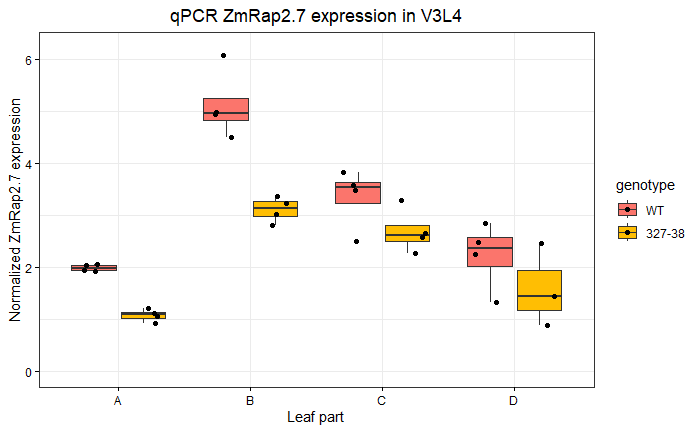

``` r
# Test egality in variance in each leaf part
bartlett.test(ZmRap27~genotype, data=df[(df$stage=="V3L4" & df$part=="A"),])
bartlett.test(ZmRap27~genotype, data=df[(df$stage=="V3L4" & df$part=="B"),])
bartlett.test(ZmRap27~genotype, data=df[(df$stage=="V3L4" & df$part=="C"),])
bartlett.test(ZmRap27~genotype, data=df[(df$stage=="V3L4" & df$part=="D"),])

# Perform T-test for each leaf part
with(df[(df$stage=="V3L4" & df$part=="A"),] , 
     t.test(ZmRap27[genotype=="WT"], ZmRap27[genotype=="327-38"], var.equal = TRUE))
with(df[(df$stage=="V3L4" & df$part=="B"),] , 
     t.test(ZmRap27[genotype=="WT"], ZmRap27[genotype=="327-38"], var.equal = TRUE))
with(df[(df$stage=="V3L4" & df$part=="C"),] , 
     t.test(ZmRap27[genotype=="WT"], ZmRap27[genotype=="327-38"], var.equal = TRUE))
with(df[(df$stage=="V3L4" & df$part=="D"),] , 
     t.test(ZmRap27[genotype=="WT"], ZmRap27[genotype=="327-38"], var.equal = TRUE))
```

### ZmRap2.7 expression in V4L5

``` r
df %>% filter(stage=="V4L5") %>% ggplot(aes(x=part, y=ZmRap27, fill=genotype)) +
  geom_boxplot(outlier.shape=NA) + 
  geom_point(position=position_jitterdodge(dodge.width=0.9), aes(fill=genotype)) + 
  theme_bw() + ggtitle("qPCR ZmRap2.7 expression in V4L5") +
  ylab("Normalized ZmRap2.7 expression") +
  xlab("Leaf part") +
  scale_fill_manual(values=c("#FB756C","#FFBE03")) +
  theme(axis.text.x = element_text(color="black"),
        axis.text.y = element_text(color="black"),
        axis.ticks = element_line(color = "black")) + 
  theme(plot.title = element_text(hjust = 0.5)) +
  scale_y_continuous(limits=c(0,6.2), breaks=seq(0,6.2,2))
```

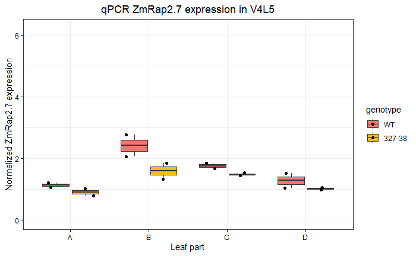

``` r
# Test egality in variance in each leaf part
bartlett.test(ZmRap27~genotype, data=df[(df$stage=="V4L5" & df$part=="A"),])
bartlett.test(ZmRap27~genotype, data=df[(df$stage=="V4L5" & df$part=="B"),])
bartlett.test(ZmRap27~genotype, data=df[(df$stage=="V4L5" & df$part=="C"),])
bartlett.test(ZmRap27~genotype, data=df[(df$stage=="V4L5" & df$part=="D"),])

# Perform T-test for each leaf part
with(df[(df$stage=="V4L5" & df$part=="A"),] , 
     t.test(ZmRap27[genotype=="WT"], ZmRap27[genotype=="327-38"], var.equal = TRUE))
with(df[(df$stage=="V4L5" & df$part=="B"),] , 
     t.test(ZmRap27[genotype=="WT"], ZmRap27[genotype=="327-38"], var.equal = TRUE))
with(df[(df$stage=="V4L5" & df$part=="C"),] , 
     t.test(ZmRap27[genotype=="WT"], ZmRap27[genotype=="327-38"], var.equal = TRUE))
with(df[(df$stage=="V4L5" & df$part=="D"),] , 
     t.test(ZmRap27[genotype=="WT"], ZmRap27[genotype=="327-38"], var.equal = TRUE))
```

### ZmRap2.7 expression in V5L6

``` r
df %>% filter(stage=="V5L6") %>% ggplot(aes(x=part, y=ZmRap27, fill=genotype)) +
  geom_boxplot(outlier.shape=NA) + 
  geom_point(position=position_jitterdodge(dodge.width=0.9), aes(fill=genotype)) + 
  theme_bw() + ggtitle("qPCR ZmRap2.7 expression in V5L6") +
  ylab("Normalized ZmRap2.7 expression") +
  xlab("Leaf part") +
  scale_fill_manual(values=c("#FB756C","#FFBE03")) +
  theme(axis.text.x = element_text(color="black"),
        axis.text.y = element_text(color="black"),
        axis.ticks = element_line(color = "black")) + 
  theme(plot.title = element_text(hjust = 0.5)) +
  scale_y_continuous(limits=c(0,6.2), breaks=seq(0,6.2,2))
```

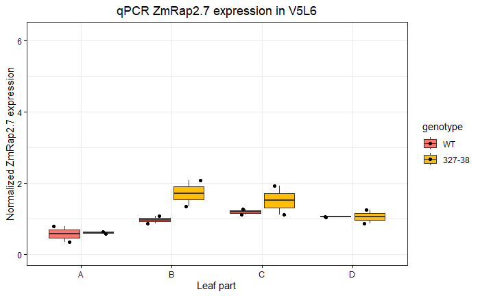

``` r
# Test egality in variance in each leaf part
bartlett.test(ZmRap27~genotype, data=df[(df$stage=="V5L6" & df$part=="A"),])
bartlett.test(ZmRap27~genotype, data=df[(df$stage=="V5L6" & df$part=="B"),])
bartlett.test(ZmRap27~genotype, data=df[(df$stage=="V5L6" & df$part=="C"),])
bartlett.test(ZmRap27~genotype, data=df[(df$stage=="V5L6" & df$part=="D"),])

# Perform T-test for each leaf part
with(df[(df$stage=="V5L6" & df$part=="A"),] , 
     t.test(ZmRap27[genotype=="WT"], ZmRap27[genotype=="327-38"], var.equal = TRUE))
with(df[(df$stage=="V5L6" & df$part=="B"),] , 
     t.test(ZmRap27[genotype=="WT"], ZmRap27[genotype=="327-38"], var.equal = TRUE))
with(df[(df$stage=="V5L6" & df$part=="C"),] , 
     t.test(ZmRap27[genotype=="WT"], ZmRap27[genotype=="327-38"], var.equal = TRUE))
with(df[(df$stage=="V5L6" & df$part=="D"),] , 
     t.test(ZmRap27[genotype=="WT"], ZmRap27[genotype=="327-38"], var.equal = TRUE))
```

## ZCN8 expression analysis

### ZCN8 expression in V3L4

``` r
df %>% filter(stage=="V3L4") %>% ggplot(aes(x=part, y=ZCN8, fill=genotype)) +
  geom_boxplot(outlier.shape=NA) + 
  geom_point(position=position_jitterdodge(dodge.width=0.9), aes(fill=genotype)) + 
  theme_bw() + ggtitle("qPCR ZCN8 expression in V3L4") +
  ylab("Normalized ZCN8 expression") +
  xlab("Leaf part") +
  scale_fill_manual(values=c("#FB756C","#FFBE03")) +
  theme(axis.text.x = element_text(color="black"),
        axis.text.y = element_text(color="black"),
        axis.ticks = element_line(color = "black")) + 
  theme(plot.title = element_text(hjust = 0.5)) + 
  scale_y_continuous(limits=c(0,80), breaks=seq(0,80,10))
```

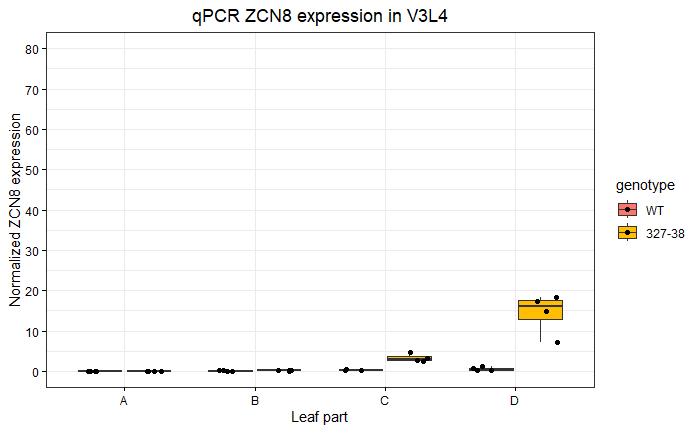

``` r
# Test egality in variance in each leaf part
bartlett.test(ZCN8~genotype, data=df[(df$stage=="V3L4" & df$part=="A"),])
bartlett.test(ZCN8~genotype, data=df[(df$stage=="V3L4" & df$part=="B"),])
bartlett.test(ZCN8~genotype, data=df[(df$stage=="V3L4" & df$part=="C"),])
bartlett.test(ZCN8~genotype, data=df[(df$stage=="V3L4" & df$part=="D"),])

# Perform T-test for each leaf part
with(df[(df$stage=="V3L4" & df$part=="A"),] , 
     t.test(ZCN8[genotype=="WT"], ZCN8[genotype=="327-38"], var.equal = TRUE))
with(df[(df$stage=="V3L4" & df$part=="B"),] , 
     t.test(ZCN8[genotype=="WT"], ZCN8[genotype=="327-38"], var.equal = TRUE))
with(df[(df$stage=="V3L4" & df$part=="C"),] , 
     t.test(ZCN8[genotype=="WT"], ZCN8[genotype=="327-38"], var.equal = FALSE))
with(df[(df$stage=="V3L4" & df$part=="D"),] , 
     t.test(ZCN8[genotype=="WT"], ZCN8[genotype=="327-38"], var.equal = FALSE))
```

### ZCN8 expression in V4L5

``` r
df %>% filter(stage=="V4L5") %>% ggplot(aes(x=part, y=ZCN8, fill=genotype)) +
  geom_boxplot(outlier.shape=NA) + 
  geom_point(position=position_jitterdodge(dodge.width=0.9), aes(fill=genotype)) + 
  theme_bw() + ggtitle("qPCR ZCN8 expression in V4L5") +
  ylab("Normalized ZCN8 expression") +
  xlab("Leaf part") +
  scale_fill_manual(values=c("#FB756C","#FFBE03")) +
  theme(axis.text.x = element_text(color="black"),
        axis.text.y = element_text(color="black"),
        axis.ticks = element_line(color = "black")) + 
  theme(plot.title = element_text(hjust = 0.5)) + 
  scale_y_continuous(limits=c(0,80), breaks=seq(0,80,10))
```

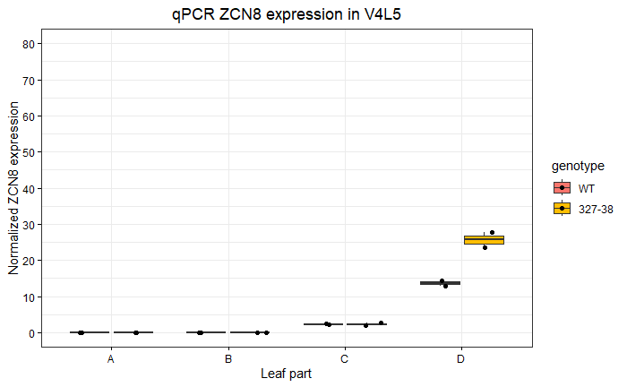

``` r
# Test egality in variance in each leaf part
bartlett.test(ZCN8~genotype, data=df[(df$stage=="V4L5" & df$part=="A"),])
bartlett.test(ZCN8~genotype, data=df[(df$stage=="V4L5" & df$part=="B"),])
bartlett.test(ZCN8~genotype, data=df[(df$stage=="V4L5" & df$part=="C"),])
bartlett.test(ZCN8~genotype, data=df[(df$stage=="V4L5" & df$part=="D"),])

# Perform T-test for each leaf part
with(df[(df$stage=="V4L5" & df$part=="A"),] , 
     t.test(ZCN8[genotype=="WT"], ZCN8[genotype=="327-38"], var.equal = FALSE))
with(df[(df$stage=="V4L5" & df$part=="B"),] , 
     t.test(ZCN8[genotype=="WT"], ZCN8[genotype=="327-38"], var.equal = TRUE))
with(df[(df$stage=="V4L5" & df$part=="C"),] , 
     t.test(ZCN8[genotype=="WT"], ZCN8[genotype=="327-38"], var.equal = TRUE))
with(df[(df$stage=="V4L5" & df$part=="D"),] , 
     t.test(ZCN8[genotype=="WT"], ZCN8[genotype=="327-38"], var.equal = TRUE))
```

### ZCN8 expression in V5L6

``` r
df %>% filter(stage=="V5L6") %>% ggplot(aes(x=part, y=ZCN8, fill=genotype)) +
  geom_boxplot(outlier.shape=NA) + 
  geom_point(position=position_jitterdodge(dodge.width=0.9), aes(fill=genotype)) + 
  theme_bw() + ggtitle("qPCR ZCN8 expression in V5L6") +
  ylab("Normalized ZCN8 expression") +
  xlab("Leaf part") +
  scale_fill_manual(values=c("#FB756C","#FFBE03")) +
  theme(axis.text.x = element_text(color="black"),
        axis.text.y = element_text(color="black"),
        axis.ticks = element_line(color = "black")) + 
  theme(plot.title = element_text(hjust = 0.5)) + 
  scale_y_continuous(limits=c(0,80), breaks=seq(0,80,10))
```

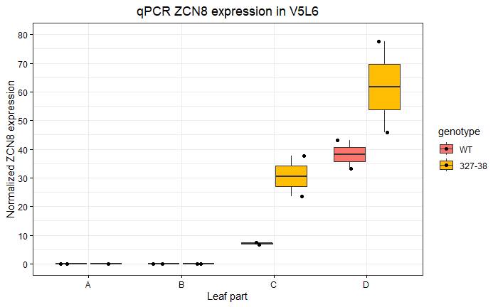

``` r
# Test egality in variance in each leaf part
bartlett.test(ZCN8~genotype, data=df[(df$stage=="V4L5" & df$part=="A"),])
bartlett.test(ZCN8~genotype, data=df[(df$stage=="V4L5" & df$part=="B"),])
bartlett.test(ZCN8~genotype, data=df[(df$stage=="V4L5" & df$part=="C"),])
bartlett.test(ZCN8~genotype, data=df[(df$stage=="V4L5" & df$part=="D"),])

# Perform T-test for each leaf part
with(df[(df$stage=="V4L5" & df$part=="A"),] , 
     t.test(ZCN8[genotype=="WT"], ZCN8[genotype=="327-38"], var.equal = FALSE))
with(df[(df$stage=="V4L5" & df$part=="B"),] , 
     t.test(ZCN8[genotype=="WT"], ZCN8[genotype=="327-38"], var.equal = TRUE))
with(df[(df$stage=="V4L5" & df$part=="C"),] , 
     t.test(ZCN8[genotype=="WT"], ZCN8[genotype=="327-38"], var.equal = TRUE))
with(df[(df$stage=="V4L5" & df$part=="D"),] , 
     t.test(ZCN8[genotype=="WT"], ZCN8[genotype=="327-38"], var.equal = TRUE))
```

## ZmMADS4 expression analysis

### ZmMADS4 expression in V3L4

``` r
df %>% filter(stage=="V3L4") %>% ggplot(aes(x=part, y=ZmMADS4, fill=genotype)) +
  geom_boxplot(outlier.shape=NA) + 
  geom_point(position=position_jitterdodge(dodge.width=0.9), aes(fill=genotype)) + 
  theme_bw() + ggtitle("qPCR ZmMADS4 expression in V3L4") +
  ylab("Normalized ZmMADS4 expression") +
  xlab("Leaf part") +
  scale_fill_manual(values=c("#FB756C","#FFBE03")) +
  theme(axis.text.x = element_text(color="black"),
        axis.text.y = element_text(color="black"),
        axis.ticks = element_line(color = "black")) + 
  theme(plot.title = element_text(hjust = 0.5)) + 
  scale_y_continuous(limits=c(0,10), breaks=seq(0,10,2))
```

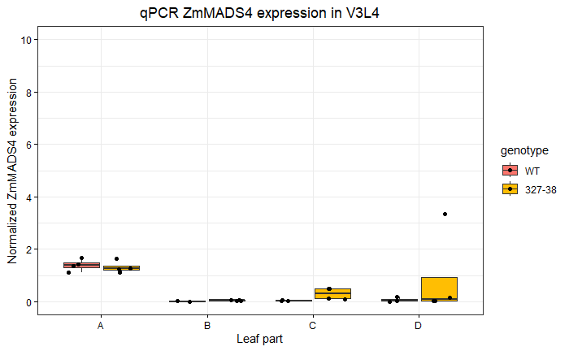

``` r
# Test egality in variance in each leaf part
bartlett.test(ZmMADS4~genotype, data=df[(df$stage=="V3L4" & df$part=="A"),])
bartlett.test(ZmMADS4~genotype, data=df[(df$stage=="V3L4" & df$part=="B"),])
bartlett.test(ZmMADS4~genotype, data=df[(df$stage=="V3L4" & df$part=="C"),])
bartlett.test(ZmMADS4~genotype, data=df[(df$stage=="V3L4" & df$part=="D"),])

# Perform T-test for each leaf part
with(df[(df$stage=="V3L4" & df$part=="A"),] , 
     t.test(ZmMADS4[genotype=="WT"], ZmMADS4[genotype=="327-38"], var.equal = TRUE))
with(df[(df$stage=="V3L4" & df$part=="B"),] , 
     t.test(ZmMADS4[genotype=="WT"], ZmMADS4[genotype=="327-38"], var.equal = TRUE))
with(df[(df$stage=="V3L4" & df$part=="C"),] , 
     t.test(ZmMADS4[genotype=="WT"], ZmMADS4[genotype=="327-38"], var.equal = FALSE))
with(df[(df$stage=="V3L4" & df$part=="D"),] , 
     t.test(ZmMADS4[genotype=="WT"], ZmMADS4[genotype=="327-38"], var.equal = FALSE))
```

### ZmMADS4 expression in V4L5

``` r
df %>% filter(stage=="V4L5") %>% ggplot(aes(x=part, y=ZmMADS4, fill=genotype)) +
  geom_boxplot(outlier.shape=NA) + 
  geom_point(position=position_jitterdodge(dodge.width=0.9), aes(fill=genotype)) + 
  theme_bw() + ggtitle("qPCR ZmMADS4 expression in V4L5") +
  ylab("Normalized ZmMADS4 expression") +
  xlab("Leaf part") +
  scale_fill_manual(values=c("#FB756C","#FFBE03")) +
  theme(axis.text.x = element_text(color="black"),
        axis.text.y = element_text(color="black"),
        axis.ticks = element_line(color = "black")) + 
  theme(plot.title = element_text(hjust = 0.5)) + 
  scale_y_continuous(limits=c(0,10), breaks=seq(0,10,2))
```

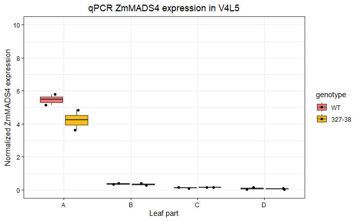

``` r
# Test egality in variance in each leaf part
bartlett.test(ZmMADS4~genotype, data=df[(df$stage=="V4L5" & df$part=="A"),])
bartlett.test(ZmMADS4~genotype, data=df[(df$stage=="V4L5" & df$part=="B"),])
bartlett.test(ZmMADS4~genotype, data=df[(df$stage=="V4L5" & df$part=="C"),])
bartlett.test(ZmMADS4~genotype, data=df[(df$stage=="V4L5" & df$part=="D"),])

# Perform T-test for each leaf part
with(df[(df$stage=="V4L5" & df$part=="A"),] , 
     t.test(ZmMADS4[genotype=="WT"], ZmMADS4[genotype=="327-38"], var.equal = TRUE))
with(df[(df$stage=="V4L5" & df$part=="B"),] , 
     t.test(ZmMADS4[genotype=="WT"], ZmMADS4[genotype=="327-38"], var.equal = TRUE))
with(df[(df$stage=="V4L5" & df$part=="C"),] , 
     t.test(ZmMADS4[genotype=="WT"], ZmMADS4[genotype=="327-38"], var.equal = FALSE))
with(df[(df$stage=="V4L5" & df$part=="D"),] , 
     t.test(ZmMADS4[genotype=="WT"], ZmMADS4[genotype=="327-38"], var.equal = TRUE))
```

### ZmMADS4 expression in V5L6

``` r
df %>% filter(stage=="V5L6") %>% ggplot(aes(x=part, y=ZmMADS4, fill=genotype)) +
  geom_boxplot(outlier.shape=NA) + 
  geom_point(position=position_jitterdodge(dodge.width=0.9), aes(fill=genotype)) + 
  theme_bw() + ggtitle("qPCR ZmMADS4 expression in V5L6") +
  ylab("Normalized ZmMADS4 expression") +
  xlab("Leaf part") +
  scale_fill_manual(values=c("#FB756C","#FFBE03")) +
  theme(axis.text.x = element_text(color="black"),
        axis.text.y = element_text(color="black"),
        axis.ticks = element_line(color = "black")) + 
  theme(plot.title = element_text(hjust = 0.5)) + 
  scale_y_continuous(limits=c(0,10), breaks=seq(0,10,2))
```

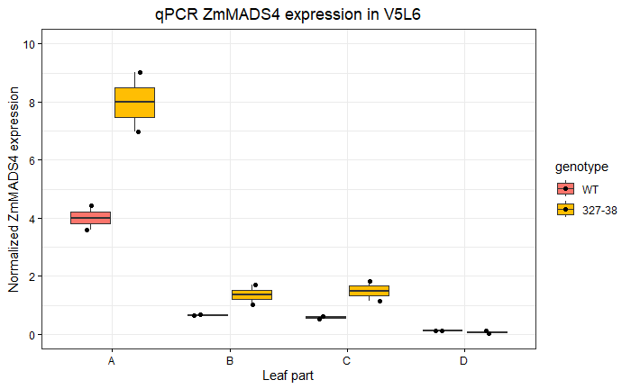

``` r
# Test egality in variance in each leaf part
bartlett.test(ZmMADS4~genotype, data=df[(df$stage=="V4L5" & df$part=="A"),])
bartlett.test(ZmMADS4~genotype, data=df[(df$stage=="V4L5" & df$part=="B"),])
bartlett.test(ZmMADS4~genotype, data=df[(df$stage=="V4L5" & df$part=="C"),])
bartlett.test(ZmMADS4~genotype, data=df[(df$stage=="V4L5" & df$part=="D"),])

# Perform T-test for each leaf part
with(df[(df$stage=="V4L5" & df$part=="A"),] , 
     t.test(ZmMADS4[genotype=="WT"], ZmMADS4[genotype=="327-38"], var.equal = TRUE))
with(df[(df$stage=="V4L5" & df$part=="B"),] , 
     t.test(ZmMADS4[genotype=="WT"], ZmMADS4[genotype=="327-38"], var.equal = TRUE))
with(df[(df$stage=="V4L5" & df$part=="C"),] , 
     t.test(ZmMADS4[genotype=="WT"], ZmMADS4[genotype=="327-38"], var.equal = FALSE))
with(df[(df$stage=="V4L5" & df$part=="D"),] , 
     t.test(ZmMADS4[genotype=="WT"], ZmMADS4[genotype=="327-38"], var.equal = TRUE))
```

# RNA-seq analysis

## Libraries

``` r
library(dplyr)
library(readr) # Import csv files
library(ggplot2)
library(ggpubr) # Easy plotting
library(car)
library(forcats) # Reordering factors (tidyverse)
library(tidyr)
library(kableExtra) # Nice table display
library(reshape2)
library(gridExtra) # Diplays plot side by side
library(VennDiagram)
library(DESeq2)
library(GeneOverlap)
library(tidyverse)
library(viridis)

# Import GO functions (git clone https://github.com/johanzi/GOMAP_maize_B73_NAM5)
source("/path/to/GOMAP_maize_B73_NAM5/go_functions.R", chdir = T)
```

    R version 4.0.3 (2020-10-10)
    Platform: x86_64-w64-mingw32/x64 (64-bit)
    Running under: Windows 10 x64 (build 19045)

    Matrix products: default

    locale:
    [1] LC_COLLATE=English_United States.1252 
    [2] LC_CTYPE=English_United States.1252   
    [3] LC_MONETARY=English_United States.1252
    [4] LC_NUMERIC=C                          
    [5] LC_TIME=English_United States.1252    

    attached base packages:
     [1] parallel  stats4    grid      stats     graphics  grDevices
     [7] utils     datasets  methods   base     

    other attached packages:
     [1] viridis_0.6.5               viridisLite_0.4.2          
     [3] lubridate_1.9.3             stringr_1.5.1              
     [5] purrr_0.3.4                 tibble_3.2.1               
     [7] tidyverse_2.0.0             GeneOverlap_1.24.0         
     [9] DESeq2_1.28.1               SummarizedExperiment_1.18.2
    [11] DelayedArray_0.14.1         matrixStats_1.3.0          
    [13] Biobase_2.48.0              GenomicRanges_1.40.0       
    [15] GenomeInfoDb_1.24.2         IRanges_2.22.2             
    [17] S4Vectors_0.26.1            BiocGenerics_0.34.0        
    [19] VennDiagram_1.7.3           futile.logger_1.4.3        
    [21] gridExtra_2.3               reshape2_1.4.4             
    [23] kableExtra_1.4.0            tidyr_1.2.1                
    [25] forcats_1.0.0               car_3.1-2                  
    [27] carData_3.0-5               ggpubr_0.4.0               
    [29] ggplot2_3.4.1               readr_2.1.5                
    [31] dplyr_1.1.0                

    loaded via a namespace (and not attached):
     [1] bitops_1.0-7           bit64_4.0.5           
     [3] RColorBrewer_1.1-3     tools_4.0.3           
     [5] backports_1.4.1        utf8_1.2.4            
     [7] R6_2.5.1               KernSmooth_2.23-24    
     [9] DBI_1.2.3              colorspace_2.1-0      
    [11] withr_3.0.0            tidyselect_1.2.1      
    [13] bit_4.0.5              compiler_4.0.3        
    [15] cli_3.6.2              formatR_1.14          
    [17] xml2_1.3.5             caTools_1.18.2        
    [19] scales_1.3.0           genefilter_1.70.0     
    [21] systemfonts_1.0.6      digest_0.6.27         
    [23] rmarkdown_2.25         svglite_2.1.3         
    [25] XVector_0.28.0         pkgconfig_2.0.3       
    [27] htmltools_0.5.2        fastmap_1.1.0         
    [29] rlang_1.0.6            rstudioapi_0.16.0     
    [31] RSQLite_2.3.7          generics_0.1.3        
    [33] gtools_3.9.5           BiocParallel_1.22.0   
    [35] RCurl_1.98-1.5         magrittr_2.0.3        
    [37] GenomeInfoDbData_1.2.3 Matrix_1.6-5          
    [39] Rcpp_1.0.12            munsell_0.5.1         
    [41] fansi_1.0.6            abind_1.4-5           
    [43] lifecycle_1.0.3        stringi_1.8.3         
    [45] zlibbioc_1.34.0        gplots_3.1.3.1        
    [47] plyr_1.8.9             blob_1.2.4            
    [49] lattice_0.22-6         splines_4.0.3         
    [51] annotate_1.66.0        hms_1.1.3             
    [53] locfit_1.5-9.4         knitr_1.42            
    [55] pillar_1.9.0           ggsignif_0.6.4        
    [57] geneplotter_1.66.0     futile.options_1.0.1  
    [59] XML_3.99-0.8           glue_1.7.0            
    [61] evaluate_0.24.0        lambda.r_1.2.4        
    [63] vctrs_0.5.2            tzdb_0.4.0            
    [65] gtable_0.3.1           cachem_1.0.6          
    [67] xfun_0.37              xtable_1.8-4          
    [69] broom_1.0.6            rstatix_0.7.2         
    [71] survival_3.5-8         AnnotationDbi_1.50.3  
    [73] memoise_2.0.1          timechange_0.3.0 

## Data

Fastq files for the 24 samples are available on NCBI PRJNA1110215.

| Accession   | line           | genotype | leaf_part |
|-------------|----------------|----------|-----------|
| SRR28994749 | Vgt1_IR_327_38 | Vgt1_IR  | B         |
| SRR28994748 | Vgt1_IR_327_38 | Vgt1_IR  | B         |
| SRR28994737 | Vgt1_IR_327_38 | Vgt1_IR  | B         |
| SRR28994732 | Vgt1_IR_327_38 | Vgt1_IR  | B         |
| SRR28994731 | Vgt1_IR_327_38 | Vgt1_IR  | D         |
| SRR28994730 | Vgt1_IR_327_38 | Vgt1_IR  | D         |
| SRR28994729 | Vgt1_IR_327_38 | Vgt1_IR  | D         |
| SRR28994728 | Vgt1_IR_327_38 | Vgt1_IR  | D         |
| SRR28994727 | Vgt1_IR_331_06 | Vgt1_IR  | B         |
| SRR28994726 | Vgt1_IR_331_06 | Vgt1_IR  | B         |
| SRR28994747 | Vgt1_IR_331_06 | Vgt1_IR  | B         |
| SRR28994746 | Vgt1_IR_331_06 | Vgt1_IR  | B         |
| SRR28994745 | Vgt1_IR_331_06 | Vgt1_IR  | D         |
| SRR28994744 | Vgt1_IR_331_06 | Vgt1_IR  | D         |
| SRR28994743 | Vgt1_IR_331_06 | Vgt1_IR  | D         |
| SRR28994742 | Vgt1_IR_331_06 | Vgt1_IR  | D         |
| SRR28994741 | WT_B104        | WT       | B         |
| SRR28994740 | WT_B104        | WT       | B         |
| SRR28994739 | WT_B104        | WT       | B         |
| SRR28994738 | WT_B104        | WT       | B         |
| SRR28994736 | WT_B104        | WT       | D         |
| SRR28994735 | WT_B104        | WT       | D         |
| SRR28994734 | WT_B104        | WT       | D         |
| SRR28994733 | WT_B104        | WT       | D         |

``` bash

while read i; do
    echo "/home/zicola/bin/sratoolkit.3.0.7-ubuntu64/bin/fasterq-dump $i -e 8"
    /home/zicola/bin/sratoolkit.3.0.7-ubuntu64/bin/fasterq-dump $i -e 8
done < <(cut -f1 list_SRR.txt)

# Compress all fastq files
gzip *fastq
```

## Adapter trimming

considering all 50 bp bases are above the Q-value 30 for quality. The
adapter content is pretty low and toward the end of the reads (top 1.28%
of the reads at base 50).

There are some content bias for the firs 9 bp but they are probably due
to the octomer of H used to random 5’ breath priming in the library
prep. I should keep them for the mapping.

## Mapping on B73 NAM5 reference

Download fasta and gtf files.

``` bash
cd ~/genomes/maize_B73/B73_NAM5

# Fasta
server="ftp://ftp.ensemblgenomes.org/pub/plants/release-51"

wget ${server}/fasta/zea_mays/dna/Zea_mays.Zm-B73-REFERENCE-NAM5.0.dna.toplevel.fa.gz

# GTF file
wget ${server}/gtf/zea_mays/Zea_mays.Zm-B73-REFERENCE-NAM5.0.51.gtf.gz

# Modify chromosome names to have chr1, ...
sed -i 's/^>\([1-9]\)/>chr\1/g' Zea_mays.Zm-B73-REFERENCE-NAM5.0.dna.toplevel.fa

# Same for GTF file
sed -i 's/^[1-9]/chr&/g' Zea_mays.Zm-B73-REFERENCE-NAM5.0.51.gtf

# Remove contigs from fasta and gtf files
sed '/^scaf/d' Zea_mays.Zm-B73-REFERENCE-NAM5.0.dna.toplevel.fa \
  > Zea_mays.Zm-B73-REFERENCE-NAM5.0.dna.toplevel.wo_contigs.fa
  
sed '/^scaf/d' Zea_mays.Zm-B73-REFERENCE-NAM5.0.51.gtf \
  > Zea_mays.Zm-B73-REFERENCE-NAM5.0.51.wo_contigs.gtf
```

## Genome index

``` bash
# Load mapper
module load hisat2/2.1.0

# Create reference genome with indexes having for prefix B73_NAM5
hisat2-build Zea_mays.Zm-B73-REFERENCE-NAM5.0.dna.toplevel.wo_contigs.fa B73_NAM5
```

## Mapping

Map reads with hisat2 (v2.1.0).

``` bash

#!/bin/bash
#SBATCH --job-name=hisat2
#SBATCH --cpus-per-task=8
#SBATCH --time=06:00:00
#SBATCH -o hisat2.o%j
#SBATCH --partition=medium

module load spack-user
module load hisat2/2.1.0
module load samtools/1.9 

outputdir="/path/to/output"

fastqc_path="/path/to/raw_fastq"

index_file="/path/to/index/B73_NAM5"

# Loop for mapping
for i in $fastqc_path/J*/*1.fq.gz; do
  name_fastq=$(basename "$i" | cut -d. -f1 | cut -d_ -f5)
  if [ -e ${outputdir}/${name_fastq}.bam ]; then
    echo "${outputdir}/${name_fastq}.bam already exists"
  else
    hisat2 -p $SLURM_CPUS_PER_TASK --rna-strandness F --dta -x $index_file -U $i | \
      tee >(samtools flagstat - > ${outputdir}/${name_fastq}.flagstat) | \
      samtools sort -O BAM | \
      tee ${outputdir}/${name_fastq}.bam | \
      samtools index - ${outputdir}/${name_fastq}.bam.bai
  fi
done
```

## Read count

``` bash

#!/bin/bash
#SBATCH --job-name=htseq
#SBATCH --cpus-per-task=8
#SBATCH --time=05:00:00
#SBATCH -o hisat2.o%j
#SBATCH --partition=medium

module load htseq/0.6.1
module load samtools/1.9

bam_dir="/path/to/mapping_hisat2_NAM5"
gtf_file="/path/to/Zea_mays.Zm-B73-REFERENCE-NAM5.0.51.wo_contigs.gtf"
output="/path/to/output"

for i in ${bam_dir}/*bam; do
    name_file=$(basename $i | cut -d. -f1 -)
    if [ ! -e ${output}/${name_file}.count ]; then
      samtools view -F 4 $i | htseq-count -s yes \
        -t exon -i gene_id - $gtf_file > ${output}/${name_file}.count
  fi
done
```

## Read count matrix

gather read counts for each gene in one matrix, genes in row, samples in
columns.

``` bash

# Get script from my Git
wget https://raw.githubusercontent.com/johanzi/RNA-seq_pipeline/master/merge_counts.sh

# Create list_file_counts.txt and sample_names.txt file, 
# I would use the library code for sample names
for i in *count; do
  echo $i >> list_file_counts.txt
  echo $i | cut -d. -f1 >> sample_names.txt
done

# Merge into cts.txt file (genes in rows, samples in columns)
bash merge_counts.sh list_file_counts.txt sample_names.txt > cts.txt
```

The `cts.txt` file is available on github
(<https://github.com/johanzi/scripts_zicola_vgt1/data/cts.txt>).

## coldata file

| sample | line      | genotype | stage | leaf_part |
|--------|-----------|----------|-------|-----------|
| J306   | WT        | WT       | V3L4  | D         |
| J308   | WT        | WT       | V3L4  | B         |
| J310   | WT        | WT       | V3L4  | D         |
| J312   | WT        | WT       | V3L4  | B         |
| J314   | WT        | WT       | V3L4  | D         |
| J316   | WT        | WT       | V3L4  | B         |
| J324   | WT        | WT       | V3L4  | B         |
| J326   | WT        | WT       | V3L4  | D         |
| J352   | IR_327-38 | Vgt1_IR  | V3L4  | B         |
| J354   | IR_327-38 | Vgt1_IR  | V3L4  | D         |
| J356   | IR_327-38 | Vgt1_IR  | V3L4  | B         |
| J358   | IR_327-38 | Vgt1_IR  | V3L4  | D         |
| J360   | IR_327-38 | Vgt1_IR  | V3L4  | B         |
| J362   | IR_327-38 | Vgt1_IR  | V3L4  | D         |
| J372   | IR_327-38 | Vgt1_IR  | V3L4  | B         |
| J374   | IR_327-38 | Vgt1_IR  | V3L4  | D         |
| J376   | IR_331-06 | Vgt1_IR  | V3L4  | B         |
| J378   | IR_331-06 | Vgt1_IR  | V3L4  | D         |
| J380   | IR_331-06 | Vgt1_IR  | V3L4  | B         |
| J382   | IR_331-06 | Vgt1_IR  | V3L4  | D         |
| J384   | IR_331-06 | Vgt1_IR  | V3L4  | B         |
| J386   | IR_331-06 | Vgt1_IR  | V3L4  | D         |
| J400   | IR_331-06 | Vgt1_IR  | V3L4  | B         |
| J402   | IR_331-06 | Vgt1_IR  | V3L4  | D         |

The `coldata.txt` file is available on github
(<https://github.com/johanzi/scripts_zicola_vgt1/data/coldata.txt>).

## Load cts and coldata

``` r
# Set directory to the cloned github repo scripts_zicola_vgt1
setwd("/path/to/scripts_zicola_vgt1")

# Adding check.names = FALSE prevent X prefixes to be added to the library names
cts = read.table("data/cts.txt", header=TRUE, row.names=1, check.names = FALSE)

coldata <- read.table("data/coldata.txt", header=TRUE)

# Convert the variables into factors 
col_names <- names(coldata)
coldata[,col_names] <- lapply(coldata[,col_names] , factor)

### Check that sample names match in both files
all(colnames(cts) %in% coldata$sample)
```

## Create dds (DESeq Data Set) object

``` r
# Create a DESeqDataSet object
dds <- DESeqDataSetFromMatrix(countData = cts,
                              colData = coldata,
                              design= ~ genotype)

# Perform differential expression analysis
dds <- DESeq(dds)

# Create a DESeqResults object
res <- results(dds)

summary(res)

DEG <- as.data.frame(res) %>% rownames_to_column("geneID")

sigDEG <- as.data.frame(res) %>% rownames_to_column("geneID") %>% filter(padj < 0.05)

write.table(sigDEG, "NAM5/significant_genes_genotype_DESeq2.txt",
            quote=FALSE, row.names=FALSE, sep="\t")
```

## PCA

``` r
# Variance stabilizing transformation
vsd <- vst(dds, blind=FALSE)

# Create PCA
#pcaData <- plotPCA(vsd, intgroup=c("leaf_part", "genotype"), returnData=TRUE)

pcaData <- plotPCA(vsd, intgroup=c("leaf_part", "line"), returnData=TRUE)

# Get percentage variation
percentVar <- round(100 * attr(pcaData, "percentVar"))

ggplot(pcaData) +  geom_point(aes(PC1, PC2, fill=leaf_part, shape=line), size=4) +
  xlab(paste0("PC1: ",percentVar[1],"% variance")) +
  ylab(paste0("PC2: ",percentVar[2],"% variance")) +
  theme_bw() + scale_fill_manual(values=c("#BCD35F","#DDAB8A")) +
  scale_shape_manual(values=c(22, 21, 24)) +
  theme(axis.text.x = element_text(color="black"), 
          axis.text.y = element_text(color="black"), 
          axis.ticks = element_line(color = "black")) +  
  theme(plot.title = element_text(hjust = 0.5))
```

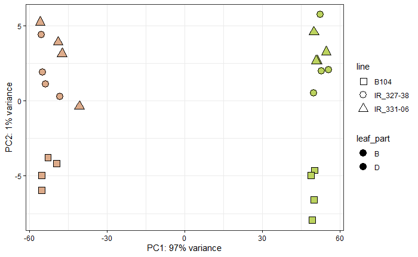

## Subanalysis - leaf part B

``` r
# Subset coldata and cts
coldata_B <- coldata %>% filter(leaf_part=="B")

samples_B <- coldata_B$sample

# Keep only columns for samples with leaf part B
cts_B <-  cts %>% dplyr::select(samples_B)


# Create a DESeqDataSet object
dds_B <- DESeqDataSetFromMatrix(countData = cts_B,
                              colData = coldata_B,
                              design= ~ genotype)

# Perform differential expression analysis
dds_B <- DESeq(dds_B)

# Create a DESeqResults object
res_B <- results(dds_B)

summary(res_B)

DEG_B <- as.data.frame(res_B) %>% rownames_to_column("geneID")

sigDEG <- as.data.frame(res_B) %>% rownames_to_column("geneID") 
  %>% filter(padj < 0.05)

write.table(sigDEG, "significant_genes_genotype_DESeq2_leaf_part_B.txt", 
            quote=FALSE, row.names=FALSE, sep="\t")
```

## Subanalysis - leaf part D

``` r
# Subset coldata and cts
coldata_D <- coldata %>% filter(leaf_part=="D")

samples_D <- coldata_D$sample

# Keep only columns for samples with leaf part D
cts_D <-  cts %>% dplyr::select(samples_D)

# Create a DESeqDataSet object
dds_D <- DESeqDataSetFromMatrix(countData = cts_D,
                              colData = coldata_D,
                              design= ~ genotype)

# Perform differential expression analysis
dds_D <- DESeq(dds_D)

# Create a DESeqResults object
res_D <- results(dds_D)

summary(res_D)

DEG_D <- as.data.frame(res_D) %>% rownames_to_column("geneID")

sigDEG <- as.data.frame(res_D) %>% rownames_to_column("geneID") 
  %>% filter(padj < 0.05)

write.table(sigDEG, "significant_genes_genotype_DESeq2_leaf_part_D.txt", 
            quote=FALSE, row.names=FALSE, sep="\t")
```

## Plot expression of ZmRap2.7

``` r
ZmRap27_plot <- plotCounts(dds, gene="Zm00001eb355240", intgroup="genotype", 
                           main = "ZmRap2.7", returnData = T)

# The row names are the individual, so I can retrieve which lines they are from

ZmRap27_plot %<>% rownames_to_column(var="sample") %>% mutate_at("sample", as.factor)

ZmRap27_plot_all <- merge(ZmRap27_plot, coldata_5, by="sample")

ZmRap27_plot_all$genotype.x <- factor(ZmRap27_plot_all$genotype.x, 
                                      levels=c("WT","Vgt1_IR"), ordered=T)

# Choose manually the shape of the signs for each line (scale_shape_manual)
ZmRap27_plot_all %>% ggplot(aes(x=genotype.x, y=count, color=leaf_part, fill=leaf_part)) +
  geom_boxplot(fill="white", position=position_dodge(width=0.9), outlier.colour=NA) +
  geom_point(position=position_jitterdodge(dodge.width=0.9), 
             aes(shape=line, group=leaf_part), size=2) +
  theme_bw() +
  scale_shape_manual(values=c(15, 16, 2)) +
  ylab("Normalized read count") +
  xlab("Genotype") +
  ggtitle("ZmRap2.7 expression") +
  theme(plot.title = element_text(hjust = 0.5)) +
  scale_colour_manual(values = c("#BCD35F","#DDAB8A"))
```

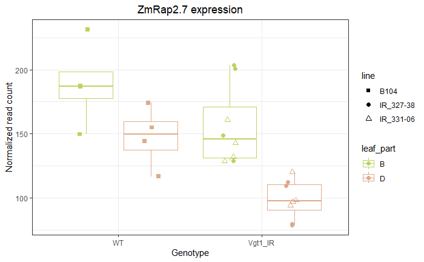

## Plot expression of ZCN8

``` r
ZCN8_plot <- plotCounts(dds_5, gene="Zm00001eb353250", 
                        intgroup="genotype", returnData = T)

# The row names are the individual, so I can retrieve which lines they are from

ZCN8_plot %<>% rownames_to_column(var="sample") %>% mutate_at("sample", as.factor)

ZCN8_plot_all <- merge(ZCN8_plot, coldata_5, by="sample")

ZCN8_plot_all$genotype.x <- factor(ZCN8_plot_all$genotype.x, 
                                   levels=c("WT","Vgt1_IR"), ordered=T)

# Choose manually the shape of the signs for each line (scale_shape_manual)
ZCN8_plot_all %>% ggplot(aes(x=genotype.x, y=count, color=leaf_part, fill=leaf_part)) +
  geom_boxplot(fill="white", position=position_dodge(width=0.9), outlier.colour=NA) +
  geom_point(position=position_jitterdodge(dodge.width=0.9), 
             aes(shape=line, group=leaf_part), size=2) + 
  theme_bw() + scale_shape_manual(values=c(15, 16, 2)) + 
  ylab("Normalized read count") +
  xlab("Genotype") +
  ggtitle("ZCN8 expression") +
  theme(plot.title = element_text(hjust = 0.5)) +
  scale_colour_manual(values = c("#BCD35F","#DDAB8A"))
```

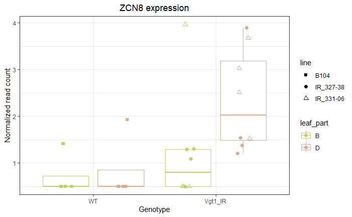

## Union DEGs leaf part B and D

``` r
# Both text files are available in github 
# https://github.com/johanzi/scripts_zicola_vgt1/data

# Set directory to the cloned github repo scripts_zicola_vgt1
setwd("/path/to/scripts_zicola_vgt1")

df_DEGs_part_B <- read.delim("data/significant_genes_genotype_DESeq2_leaf_part_B.txt")
df_DEGs_part_D <- read.delim("data/significant_genes_genotype_DESeq2_leaf_part_D.txt")

# Check how many genes are expressed
# Franziska uses as background the number of genes expressed in her RNA-seq data
sum(rowSums(cts_5)>50)

# 21702 / 43459 genes have more than 50 reads across the 24 samples

require(GeneOverlap)

gs=21702

overlap <-  newGeneOverlap(df_DEGs_part_B$geneID, df_DEGs_part_D$geneID, genome.size = gs)
print(overlap)

print(testGeneOverlap(overlap))

ID_genes_union <- overlap@union
```

## Venn Diagram

``` r
grid.newpage()
draw.pairwise.venn(area1 = 1374, area2 = 1019, cross.area = 259, 
                   category = c("Part B","Part D"), lty="blank", 
                   fill = c("#BCD35F","#DEAA87"))
```


## GO enrichment analysis

``` r
list_ego_results <- ego_analysis(ID_genes_union)

lapply(list_ego_results, function(x) sum(x@result$p.adjust < 0.05))
```

BP has 124 significant terms, CC 1, and MF 7.

``` r
df_ego_analysis <- enrichResult2dataframe(list_ego_results)

df_ego_analysis_significant <- df_ego_analysis %>% dplyr::filter(p.adjust < 0.05)

write_delim(df_ego_analysis_significant, 
            "df_ego_analysis_significant_2134_DEGs.txt", delim="\t")

df_ego_analysis_significant %>% arrange(qvalue) %>% 
  head(10) %>% 
  mutate(Description = fct_reorder(Description, FoldEnrich)) %>%
  ggplot(aes(x=FoldEnrich, y=Description, color=-log10(qvalue))) +
  geom_point(aes(size = Count))  + xlab("Fold enrichment") + 
  ylab("GO term") + 
  ggtitle("BP GO enrichment 2,134 genes") +
  theme_bw() +
  theme(axis.text.x = element_text(color="black"),
        axis.text.y = element_text(color="black"),
        axis.ticks = element_line(color = "black")) +
  theme(plot.title = element_text(hjust = 0.5)) +
  scale_size_area(max_size = 10) +
  scale_color_viridis()
```

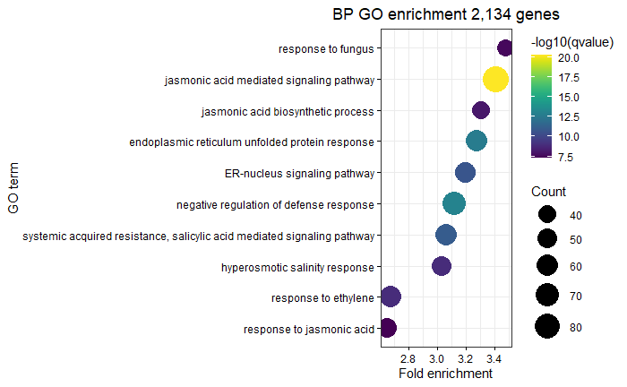

# ChIP-seq analysis

## Libraries

``` r
library(dplyr)
library(readr) # Import csv files
library(ggplot2)
library(viridis)
library(ggpubr) # Easy plotting
library(car)
library(forcats) # Reordering factors (tidyverse)
library(tidyr)
library(kableExtra) # Nice table display
library(reshape2)
library(gridExtra) # Diplays plot side by side
library(VennDiagram)
library(DESeq2)
library(GeneOverlap)
library(tidyverse)
library(motifStack)

# Import GO functions (git clone https://github.com/johanzi/GOMAP_maize_B73_NAM5)
source("/path/to/GOMAP_maize_B73_NAM5/go_functions.R", chdir = T)
```

    R version 4.0.3 (2020-10-10)
    Platform: x86_64-w64-mingw32/x64 (64-bit)
    Running under: Windows 10 x64 (build 19045)

    Matrix products: default

    locale:
    [1] LC_COLLATE=English_United States.1252  LC_CTYPE=English_United States.1252   
    [3] LC_MONETARY=English_United States.1252 LC_NUMERIC=C                          
    [5] LC_TIME=English_United States.1252    

    attached base packages:
     [1] parallel  stats4    grid      stats     graphics  grDevices utils     datasets 
     [9] methods   base     

    other attached packages:
     [1] motifStack_1.32.1           Biostrings_2.56.0          
     [3] XVector_0.28.0              ade4_1.7-22                
     [5] MotIV_1.43.0                grImport2_0.3-1            
     [7] lubridate_1.9.3             stringr_1.5.1              
     [9] purrr_0.3.4                 tibble_3.2.1               
    [11] tidyverse_2.0.0             GeneOverlap_1.24.0         
    [13] DESeq2_1.28.1               SummarizedExperiment_1.18.2
    [15] DelayedArray_0.14.1         matrixStats_1.3.0          
    [17] Biobase_2.48.0              GenomicRanges_1.40.0       
    [19] GenomeInfoDb_1.24.2         IRanges_2.22.2             
    [21] S4Vectors_0.26.1            BiocGenerics_0.34.0        
    [23] VennDiagram_1.7.3           futile.logger_1.4.3        
    [25] gridExtra_2.3               reshape2_1.4.4             
    [27] kableExtra_1.4.0            tidyr_1.2.1                
    [29] forcats_1.0.0               car_3.1-2                  
    [31] carData_3.0-5               ggpubr_0.4.0               
    [33] viridis_0.6.5               viridisLite_0.4.2          
    [35] ggplot2_3.4.1               readr_2.1.5                
    [37] dplyr_1.1.0                

    loaded via a namespace (and not attached):
     [1] colorspace_2.1-0         ggsignif_0.6.4           base64enc_0.1-3         
     [4] rstudioapi_0.16.0        rGADEM_2.36.0            bit64_4.0.5             
     [7] AnnotationDbi_1.50.3     fansi_1.0.6              xml2_1.3.5              
    [10] splines_4.0.3            cachem_1.0.6             geneplotter_1.66.0      
    [13] knitr_1.42               seqLogo_1.54.3           Rsamtools_2.4.0         
    [16] broom_1.0.6              annotate_1.66.0          png_0.1-8               
    [19] compiler_4.0.3           backports_1.4.1          Matrix_1.6-5            
    [22] fastmap_1.1.0            cli_3.6.2                formatR_1.14            
    [25] htmltools_0.5.2          tools_4.0.3              gtable_0.3.1            
    [28] glue_1.7.0               GenomeInfoDbData_1.2.3   Rcpp_1.0.12             
    [31] vctrs_0.5.2              svglite_2.1.3            rtracklayer_1.48.0      
    [34] xfun_0.37                timechange_0.3.0         lifecycle_1.0.3         
    [37] gtools_3.9.5             rstatix_0.7.2            XML_3.99-0.8            
    [40] MASS_7.3-60.0.1          zlibbioc_1.34.0          scales_1.3.0            
    [43] BSgenome_1.56.0          hms_1.1.3                lambda.r_1.2.4          
    [46] RColorBrewer_1.1-3       memoise_2.0.1            stringi_1.8.3           
    [49] RSQLite_2.3.7            genefilter_1.70.0        caTools_1.18.2          
    [52] BiocParallel_1.22.0      rlang_1.0.6              pkgconfig_2.0.3         
    [55] systemfonts_1.0.6        bitops_1.0-7             evaluate_0.24.0         
    [58] lattice_0.22-6           htmlwidgets_1.5.4        GenomicAlignments_1.24.0
    [61] bit_4.0.5                tidyselect_1.2.1         plyr_1.8.9              
    [64] magrittr_2.0.3           R6_2.5.1                 gplots_3.1.3.1          
    [67] generics_0.1.3           DBI_1.2.3                pillar_1.9.0            
    [70] withr_3.0.0              survival_3.5-8           abind_1.4-5             
    [73] RCurl_1.98-1.5           crayon_1.5.2             futile.options_1.0.1    
    [76] KernSmooth_2.23-24       utf8_1.2.4               tzdb_0.4.0              
    [79] rmarkdown_2.25           jpeg_0.1-10              locfit_1.5-9.4          
    [82] blob_1.2.4               digest_0.6.27            xtable_1.8-4            
    [85] munsell_0.5.1   

## Data

| Accession   | Gene name B73 NAM5     | EREB name |
|-------------|------------------------|-----------|
| SRR8525048  | Zm00001eb311180        | EREB109   |
| SRR8525151  | Zm00001eb311180        | EREB109   |
| SRR8525136  | Zm00001eb150840        | EREB147   |
| SRR8525134  | Zm00001eb150840        | EREB147   |
| SRR8525082  | Zm00001eb194220        | EREB17    |
| SRR8525083  | Zm00001eb194220        | EREB17    |
| SRR8524996  | Zm00001eb038070        | EREB172   |
| SRR8524995  | Zm00001eb038070        | EREB172   |
| SRR8525012  | Zm00001eb255160        | EREB18    |
| SRR8525011  | Zm00001eb255160        | EREB18    |
| SRR8525086  | Zm00001eb074930        | EREB198   |
| SRR8525047  | Zm00001eb074930        | EREB198   |
| SRR8525068  | Zm00001eb171050        | EREB209   |
| SRR8525069  | Zm00001eb171050        | EREB209   |
| SRR8525077  | Zm00001d053859         | EREB211   |
| SRR8525078  | Zm00001d053859         | EREB211   |
| SRR8525044  | Zm00001eb296430        | EREB34    |
| SRR8525043  | Zm00001eb296430        | EREB34    |
| SRR8525105  | Zm00001eb413930        | EREB54    |
| SRR8525104  | Zm00001eb413930        | EREB54    |
| SRR8524985  | Zm00001eb401290        | EREB71    |
| SRR8524986  | Zm00001eb401290        | EREB71    |
| SRR8525118  | Zm00001eb071190        | EREB97    |
| SRR8525120  | Zm00001eb071190        | EREB97    |
| SRR12022262 | ChIP-seq input control | control   |
| SRR29006028 | Zm00001eb355240        | ZmRap27   |
| SRR29006029 | Zm00001eb355240        | ZmRap27   |

The first 26 samples were published in [Tu et al
2020](https://www.nature.com/articles/s41467-020-18832-8) The last 2
samples were generated in this study (PRJNA1110977).

Download data by pasting the first column of the table above into the
text file `list_SRR.txt`.

``` bash

while read i; do
  if [[ -e ${i}_1.fastq ]] & [[ -e ${i}_2.fastq ]]; then
    echo "$i already downloaded"
  else
    echo "/home/zicola/bin/sratoolkit.3.0.7-ubuntu64/bin/fasterq-dump $i -e 8"
    /home/zicola/bin/sratoolkit.3.0.7-ubuntu64/bin/fasterq-dump $i -e 8
  fi
done < <(cut -f1 list_SRR.txt)

# Compress all fastq files
gzip *fastq
```

Add a prefix the fastq files names with the sample name.
`SRR_to_EREB.txt` should contain in fist column the SRA
(e.g. SRR8525105) and sample name (e.g. SRR8525105 EREB54). Use table
above to create this file.

``` bash

while read i; do
  SRR=$(echo "$i" | cut -f1)
  name=$(echo "$i" | cut -f2)
  mv ${SRR}_1.fastq.gz ${SRR}_${name}_1.fastq.gz
  mv ${SRR}_2.fastq.gz ${SRR}_${name}_2.fastq.gz
done < SRR_to_EREB.txt
```

## Adapter trimming and deduplication

``` bash

fastp --version
fastp 0.23.4

for i in raw/*gz; do
  name=$(basename "$i" | cut -d_ -f1-2)
  if [[ -e trimmed/${name}_1.trimmed.fastq.gz ]] & \
      [[ -e trimmed/${name}_2.trimmed.fastq.gz ]]; then
    echo "$i already processed"
  else 
    fastp --thread 16 \
    --in1 raw/${name}_1.fastq.gz \
    --in2 raw/${name}_2.fastq.gz \
    --out1 trimmed/${name}_1.trimmed.fastq.gz \
    --out2 trimmed/${name}_2.trimmed.fastq.gz \
    --dedup \
    --json trimmed/${name}.json \
    --html trimmed/${name}.html
  fi
done
```

## Mapping

Download fasta and gtf files.

``` bash
cd ~/genomes/maize_B73/B73_NAM5

# Download Fasta
server="ftp://ftp.ensemblgenomes.org/pub/plants/release-51"

wget ${server}/fasta/zea_mays/dna/Zea_mays.Zm-B73-REFERENCE-NAM5.0.dna.toplevel.fa.gz

# Modify chromosome names to have chr1, ...
sed -i 's/^>\([1-9]\)/>chr\1/g' Zea_mays.Zm-B73-REFERENCE-NAM5.0.dna.toplevel.fa

# Remove contigs
sed '/^scaf/d' Zea_mays.Zm-B73-REFERENCE-NAM5.0.dna.toplevel.fa \
  > B73_NAM5.fa

# Create a bowtie2 index
bowtie2-build -f B73_NAM5.fa B73_NAM5

# Create an index samtools index (Zm_NAM5.fa.fai)
samtools faidx B73_NAM5.fa
```

``` bash

bowtie2 --version
bowtie2-align-s version 2.5.2

samtools version
samtools 1.18
Using htslib 1.18

# Get prefix files
ls -1 trimmed/*gz | cut -d/ -f2 | cut -d_ -f1-2 | sort | uniq > prefix_fastq.txt

# -f 3 keep only paired reads
# -F 4 remove unmapped reads

# Give absolute path (crash otherwise)
index="/path/to/index/B73_NAM5"

while read i; do
    if [[ -e mapped/${i}.bam ]]; then
      echo "$i already processed"
    else 
      echo "Processing $i"
      bowtie2 -p 10 \
        -x $index \
        -1 ./trimmed/${i}_1.trimmed.fastq.gz \
        -2 ./trimmed/${i}_2.trimmed.fastq.gz | \
        samtools view -Sb -F 4 -f 3 -@ 2 | \
        samtools sort -@ 2 | \
        samtools rmdup - mapped/${i}.bam
    fi
done < prefix_fastq.txt
```

## Peak calling

GEM requires chromosome files in separate folders. The fasta files
should have the name of the chromosome only (creates bug in GEM
otherwise).

``` bash
# Split chromosomes in individual fasta files.
seqkit split --by-id Zm_NAM5.fa

# Rename fasta with only chromosome names
rename 's/Zm_NAM5.part_//' Zm_NAM5.fa.split/*fa

# Remove any extra information after the chromosome name in the fasta files
for i in *fa; do
  cut -d' ' -f1 $i > ${i%.*}.renamed.fa
  mv ${i%.*}.renamed.fa ${i%.*}.fa
done
```

Create bash script `peak_calling.sh` for peak calling. Note that
`SRR12022262_control.bam` contain the mapped reads of the ChIP-seq input
control and provides the background level to perform peak calling.

``` bash
#!/usr/bin/env bash

if [ -z $1 ]; then
      echo "$(basename $0) <file.bam> <output_name>"
      exit 0
fi

# First and second arguments given to the bash script
sample=$1
output_name=$2

control="/path/to/SRR12022262_control.bam"
genome_file="/path/to/Zm_NAM5.fa.split/"

# Genome index created by the command samtools faidx Zm_NAM5.fa
chrom_size="/path/to/Zm_NAM5.fa.fai"

# Argument explanation (check https://groups.csail.mit.edu/cgs/gem/index.html)
# --kmin and --k_max:   minimum and maximum value of k-mers
# --fold:   Fold (IP/Control) cutoff to filter predicted events (default=3)
# --q:  significance level for q-value, specified as -log10(q-value). 
#             For example, to enforce a q-value threshold of 0.001, 
#             set this value to 3. (default=2, i.e. q-value=0.01)
# --nrf: Do not filter duplicate reads (i.e. potential PCR duplicates) 
#             (default is to apply filtering considering 
#             the read counts at its neighboring bases)
# --outNP: Output binding events in ENCODE NarrowPeak format
#             (default is NO narrowPeak file output)

java -Xmx10G -jar /home/zicola/bin/gem/gem.jar \
  --t 16 \
  --g $chrom_size \
  --d /home/zicola/bin/gem/Read_Distribution_default.txt \
  --genome $genome_file \
  --expt $sample \
  --ctrl $control \
  --f bam \
  --out $output_name \
  --k_min 4 \
  --k_max 12 \
  --fold 3 \
  --q 3 \
  --nrf \
  --outNP \
  --outHOMER \
  --outMEME
  
```

``` bash
# Create output directory
mkdir peak_calling

# List all mapped bam files
\ls -1 mapped/*bam |  cut -d/ -f2 | cut -d. -f1 > list_samples_bam.txt

# Remove control from the list
sed -i '/SRR12022262_control/d' list_samples_bam.txt

# Loop over the bam file list and perform peak calling
while read i; do
  if [ -d peak_calling/$i ]; then
    echo "$i already processed, skip."
  else
    echo "bash peak_calling.sh mapped/${i}.bam peak_calling/$i"
    bash peak_calling.sh mapped/${i}.bam peak_calling/$i
  fi
done < list_samples_bam.txt
```

All peaks are 201-long.

### Summary mapping and peak calling

``` bash

while read i; do
  if [ -e peak_calling/$i/${i}.GEM_events.narrowPeak ]; then
    nb_peak=$(wc -l peak_calling/$i/${i}.GEM_events.narrowPeak | cut -d' ' -f1 )
    echo -e "$i\t$nb_peak"
  fi
done < list_samples_bam.txt
```

Summary of the number of peaks called by GEM for each sample:

| TF      | sample              | peaks_GEM |
|---------|---------------------|-----------|
| EREB102 | SRR8525013_EREB102  | 62,485    |
| EREB102 | SRR8525014_EREB102  | 49,922    |
| EREB109 | SRR8525048_EREB109  | 119,914   |
| EREB109 | SRR8525151_EREB109  | 52,394    |
| EREB147 | SRR8525134_EREB147  | 77,240    |
| EREB147 | SRR8525136_EREB147  | 62,525    |
| EREB17  | SRR8525082_EREB17   | 25,534    |
| EREB17  | SRR8525083_EREB17   | 32,706    |
| EREB172 | SRR8524995_EREB172  | 66,435    |
| EREB172 | SRR8524996_EREB172  | 88,245    |
| EREB18  | SRR8525011_EREB18   | 26,317    |
| EREB18  | SRR8525012_EREB18   | 26,789    |
| EREB198 | SRR8525047_EREB198  | 57,714    |
| EREB198 | SRR8525086_EREB198  | 29,103    |
| EREB209 | SRR8525068_EREB209  | 73,347    |
| EREB209 | SRR8525069_EREB209  | 99,247    |
| EREB211 | SRR8525077_EREB211  | 118,118   |
| EREB211 | SRR8525078_EREB211  | 47,657    |
| EREB34  | SRR8525043_EREB34   | 18,228    |
| EREB34  | SRR8525044_EREB34   | 35,840    |
| EREB54  | SRR8525104_EREB54   | 67,131    |
| EREB54  | SRR8525105_EREB54   | 71,437    |
| EREB71  | SRR8524985_EREB71   | 13,304    |
| EREB71  | SRR8524986_EREB71   | 16,306    |
| EREB97  | SRR8525118_EREB97   | 65,991    |
| EREB97  | SRR8525120_EREB97   | 39,087    |
| EREB98  | SRR8525113_EREB98   | 34,389    |
| EREB98  | SRR8525114_EREB98   | 67,383    |
| ZmRap27 | SRR29006028_ZmRap27 | 49,609    |
| ZmRap27 | SRR29006029_ZmRap27 | 70,754    |

The number of peaks vary greatly across samples (from 13,204 to
119,914).

### Reproducible peaks with IDR

#### Install IDR package with conda

``` bash
# Create an environment in python (v3.9)
# (recommended in https://bioconda.github.io/recipes/idr/README.html)

conda create --name IDR python=3.9.19
conda activate IDR

# Install IDR via conda
conda install idr -c bioconda

idr -h
# Error message
#/home/zicola/anaconda3/envs/IDR/lib/python3.9/site-packages/idr/idr.py:9: 
#UserWarning: A NumPy version >=1.22.4 and <2.3.0 is 
# required for this version of SciPy (detected version 1.19.5)
#  from scipy.stats.stats import rankdata

# Define version of numpy (1.19.5 mentioned in
# https://bioconda.github.io/recipes/idr/README.html)
pip install "numpy==1.19.5"

# I don't which version of scipy I need but one before 1.13.1. 
# Give random try with 1.9
pip install "scipy==1.9"

idr -h
# Works

# Test
idr --samples ./tests/data/peak1 ./tests/data/peak2

Initial parameter values: [0.10 1.00 0.20 0.50]
Final parameter values: [1.57 1.26 0.89 0.41]
Number of reported peaks - 50537/50537 (100.0%)

Number of peaks passing IDR cutoff of 0.05 - 12748/50537 (25.2%)
```

#### Run IDR for each sample

``` bash

mkdir IDR_output

# Keep only TF name
cut -d_ -f2 list_samples_bam.txt | uniq > list_IDR.txt

while read i; do
  echo "Processing $i"
  if [[ -e IDR_output/${i}_idr_peak.txt ]]; then
    echo "$i already processed"
  else
    rep1=$(ls -1 peak_calling/*${i}/*${i}.GEM_events.narrowPeak | head -n1)
    rep2=$(ls -1 peak_calling/*${i}/*${i}.GEM_events.narrowPeak | tail -n1)
    echo "IDR on $rep1 and $rep2"
    echo "idr --samples $rep1 $rep2 --input-file-type narrowPeak 
      --rank signal.value --idr-threshold 0.01 \
      --output-file IDR_output/${i}"
    idr --samples $rep1 $rep2 --input-file-type narrowPeak \
      --rank signal.value --idr-threshold 0.01 \
      --output-file IDR_output/${i}_idr_peak.txt
  fi
done < list_IDR.txt
```

| TF      | IDR_peaks |
|---------|-----------|
| EREB102 | 11,084    |
| EREB109 | 6,653     |
| EREB147 | 20,675    |
| EREB17  | 6,511     |
| EREB172 | 35,763    |
| EREB18  | 2,157     |
| EREB198 | 9,133     |
| EREB209 | 27,981    |
| EREB211 | 10,853    |
| EREB34  | 792       |
| EREB54  | 23,477    |
| EREB71  | 1,895     |
| EREB97  | 2,274     |
| EREB98  | 6,307     |
| ZmRap27 | 1,846     |

We get from 792 to 35,763 reproducible peaks for each TF.

#### Retrieve peaks from replicates

Retrieve peaks considered as reproducible from each replicate. Note that
overlapping peaks will be merged and the length of the peaks from GEM
(201 bp) will vary at these locations.

``` bash

module load samtools seqkit

cd IDR_output

mkdir rep1_IDR_peaks
mkdir rep2_IDR_peaks

# Retrieve coordinates of the peaks for first and second replicates
for i in *txt; do
  cut -f1,13-16 $i > rep1_IDR_peaks/${i%%_*}_rep1.bed
  cut -f1,17-20 $i > rep2_IDR_peaks/${i%%_*}_rep2.bed
done

# Get fasta for each peak
mkdir rep1_IDR_peaks/fasta
mkdir rep2_IDR_peaks/fasta

# Location of the fasta file from B73 NAM5 genome
genome_file="/path/to/Zm_NAM5.fa"

for i in *txt; do
  fastaFromBed -fi $genome_file -bed rep1_IDR_peaks/${i%%_*}.bed \
  -fo rep1_IDR_peaks/fasta/${i%%_*}_rep1.fa
  fastaFromBed -fi $genome_file -bed rep2_IDR_peaks/${i%%_*}.bed \
  -fo rep2_IDR_peaks/fasta/${i%%_*}_rep1.fa
done

# Keep only top 1000 peaks for MEME-CHIP analysis
mkdir rep1_IDR_peaks/fasta/top_1000
mkdir rep2_IDR_peaks/fasta/top_1000

for i in *txt; do
  seqkit head -n 1000 rep1_IDR_peaks/fasta/${i%%_*}_rep1.fa > \
  rep1_IDR_peaks/fasta/top_1000/${i%%_*}_rep1.top1000.fa
  seqkit head -n 1000 rep2_IDR_peaks/fasta/${i%%_*}_rep2.fa > \
  rep2_IDR_peaks/fasta/top_1000/${i%%_*}_rep2.top1000.fa
done
```

## MEME-CHIP analysis

### MEME-CHIP local installation

``` bash
# Go to a directory containing the fasta files to be analyzed
# Make sure this directory and subdirectories are set in chmod 777
# chmod -R 777 /path/to/meme/analysis
chmod -R 777 /path/to/meme/analysis && cd /path/to/meme/analysis

# Get the last version of memesuite (v5.5.5)
docker pull memesuite/memesuite

# Run memesuite
docker run -v `pwd`:/home/meme -d memesuite/memesuite:latest

# Get into interactive mode using container id
# Here I assume only one container is running 
docker exec -it $(docker ps -q) /bin/sh
```

Run MEME-CHIP for all top 1000 peaks. Run with the mode with default
motif size of 15-nt (-maxw 15) and 8-nt (-maxw 8):

``` bash

# Gather all fasta files in one folder
mdkir meme_chip_analysis
cp rep1_IDR_peaks/fasta/top_1000/*_rep1.top1000.fa meme_chip_analysis
cp rep2_IDR_peaks/fasta/top_1000/*_rep2.top1000.fa meme_chip_analysis

# Default max motif length (-maxw 15)
mkdir meme_chip_analysis/analysis_maxw_15nt

for i in meme_chip_analysis/*fa; do
  name=$(basename "$i" | cut -d_ -f1)
  meme-chip -dna -maxw 15 -o \
      meme_chip_analysis/analysis_maxw_15nt/$name \
      -meme-mod zoops -spamo-skip -fimo-skip -meme-p 16 $i
done


# Max motif length of 8-nt (-maxw 8)
mkdir meme_chip_analysis/analysis_maxw_8nt

for i in meme_chip_analysis/*fa; do
  name=$(basename "$i" | cut -d_ -f1)
  meme-chip -dna -maxw 8 -o \
      meme_chip_analysis/analysis_maxw_8nt/$name \
      -meme-mod zoops -spamo-skip -fimo-skip -meme-p 16 $i
done
```

### Motif visualization

Gather the `combined.meme` files which contains the motifs found across
the different analyses of MEME-CHIP and ranked by most to least
significant.

``` bash

# Rename each combined.meme with the TF name
for i in *; do
  if [ -e ${i}/combined.meme ]; then
    cp ${i}/combined.meme output_meme_combined/${i}.txt
  fi
done
```

In R, load the top motif of each `combined.meme` file for display with
motifStack.

#### Motif width of 15-nt max

``` r
# Set directory to the cloned github repo scripts_zicola_vgt1
setwd("/path/to/scripts_zicola_vgt1")

# Gather list of combined.meme files
temp = list.files(path="data/meme_chip/output_meme_combined_maxw15", pattern="*.txt")

# Load combined.meme files
motifs_EREB = lapply(paste("data/meme_chip/output_meme_combined_maxw15/", temp, sep=""),
                     function(x) importMatrix(x, format="meme", to="pcm")[[1]])

# Rename each elements with the TF name
names <-  gsub(".txt", "", temp)

# Extract top motif (first in the list) for each TF
for (i in 1:length(motifs_EREB)){
  motifs_EREB[[i]]$name <- names[[i]]
}

# Rename motif with the TF name
names(motifs_EREB) <- names

# Display the stacked motifs
#motifStack(pfms=motifs_EREB, layout="tree",  ncex=1)
motifStack(pfms=motifs_EREB, layout="radialPhylog")
```


#### Motif width of 8-nt max

``` r
# Gather list of combined.meme files
temp = list.files(path="data/meme_chip/output_meme_combined_maxw8", pattern="*.txt")

# Load combined.meme files
motifs_EREB = lapply(paste("data/meme_chip/output_meme_combined_maxw8/", temp, sep=""),
                     function(x) importMatrix(x, format="meme", to="pcm")[[1]])

# Rename each elements with the TF name
names <-  gsub(".txt", "", temp)

# Extract top motif (first in the list) for each TF
for (i in 1:length(motifs_EREB)){
  motifs_EREB[[i]]$name <- names[[i]]
}

# Rename motif with the TF name
names(motifs_EREB) <- names

# Display the stacked motifs
#motifStack(pfms=motifs_EREB, layout="tree",  ncex=1)
motifStack(pfms=motifs_EREB, layout="radialPhylog")
```


## ZmRap2.7 read density around TSS

Visualize enrichment in ZmRap2.7 ChIP-seq data around the
transcriptional start sites of genes.

### Libraries

Install R libraries needed for ngs.plot:

``` r
install.packages("doMC", dep=T)
install.packages("caTools", dep=T)
install.packages("utils", dep=T)

if (!require("BiocManager", quietly = TRUE))
    install.packages("BiocManager")
BiocManager::install(version = "3.19")
source("http://bioconductor.org/biocLite.R")
BiocManager::install(c("BSgenome", "Rsamtools","ShortRead"))
```

``` r
library(doMC)
library(caTools)
library(utils)
library(BSgenome)
library(Rsamtools)
library(ShortRead)
```

    R version 4.4.1 (2024-06-14)
    Platform: x86_64-pc-linux-gnu
    Running under: Ubuntu 20.04.6 LTS

    Matrix products: default
    BLAS:   /usr/lib/x86_64-linux-gnu/blas/libblas.so.3.9.0 
    LAPACK: /usr/lib/x86_64-linux-gnu/lapack/liblapack.so.3.9.0

    locale:
     [1] LC_CTYPE=en_US.UTF-8       LC_NUMERIC=C              
     [3] LC_TIME=de_DE.UTF-8        LC_COLLATE=en_US.UTF-8    
     [5] LC_MONETARY=de_DE.UTF-8    LC_MESSAGES=en_US.UTF-8   
     [7] LC_PAPER=de_DE.UTF-8       LC_NAME=C                 
     [9] LC_ADDRESS=C               LC_TELEPHONE=C            
    [11] LC_MEASUREMENT=de_DE.UTF-8 LC_IDENTIFICATION=C       

    time zone: Europe/Berlin
    tzcode source: system (glibc)

    attached base packages:
    [1] stats4    parallel  stats     graphics  grDevices utils     datasets 
    [8] methods   base     

    other attached packages:
     [1] ShortRead_1.62.0            GenomicAlignments_1.40.0   
     [3] SummarizedExperiment_1.34.0 Biobase_2.64.0             
     [5] MatrixGenerics_1.16.0       matrixStats_1.3.0          
     [7] BiocParallel_1.38.0         Rsamtools_2.20.0           
     [9] BSgenome_1.72.0             rtracklayer_1.64.0         
    [11] BiocIO_1.14.0               Biostrings_2.72.1          
    [13] XVector_0.44.0              GenomicRanges_1.56.1       
    [15] GenomeInfoDb_1.40.1         IRanges_2.38.1             
    [17] S4Vectors_0.42.1            BiocGenerics_0.50.0        
    [19] caTools_1.18.2              doMC_1.3.8                 
    [21] iterators_1.0.14            foreach_1.5.2              

    loaded via a namespace (and not attached):
     [1] SparseArray_1.4.8       bitops_1.0-7            jpeg_0.1-10            
     [4] lattice_0.22-5          grid_4.4.1              RColorBrewer_1.1-3     
     [7] jsonlite_1.8.8          Matrix_1.6-5            restfulr_0.0.15        
    [10] httr_1.4.7              UCSC.utils_1.0.0        XML_3.99-0.17          
    [13] codetools_0.2-19        abind_1.4-5             crayon_1.5.2           
    [16] DelayedArray_0.30.1     yaml_2.3.8              S4Arrays_1.4.1         
    [19] tools_4.4.1             deldir_2.0-4            interp_1.1-6           
    [22] GenomeInfoDbData_1.2.12 hwriter_1.3.2.1         curl_5.2.0             
    [25] R6_2.5.1                png_0.1-8               zlibbioc_1.50.0        
    [28] pwalign_1.0.0           Rcpp_1.0.12             latticeExtra_0.6-30    
    [31] rjson_0.2.21            compiler_4.4.1          RCurl_1.98-1.14    

### Install ngs.plot and the maize database

ngs.plot can be download from GitHub
(<https://github.com/shenlab-sinai/ngsplot>).

Use ngsplot database for B73 AGPv3 genome assembly (download archive
`ngsplotdb_AGPv3_26_3.00.tar.gz` on
<https://drive.google.com/drive/folders/0B1PVLadG_dCKNEsybkh5TE9XZ1E?resourcekey=0-ux6XMoJr0qaS6lemqPJBpQ>)

``` bash
# Clone repository
cd ~/bin
git clone https://github.com/shenlab-sinai/ngsplot

# Add to ~/.bashrc
export PATH="~/bin/ngsplot/bin:$PATH"
export NGSPLOT="~/bin/ngsplot"

# Move archive file into ~/bin/ngsplot and install
ngsplotdb.py install ngsplotdb_AGPv3_26_3.00.tar.gz

# Check if installation worked
ngsplotdb.py list

#ID       Assembly Species  EnsVer   NPVer    InstalledFeatures        
#AGPv3  AGPv3   zea_mays    26.0    3.0 exon,genebody,tss,tes
```

### Map ChIP-seq data on B73 AGPv3

Use ngs.plot but I need to remap the ChIP-seq reads to B73 AGPv3:

``` bash

# Download B73 AGPv3 fasta
wget https://download.maizegdb.org/B73_RefGen_v3/B73_RefGen_v3.fa.gz

gunzip B73_RefGen_v3/B73_RefGen_v3.fa.gz

# Build index
bowtie2-build -f B73_RefGen_v3.fa B73_RefGen_v3

# Map the two replicates for ZmRap2.7 and the control

index="/home/zicola/fasta/B73_AGPv3/B73_RefGen_v3"

bowtie2 -p 10 \
  -x $index \
  -1 trimmed/SRR29006028_ZmRap27_1.trimmed.fastq.gz \
  -2 trimmed/SRR29006028_ZmRap27_2.trimmed.fastq.gz | \
  samtools view -b -F 4 -f 3 -@ 2 | \
  samtools sort -@ 4 | \
  samtools rmdup - mapped_AGPv3/SRR29006028_ZmRap27.bam
  
bowtie2 -p 10 \
  -x $index \
  -1 trimmed/SRR29006029_ZmRap27_1.trimmed.fastq.gz \
  -2 trimmed/SRR29006029_ZmRap27_2.trimmed.fastq.gz | \
  samtools view -b -F 4 -f 3 -@ 2 | \
  samtools sort -@ 4 | \
  samtools rmdup - mapped_AGPv3/SRR29006029_ZmRap27.bam

bowtie2 -p  10 \
  -x $index \
  -1 trimmed/SRR12022262_control_1.trimmed.fastq.gz \
  -2 trimmed/SRR12022262_control_2.trimmed.fastq.gz | \
  samtools view -b -F 4 -f 3 -@ 4 | \
  samtools sort -@ 4 | \
  samtools rmdup - mapped_AGPv3/SRR12022262_control.bam
  
```

### Run ngs.plot

Create a configuration file `config_file.txt`:

| mapped_AGPv3/SRR29006029_ZmRap27.bam:mapped_AGPv3/SRR12022262_control.bam | -1  | Replicate_1 |
|---------------------------------------------------------------------------|-----|-------------|
| mapped_AGPv3/SRR29006028_ZmRap27.bam:mapped_AGPv3/SRR12022262_control.bam | -1  | Replicate_2 |

``` bash
# Read density at TSS (-/+ 1 kb) with normalization by the control sample
ngs.plot.r -P 0 -G AGPv3 -R tss -C ngsplot/config_file.txt \
-O ngsplot/ChIP_TSS_1kb -T ngsplot/ChIP_TSS_1kb_normalized -L 1000
```

Output file is `ngsplot/ChIP_TSS_1kb_normalized.avgprof.pdf`

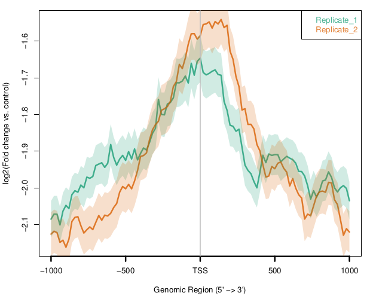

# 4C-seq analysis

Enzymes used for the 4C-seq:

First restriction enzyme (RE1) \* BglII: AGATCT Second restriction
enzyme (RE2) \* Csp6I (CviQI): GTAC

## Libraries

Install pipe4C.

Paper:[Krijger et al
2020](https://www.sciencedirect.com/science/article/pii/S1046202318304742#s0135)
GitHub repository:
[pipe4C](https://github.com/deLaatLab/pipe4C/tree/master)

``` bash
# Download git repository
git clone https://github.com/deLaatLab/pipe4C.git
```

``` r
# R 4.4.1

library(tidyverse)
library(ggraph)
library(optparse)
library(config)
library(caTools)
library(isotone)

# The following R packages available from Bioconductor:
library(ShortRead)
library(GenomicAlignments)
library(GenomicRanges)
library(BSgenome)
library(rtracklayer)

# The peakC package available from https://github.com/deWitLab/peakC/.
library(devtools)

#install_github("deWitLab/peakC")
library(peakC)

# Load after you created the package 
# See part "Create BSgenome for B73 NAM5"
library(BSgenome.zmv5)
```

    R version 4.4.1 (2024-06-14)
    Platform: x86_64-pc-linux-gnu
    Running under: Ubuntu 20.04.6 LTS

    Matrix products: default
    BLAS:   /usr/lib/x86_64-linux-gnu/blas/libblas.so.3.9.0 
    LAPACK: /usr/lib/x86_64-linux-gnu/lapack/liblapack.so.3.9.0

    locale:
      [1] LC_CTYPE=en_US.UTF-8       LC_NUMERIC=C              
    [3] LC_TIME=de_DE.UTF-8        LC_COLLATE=en_US.UTF-8    
    [5] LC_MONETARY=de_DE.UTF-8    LC_MESSAGES=en_US.UTF-8   
    [7] LC_PAPER=de_DE.UTF-8       LC_NAME=C                 
    [9] LC_ADDRESS=C               LC_TELEPHONE=C            
    [11] LC_MEASUREMENT=de_DE.UTF-8 LC_IDENTIFICATION=C       

    time zone: Europe/Berlin
    tzcode source: system (glibc)

    attached base packages:
      [1] stats4    stats     graphics  grDevices utils     datasets  methods  
    [8] base     

    other attached packages:
      [1] peakC_0.2                   devtools_2.4.5             
    [3] usethis_2.2.3               BSgenome.zmv5_1.0          
    [5] BSgenome_1.72.0             rtracklayer_1.64.0         
    [7] BiocIO_1.14.0               ShortRead_1.62.0           
    [9] GenomicAlignments_1.40.0    SummarizedExperiment_1.34.0
    [11] Biobase_2.64.0              MatrixGenerics_1.16.0      
    [13] matrixStats_1.3.0           Rsamtools_2.20.0           
    [15] GenomicRanges_1.56.1        Biostrings_2.72.1          
    [17] GenomeInfoDb_1.40.1         XVector_0.44.0             
    [19] IRanges_2.38.1              S4Vectors_0.42.1           
    [21] BiocParallel_1.38.0         BiocGenerics_0.50.0        
    [23] isotone_1.1-1               caTools_1.18.2             
    [25] config_0.3.2                optparse_1.7.5             
    [27] ggraph_2.2.1                lubridate_1.9.3            
    [29] forcats_1.0.0               stringr_1.5.1              
    [31] dplyr_1.1.4                 purrr_1.0.2                
    [33] readr_2.1.4                 tidyr_1.3.0                
    [35] tibble_3.2.1                ggplot2_3.5.1              
    [37] tidyverse_2.0.0            

    loaded via a namespace (and not attached):
      [1] RColorBrewer_1.1-3      rstudioapi_0.15.0       jsonlite_1.8.8         
    [4] magrittr_2.0.3          farver_2.1.1            fs_1.6.3               
    [7] zlibbioc_1.50.0         vctrs_0.6.5             memoise_2.0.1          
    [10] RCurl_1.98-1.14         htmltools_0.5.7         S4Arrays_1.4.1         
    [13] curl_5.2.0              SparseArray_1.4.8       htmlwidgets_1.6.4      
    [16] cachem_1.0.8            igraph_2.0.3            mime_0.12              
    [19] lifecycle_1.0.4         pkgconfig_2.0.3         Matrix_1.6-5           
    [22] R6_2.5.1                fastmap_1.1.1           GenomeInfoDbData_1.2.12
    [25] shiny_1.8.1.1           digest_0.6.33           colorspace_2.1-0       
    [28] pkgload_1.3.3           hwriter_1.3.2.1         fansi_1.0.6            
    [31] timechange_0.2.0        nnls_1.5                httr_1.4.7             
    [34] polyclip_1.10-6         abind_1.4-5             compiler_4.4.1         
    [37] remotes_2.5.0           withr_2.5.2             viridis_0.6.5          
    [40] pkgbuild_1.4.3          ggforce_0.4.2           MASS_7.3-60            
    [43] DelayedArray_0.30.1     sessioninfo_1.2.2       rjson_0.2.21           
    [46] tools_4.4.1             httpuv_1.6.15           glue_1.6.2             
    [49] restfulr_0.0.15         promises_1.3.0          grid_4.4.1             
    [52] generics_0.1.3          gtable_0.3.4            tzdb_0.4.0             
    [55] hms_1.1.3               tidygraph_1.3.1         utf8_1.2.4             
    [58] ggrepel_0.9.5           pillar_1.9.0            later_1.3.2            
    [61] getopt_1.20.4           tweenr_2.0.3            lattice_0.22-5         
    [64] deldir_2.0-4            tidyselect_1.2.0        miniUI_0.1.1.1         
    [67] gridExtra_2.3           graphlayouts_1.1.1      stringi_1.8.3          
    [70] UCSC.utils_1.0.0        yaml_2.3.8              codetools_0.2-19       
    [73] interp_1.1-6            cli_3.6.2               xtable_1.8-4           
    [76] munsell_0.5.0           Rcpp_1.0.12             png_0.1-8              
    [79] XML_3.99-0.17           parallel_4.4.1          ellipsis_0.3.2         
    [82] latticeExtra_0.6-30     jpeg_0.1-10             profvis_0.3.8          
    [85] urlchecker_1.0.1        bitops_1.0-7            pwalign_1.0.0          
    [88] viridisLite_0.4.2       scales_1.3.0            crayon_1.5.2           
    [91] rlang_1.1.2        

## Data

| Accession   | code        | name                                                   |
|-------------|-------------|--------------------------------------------------------|
| SRR29005912 | Husk_rep1   | 4C-seq of Zea mays: Husk tissue rep1                   |
| SRR29005911 | Husk_rep2   | 4C-seq of Zea mays: Husk tissue rep2                   |
| SRR29005910 | Husk_rep3   | 4C-seq of Zea mays: Husk tissue rep3                   |
| SRR30183516 | V2_IST_rep1 | 4C-seq of Zea mays: Inner stem tissue seedling V2 rep1 |
| SRR29005908 | V2_IST_rep2 | 4C-seq of Zea mays: Inner stem tissue seedling V2 rep2 |
| SRR30183515 | V2_IST_rep3 | 4C-seq of Zea mays: Inner stem tissue seedling V2 rep3 |

Download data by pasting the first column of the table above into the
text file `list_SRR.txt`.

``` bash

while read i; do
  if [[ -e ${i}_1.fastq ]] & [[ -e ${i}_2.fastq ]]; then
    echo "$i already downloaded"
  else
    echo "/home/zicola/bin/sratoolkit.3.0.7-ubuntu64/bin/fasterq-dump $i -e 8"
    /home/zicola/bin/sratoolkit.3.0.7-ubuntu64/bin/fasterq-dump $i -e 8
  fi
done < <(cut -f1 list_SRR.txt)

# Compress all fastq files
gzip *fastq
```

Rename the file to integrate sample name:

``` bash

while read i; do
  SRR=$(echo "$i" | cut -f1)
  name=$(echo "$i" | cut -f2)
  mv ${SRR}.fastq.gz ${SRR}_${name}.fastq.gz
done < table_SRR.txt
```

## Create BSgenome for B73 NAM5

Use only first 10 chromosomes. Each chromosome should be in a separate
fasta file

``` bash
cd /home/zicola/B73_NAM5/

# Download Fasta
server="ftp://ftp.ensemblgenomes.org/pub/plants/release-51"

wget ${server}/fasta/zea_mays/dna/Zea_mays.Zm-B73-REFERENCE-NAM5.0.dna.toplevel.fa.gz

# Modify chromosome names to have chr1, ...
sed -i 's/^>\([1-9]\)/>chr\1/g' Zea_mays.Zm-B73-REFERENCE-NAM5.0.dna.toplevel.fa

# Remove contigs
sed '/^scaf/d' Zea_mays.Zm-B73-REFERENCE-NAM5.0.dna.toplevel.fa \
  > B73_NAM5.fa
  
# Pipe4C also needs bowtie2 index for the genome
# Create a bowtie2 index
bowtie2-build -f B73_NAM5.fa B73_NAM5

# Create an index samtools index (Zm_NAM5.fa.fai)
samtools faidx B73_NAM5.fa

# Split chromosomes in individual fasta files.
seqkit split --by-id Zm_NAM5.fa

# Rename fasta with only chromosome names
rename 's/Zm_NAM5.part_//' Zm_NAM5.fa.split/*fa

# Move fasra files in extdata/zm_seqs
mkdir -p extdata/zm_seqs
mv Zm_NAM5.fa.split/*fa extdata/zm_seqs/
```

Create a text file `ZmaysZm5_seed` in `/home/zicola/B73_NAM5/`
containing:

    Package: BSgenome.zmv5
    Title: Genome sequences for Zea mays (MaizeGDB B73 NAM5)
    Description: A BSgenome package for chr1-10 Zea mays (B73 NAM5).
    Version: 1.0
    organism: Zea mays
    common_name: Maize
    provider: MaizeGDB
    provider_version: zmv5
    release_date: Mar. 2020
    release_name: Maize Genome Sequencing B73 5.0
    source_url: NA
    circ_seqs: NA
    organism_biocview: zmays
    BSgenomeObjname: zmays
    seqs_srcdir: extdata/zm_seqs
    seqfiles_suffix: .fa
    seqnames: c("chr1","chr2","chr3","chr4","chr5","chr6","chr7","chr8","chr9","chr10")

Forge the package in R:

``` r
# Set working directory containing the extdata/zm_seqs directory
setwd("/home/zicola/B73_NAM5/")

library(BSgenome)
forgeBSgenomeDataPkg("ZmaysZm5_seed")
```

Build the package in bash:

``` bash
cd /home/zicola/fasta/B73_NAM5

R CMD build BSgenome.zmv5
R CMD check BSgenome.zmv5_1.0.tar.gz
R CMD INSTALL BSgenome.zmv5_1.0.tar.gz
```

Check if it works:

``` r
library(BSgenome.zmv5)

# Get full length in bp of the chromosome 1
length(zmays$chr1)
308452471
```

## Update conf.ylm file

Edit `/path/to/pipe4C/conf.ylm` to add the path to fragFolder, the
missing enzyme (BglII), the name of the BSgenome package created, and
the path to bowtie2 indexes (including the prefix of the index):

    Default:
     fragFolder: /home/zicola/bin/pipe4C/fragFolder 
     normalizeFactor: 1000000
     qualityCutoff : 0
     trimLength : 0
     minAmountReads : 1000
     maxAmountReads : 100000000
     readsQuality : 1
     cores : 1
     wSize : 21
     nTop : 2
     alnStart : TRUE
     mapUnique : FALSE
     nonBlind : TRUE
     wig : FALSE
     bigwig : FALSE
     cisplot : FALSE
     genomePlot : FALSE
     tsv : FALSE
     bins : FALSE
     mismatchMax : 0
     chr_random : FALSE
     chr_fix : FALSE
     chrUn : FALSE
     chrM : FALSE
     prefix : chr
     
    enzymes:
      -
        BglII
        AGATCT
      -
        Csp6I
        GTAC
        
    genomes:
      -
        zmays
        BSgenome.zmv5 

    bowtie2:
      -
        zmays    
        /home/zicola/B73_NAM5/B73_NAM5
        
    plot:
      maxY: 2500
      plotView: 1000000

## Create a VPinfo file

A text file `VPinfo.txt` containing a table with 9 columns
(tab-separated) should be created. The table is here split in two due to
the width limitation on a knitted PDF:

| expname     | primer                    | firstenzyme | secondenzyme |
|-------------|---------------------------|-------------|--------------|
| Husk_rep1   | TTCTTAAGATAGTGACAATAAGATC | BglII       | Csp6I        |
| Husk_rep2   | TTCTTAAGATAGTGACAATAAGATC | BglII       | Csp6I        |
| Husk_rep3   | TTCTTAAGATAGTGACAATAAGATC | BglII       | Csp6I        |
| V2_IST_rep1 | TTCTTAAGATAGTGACAATAAGATC | BglII       | Csp6I        |
| V2_IST_rep2 | TTCTTAAGATAGTGACAATAAGATC | BglII       | Csp6I        |
| V2_IST_rep3 | TTCTTAAGATAGTGACAATAAGATC | BglII       | Csp6I        |

| genome | vpchr | vppos     | analysis | fastq                            |
|--------|-------|-----------|----------|----------------------------------|
| zmays  | 8     | 135653433 | cis      | SRR29005912_Husk_rep1.fastq.gz   |
| zmays  | 8     | 135653433 | cis      | SRR29005911_Husk_rep2.fastq.gz   |
| zmays  | 8     | 135653433 | cis      | SRR29005910_Husk_rep3.fastq.gz   |
| zmays  | 8     | 135653433 | cis      | SRR30183516_V2_IST_rep1.fastq.gz |
| zmays  | 8     | 135653433 | cis      | SRR29005908_V2_IST_rep2.fastq.gz |
| zmays  | 8     | 135653433 | cis      | SRR30183515_V2_IST_rep3.fastq.gz |

## Run pipe4C

``` bash

cd /home/zicola/bin/pipe4C/

Rscript pipe4C.R --vpFile=/path/to/VPinfo.txt \
    --fqFolder=/path/to/fastq \
    --outFolder=/path/to/output/out_vgt1 \
    --cores 16 --plot --wig
```

## Identify peaks

Use the three replicates to call for significant interactions with
ZmRap2.7 TSS.

``` r
setwd("~/bin/pipe4C")

pipe4CFunctionsFile <- "functions.R"

source(pipe4CFunctionsFile)

# For V2-IST tissue
resultsDir <- "./out_vgt1/RDS"
setwd(resultsDir)
rdsFiles <- c("V2_IST_rep1.rds","V2_IST_rep2.rds", "V2_IST_rep3.rds")
resPeakC <- doPeakC(rdsFiles = rdsFiles)
resPeaks <- getPeakCPeaks(resPeakC=resPeakC)

# Export peaks as bed files
setwd("~/bin/pipe4C")
peaksFile <- "./out_vgt1/V2_IST_peakC_peaks.bed"
exportPeakCPeaks(resPeakC=resPeakC,bedFile=peaksFile,name="V2_IST_peakC_peaks")

# For Husk tissue
resultsDir <- "./out_vgt1/RDS"
rdsFiles <- c("Husk_rep1.rds","Husk_rep2.rds","Husk_rep3.rds")
setwd(resultsDir)
resPeakC <- doPeakC(rdsFiles = rdsFiles)
resPeaks <- getPeakCPeaks(resPeakC=resPeakC)

# Export peaks as bed files
setwd("~/bin/pipe4C")
peaksFile <- "./out_vgt1/Husk_peakC_peaks.bed"
exportPeakCPeaks(resPeakC=resPeakC,bedFile=peaksFile,name="Husk_peakC_peaks")
```

## Plot normalized read count at Vgt1

Gather the normalized read count at Vgt1 and uva to assess the
difference between replicates and tissues.

``` r
setwd("/home/zicola/bin/pipe4C/")

# chr8:135590574..135593098 (take a bit more downstream of Vgt1 
# to get the BglII site)
gr_vgt1 <- makeGRangesFromDataFrame(
    data.frame(
        chr = "chr8",
        start = 135590574,
        end = 135593098,
        keep.extra.columns = TRUE))

# chr8:135587754..135589590
gr_uva1 <- makeGRangesFromDataFrame(
    data.frame(
        chr = "chr8",
        start = 135587754,
        end = 135589590,
        keep.extra.columns = TRUE))

# Get values for uva1 and vgt1 region (chr8:135587501..135593000)

V1 <- readRDS("out_vgt1/RDS/V2_IST_rep1.rds")
V2 <- readRDS("out_vgt1/RDS/V2_IST_rep2.rds")
V3 <- readRDS("out_vgt1/RDS/V2_IST_rep3.rds")

H1 <- readRDS("out_vgt1/RDS/Husk_rep1.rds")
H2 <- readRDS("out_vgt1/RDS/Husk_rep2.rds")
H3 <- readRDS("out_vgt1/RDS/Husk_rep3.rds")

list_v <- list(V1,V2,V3)
list_h <- list(H1,H2,H3)

data_Vgt1_v <- lapply(list_v, function(x) subsetByOverlaps(x$reads, gr_vgt1))
data_uva1_v <- lapply(list_v, function(x) subsetByOverlaps(x$reads, gr_uva1))

data_vgt1_h <- lapply(list_h, function(x) subsetByOverlaps(x$reads, gr_vgt1))
data_uva1_h <- lapply(list_h, function(x) subsetByOverlaps(x$reads, gr_uva1))


norm4C_vgt1_h <- lapply(data_vgt1_h, function(x) sum(x$norm4C))
norm4C_uva1_h <- lapply(data_uva1_h, function(x) sum(x$norm4C))

norm4C_vgt1_v <- lapply(data_Vgt1_v, function(x) sum(x$norm4C))
norm4C_uva1_v <- lapply(data_uva1_v, function(x) sum(x$norm4C))

v_col_norm4C <- cbind(norm4C_uva1_v, norm4C_uva1_h, norm4C_vgt1_v, norm4C_vgt1_h)

# Create a dataframe
df_norm4C <- data.frame(uva1_v=unlist(norm4C_uva1_v), 
                        uva1_h=unlist(norm4C_uva1_h), 
                        vgt1_v=unlist(norm4C_vgt1_v), 
                        vgt1_h=unlist(norm4C_vgt1_h))

df_norm4C_long <- df_norm4C %>% gather(replicate, norm4C,uva1_v:vgt1_h)

df_norm4C_long <- cbind(df_norm4C_long, rep(paste0("rep",1:3),4), 
                        c(rep("uva1",6), rep("vgt1",6)), 
                        c(rep("V2_IST",3), 
                          rep("Husk",3),
                          rep("V2_IST",3), 
                          rep("Husk",3)))

colnames(df_norm4C_long) <- c("sample","norm4C","rep","region","tissue")

# Order 
df_norm4C_long$tissue <- factor(df_norm4C_long$tissue, 
                                levels=c("V2_IST","Husk"), ordered=T)

# Plot
ggplot(df_norm4C_long, aes(y=norm4C, x=tissue, fill=region)) +
  geom_boxplot() +
  geom_point(position=position_jitterdodge(dodge.width = 0.8), 
               aes(y=norm4C, group=region), size=2)  +
  theme_bw() +
  ylab("Normalized read count") +
  xlab("Tissue") +
  theme(axis.text.x = element_text(color="black"),
        axis.text.y = element_text(color="black"),
        axis.ticks = element_line(color = "black")) +
  theme(plot.title = element_text(hjust = 0.5)) +
  scale_y_continuous(labels = scales::comma_format()) +
  scale_fill_manual(values=c("#00B050","#FFC000")) +
  ggtitle("4C-seq normalized read count at uva1 and Vgt1")
```


